# Database Design — Internals, Concurrency and Scale

**How databases actually work: storage engines, indexes, transactions, isolation, locks, MVCC, replication, partitioning, sharding — explained with diagrams.**


Most database material teaches syntax. This teaches **mechanism** — what happens
between `COMMIT` and the disk, why an index makes one query fast and another
slower, what a lock actually holds and for how long, why your replica is behind,
and what breaks when you shard.

The organising claim of this repository: **almost every database problem you will
meet in production is a consequence of a small number of internal mechanisms.**
Slow queries come from the planner's cardinality estimates. Deadlocks come from
lock ordering. Phantom reads come from the isolation level. Bloat comes from MVCC.
Replication lag comes from single-threaded apply. Once you can see the mechanism,
the fix stops being folklore.

Every diagram is Mermaid and renders natively on GitHub. Sources are kept
standalone in [`diagrams/`](diagrams/).

> **Companion repository.** The system-level view — where the database sits, how it
> is cached, sharded and operated inside a larger architecture — is in
> [System-Design](https://github.com/ahmedselimmansor-ctrl/System-Design).
> That one treats the database as a component; this one opens it up.

---

## Who this is for

| You are | Read this way |
|---|---|
| **Debugging something slow** | §7 (indexes) → §9 (execution plans) → [`docs/14-performance-playbook.md`](docs/14-performance-playbook.md) |
| **Debugging something wrong** | §11 (isolation) → §12 (anomalies) → §13 (locks) |
| **Designing a new schema** | §2–§5, then §7 and §17 before you write a single `CREATE TABLE` |
| **Scaling past one machine** | §15 (replication) → §16 (partitioning) → §17 (sharding) |
| **Preparing for an interview** | Straight through, then [`docs/16-interview-questions.md`](docs/16-interview-questions.md) |

---

## Table of contents

**Part I — Modelling**
- [1. What a database is for](#1-what-a-database-is-for)
- [2. Entities, keys and relationships](#2-entities-keys-and-relationships)
- [3. Normalisation](#3-normalisation)
- [4. Denormalisation](#4-denormalisation)
- [5. Data types and constraints](#5-data-types-and-constraints)

**Part II — Storage and access**
- [6. Storage engines](#6-storage-engines)
- [7. Indexes](#7-indexes)
- [8. Index selection and the leftmost prefix](#8-index-selection-and-the-leftmost-prefix)
- [9. The query planner and execution](#9-the-query-planner-and-execution)
- [10. Join algorithms](#10-join-algorithms)

**Part III — Correctness**
- [11. Transactions and ACID](#11-transactions-and-acid)
- [12. Isolation levels and anomalies](#12-isolation-levels-and-anomalies)
- [13. Locks](#13-locks)
- [14. Concurrency control: 2PL, MVCC, OCC](#14-concurrency-control-2pl-mvcc-occ)
- [15. Deadlocks](#15-deadlocks)
- [16. WAL, durability and recovery](#16-wal-durability-and-recovery)

**Part IV — Scale**
- [17. Replication](#17-replication)
- [18. Partitioning](#18-partitioning)
- [19. Sharding](#19-sharding)
- [20. Distributed databases](#20-distributed-databases)
- [21. Connection pooling](#21-connection-pooling)
- [22. Caching around the database](#22-caching-around-the-database)

**Part V — Beyond the relational model**
- [23. NoSQL families](#23-nosql-families)
- [24. OLTP vs OLAP](#24-oltp-vs-olap)
- [25. Change data capture and ETL](#25-change-data-capture-and-etl)

**Part VI — Operating it**
- [26. Schema migrations](#26-schema-migrations)
- [27. Performance tuning](#27-performance-tuning)
- [28. Backup and recovery](#28-backup-and-recovery)
- [29. Security](#29-security)
- [30. Observability](#30-observability)

**Part VII — Judgement**
- [31. Anti-patterns](#31-anti-patterns)
- [32. Decision guides](#32-decision-guides)
- [33. Glossary](#33-glossary)

### Deep dives

| Document | What it covers |
|---|---|
| [docs/01-data-modelling-and-normalization.md](docs/01-data-modelling-and-normalization.md) | ER modelling, functional dependencies, 1NF→5NF worked, denormalisation economics |
| [docs/02-storage-engines-and-indexes.md](docs/02-storage-engines-and-indexes.md) | Pages, heap files, B+Tree mechanics, LSM and compaction, index types in depth |
| [docs/03-query-planning-and-optimization.md](docs/03-query-planning-and-optimization.md) | Statistics, cardinality estimation, cost models, EXPLAIN read properly, plan pitfalls |
| [docs/04-transactions-and-acid.md](docs/04-transactions-and-acid.md) | Each ACID letter mechanically, savepoints, distributed transactions |
| [docs/05-isolation-levels-and-anomalies.md](docs/05-isolation-levels-and-anomalies.md) | Every anomaly with a reproduction, SI vs SSI, per-engine differences |
| [docs/06-locking-and-concurrency-control.md](docs/06-locking-and-concurrency-control.md) | Lock modes and compatibility, gap and next-key locks, 2PL, OCC, escalation |
| [docs/07-wal-durability-and-recovery.md](docs/07-wal-durability-and-recovery.md) | WAL records, checkpoints, ARIES, fsync and the durability stack, group commit |
| [docs/08-replication.md](docs/08-replication.md) | Physical vs logical, sync modes, lag, failover, split brain, chain replication |
| [docs/09-partitioning-and-sharding.md](docs/09-partitioning-and-sharding.md) | Partition pruning, local vs global indexes, shard keys, resharding, cross-shard work |
| [docs/10-distributed-databases.md](docs/10-distributed-databases.md) | Distributed SQL, Spanner/TrueTime, Calvin, quorums, distributed deadlock |
| [docs/11-nosql-and-polyglot-persistence.md](docs/11-nosql-and-polyglot-persistence.md) | Each family's data model, access patterns, and when it beats relational |
| [docs/12-olap-warehousing-and-cdc.md](docs/12-olap-warehousing-and-cdc.md) | Columnar storage, star schemas, ELT, CDC pipelines, lakehouse |
| [docs/13-migrations-and-operations.md](docs/13-migrations-and-operations.md) | Expand/contract, online DDL, backfills, zero-downtime playbooks |
| [docs/14-performance-playbook.md](docs/14-performance-playbook.md) | A diagnostic procedure from symptom to fix, with the queries to run |
| [docs/15-security-backup-and-observability.md](docs/15-security-backup-and-observability.md) | Least privilege, RLS, encryption, PITR, restore testing, key metrics |
| [docs/16-interview-questions.md](docs/16-interview-questions.md) | 60 questions with answers, graded junior → staff |

---

## Part I — Modelling

## 1. What a database is for

A database exists to do four things that an application cannot do safely for
itself:

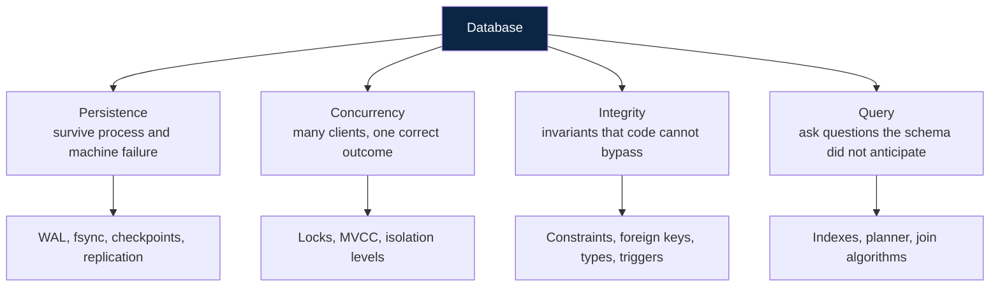
```mermaid
flowchart TD
    D["Database"] --> P["Persistence<br/>survive process and machine failure"]
    D --> C["Concurrency<br/>many clients, one correct outcome"]
    D --> I["Integrity<br/>invariants that code cannot bypass"]
    D --> Q["Query<br/>ask questions the schema did not anticipate"]

    P --> P1["WAL, fsync, checkpoints, replication"]
    C --> C1["Locks, MVCC, isolation levels"]
    I --> I1["Constraints, foreign keys, types, triggers"]
    Q --> Q1["Indexes, planner, join algorithms"]
    style D fill:#0b2545,color:#fff
```

Every mechanism in this handbook implements one of those four. When you find
yourself reimplementing one in application code — your own locking, your own
uniqueness check, your own consistency pass — stop and ask whether the database
already offers it. It almost always does, and its version is correct under
concurrency while yours is not.

> **The single most important habit:** put invariants in the database. An
> application-level check is a suggestion; a `UNIQUE` constraint is a guarantee.
> Any rule enforced only in code will eventually be violated by a second code path,
> a background job, a migration script, or a race.

---

## 2. Entities, keys and relationships

### 2.1 The ER model

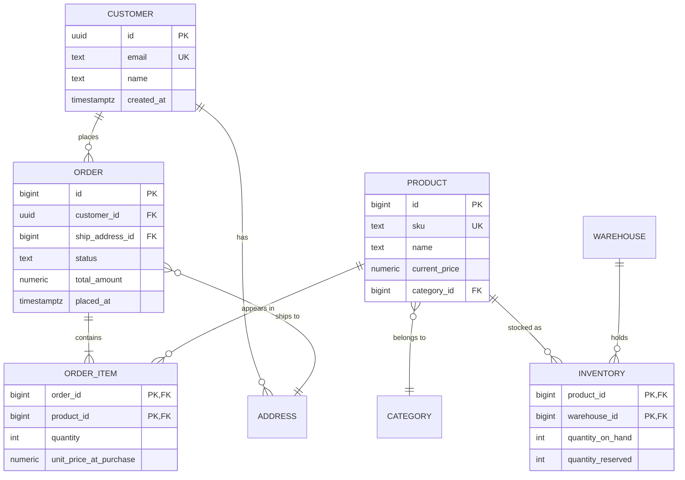
```mermaid
erDiagram
    CUSTOMER ||--o{ ORDER : places
    CUSTOMER ||--o{ ADDRESS : has
    ORDER ||--|{ ORDER_ITEM : contains
    ORDER }o--|| ADDRESS : "ships to"
    PRODUCT ||--o{ ORDER_ITEM : "appears in"
    PRODUCT }o--|| CATEGORY : "belongs to"
    PRODUCT ||--o{ INVENTORY : "stocked as"
    WAREHOUSE ||--o{ INVENTORY : holds

    CUSTOMER {
        uuid id PK
        text email UK
        text name
        timestamptz created_at
    }
    ORDER {
        bigint id PK
        uuid customer_id FK
        bigint ship_address_id FK
        text status
        numeric total_amount
        timestamptz placed_at
    }
    ORDER_ITEM {
        bigint order_id PK,FK
        bigint product_id PK,FK
        int quantity
        numeric unit_price_at_purchase
    }
    PRODUCT {
        bigint id PK
        text sku UK
        text name
        numeric current_price
        bigint category_id FK
    }
    INVENTORY {
        bigint product_id PK,FK
        bigint warehouse_id PK,FK
        int quantity_on_hand
        int quantity_reserved
    }
```

Note `unit_price_at_purchase` on `ORDER_ITEM`. This is not redundancy — it is a
**historical fact**. The product's current price will change; the price the
customer actually paid must not. Confusing "current state" with "recorded history"
is one of the most common and most damaging modelling errors, because it silently
rewrites the past.

### 2.2 Keys

| Key | Definition |
|---|---|
| **Super key** | Any set of columns that uniquely identifies a row |
| **Candidate key** | A minimal super key — no column can be removed |
| **Primary key** | The chosen candidate key. Not null, unique, immutable |
| **Alternate key** | Any other candidate key, enforced with `UNIQUE` |
| **Foreign key** | A column referencing another table's key |
| **Composite key** | A key spanning multiple columns |
| **Surrogate key** | A synthetic id with no business meaning |
| **Natural key** | A key with business meaning (email, ISBN, SKU) |

### 2.3 Surrogate vs natural — and the answer

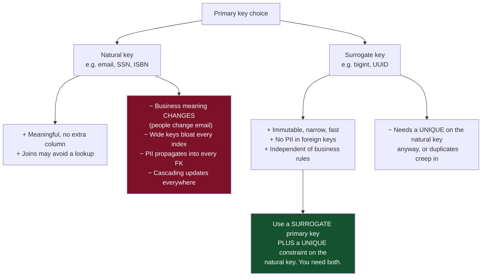
```mermaid
flowchart TD
    Q["Primary key choice"] --> N["Natural key<br/>e.g. email, SSN, ISBN"]
    Q --> S["Surrogate key<br/>e.g. bigint, UUID"]
    N --> N1["+ Meaningful, no extra column<br/>+ Joins may avoid a lookup"]
    N --> N2["− Business meaning CHANGES<br/>  (people change email)<br/>− Wide keys bloat every index<br/>− PII propagates into every FK<br/>− Cascading updates everywhere"]
    S --> S1["+ Immutable, narrow, fast<br/>+ No PII in foreign keys<br/>+ Independent of business rules"]
    S --> S2["− Needs a UNIQUE on the natural key<br/>  anyway, or duplicates creep in"]
    S1 --> A["Use a SURROGATE primary key<br/>PLUS a UNIQUE constraint on the<br/>natural key. You need both."]
    style A fill:#14532d,color:#fff
    style N2 fill:#7d1128,color:#fff
```

**Which surrogate?**

| Type | Size | Index locality | Verdict |
|---|---|---|---|
| `int` auto-increment | 4 B | Excellent | Runs out at 2.1 B. It has happened to real companies |
| `bigint` auto-increment | 8 B | Excellent | Great single-node choice. Leaks volume; needs a coordinator to shard |
| `UUIDv4` | 16 B | **Terrible** | Random ⇒ every insert lands in a random page ⇒ page splits, write amplification, working set = whole index |
| **`UUIDv7` / ULID** | 16 B | Excellent | Timestamp-prefixed ⇒ sequential inserts, sortable, no coordinator. **The modern default** |
| Snowflake | 8 B | Excellent | Compact and sortable; needs worker-id assignment |

> Switching a high-write table from UUIDv4 to UUIDv7 is one of the highest-value
> one-line changes available in database work. The mechanism is in §7.2.

### 2.4 Relationships

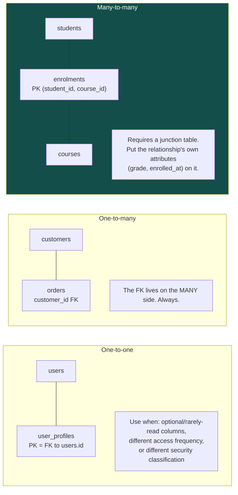
```mermaid
flowchart LR
    subgraph o2o["One-to-one"]
        A1["users"] --- A2["user_profiles<br/>PK = FK to users.id"]
        A3["Use when: optional/rarely-read columns,<br/>different access frequency,<br/>or different security classification"]
    end
    subgraph o2m["One-to-many"]
        B1["customers"] --- B2["orders<br/>customer_id FK"]
        B3["The FK lives on the MANY side. Always."]
    end
    subgraph m2m["Many-to-many"]
        C1["students"] --- C2["enrolments<br/>PK (student_id, course_id)"] --- C3["courses"]
        C4["Requires a junction table.<br/>Put the relationship's own attributes<br/>(grade, enrolled_at) on it."]
    end
    style m2m fill:#134e4a,color:#fff
```

### 2.5 Modelling hierarchies

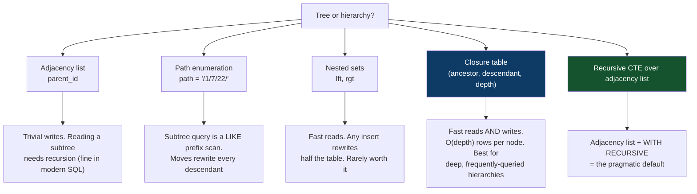
```mermaid
flowchart TD
    Q["Tree or hierarchy?"] --> A["Adjacency list<br/>parent_id"]
    Q --> B["Path enumeration<br/>path = '/1/7/22/'"]
    Q --> C["Nested sets<br/>lft, rgt"]
    Q --> D["Closure table<br/>(ancestor, descendant, depth)"]
    Q --> E["Recursive CTE over adjacency list"]

    A --> A1["Trivial writes. Reading a subtree<br/>needs recursion (fine in modern SQL)"]
    B --> B1["Subtree query is a LIKE prefix scan.<br/>Moves rewrite every descendant"]
    C --> C1["Fast reads. Any insert rewrites<br/>half the table. Rarely worth it"]
    D --> D1["Fast reads AND writes.<br/>O(depth) rows per node. Best for<br/>deep, frequently-queried hierarchies"]
    E --> E1["Adjacency list + WITH RECURSIVE<br/>= the pragmatic default"]
    style E fill:#14532d,color:#fff
    style D fill:#0d3b66,color:#fff
```

---

## 3. Normalisation

Normalisation removes redundancy so that **each fact is stored exactly once**. When
a fact is stored twice, the two copies will eventually disagree, and there is no
principled way to decide which is right.

### 3.1 The anomalies it prevents

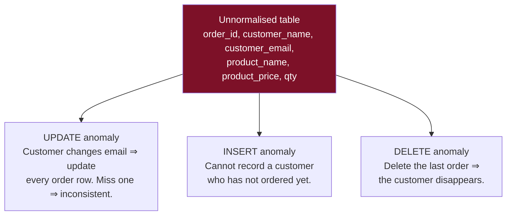
```mermaid
flowchart TD
    T["Unnormalised table<br/>order_id, customer_name, customer_email,<br/>product_name, product_price, qty"] --> A1["UPDATE anomaly<br/>Customer changes email ⇒ update<br/>every order row. Miss one ⇒ inconsistent."]
    T --> A2["INSERT anomaly<br/>Cannot record a customer<br/>who has not ordered yet."]
    T --> A3["DELETE anomaly<br/>Delete the last order ⇒<br/>the customer disappears."]
    style T fill:#7d1128,color:#fff
```

### 3.2 The normal forms

| Form | Requires | Removes |
|---|---|---|
| **1NF** | Atomic values, no repeating groups | Comma-separated lists, array columns used as sets |
| **2NF** | 1NF + no partial dependency on part of a composite key | Columns depending on only half the key |
| **3NF** | 2NF + no transitive dependency | Non-key columns depending on other non-key columns |
| **BCNF** | Every determinant is a candidate key | The remaining edge cases 3NF permits |
| **4NF** | BCNF + no multi-valued dependency | Independent multi-valued facts in one table |
| **5NF** | 4NF + no join dependency | Rare in practice |

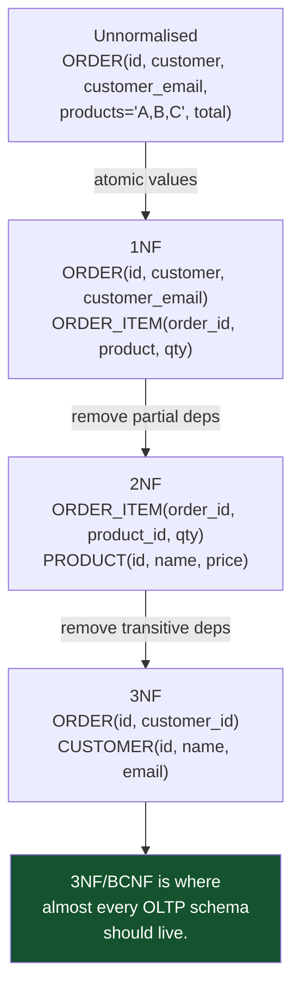
```mermaid
flowchart TD
    U["Unnormalised<br/>ORDER(id, customer, customer_email,<br/>products='A,B,C', total)"] -->|"atomic values"| F1
    F1["1NF<br/>ORDER(id, customer, customer_email)<br/>ORDER_ITEM(order_id, product, qty)"] -->|"remove partial deps"| F2
    F2["2NF<br/>ORDER_ITEM(order_id, product_id, qty)<br/>PRODUCT(id, name, price)"] -->|"remove transitive deps"| F3
    F3["3NF<br/>ORDER(id, customer_id)<br/>CUSTOMER(id, name, email)"] --> STOP["3NF/BCNF is where<br/>almost every OLTP schema<br/>should live."]
    style STOP fill:#14532d,color:#fff
```

### 3.3 The practical rule

> **Normalise to 3NF by default. Denormalise deliberately, with a measurement.**

3NF is not an academic ideal — it is the shape that makes updates safe. Most
"normalisation hurts performance" claims turn out to be an index problem or an N+1
query problem, and denormalising to fix them adds a permanent correctness liability
in exchange for a temporary speed-up that a covering index would have delivered
without it.

---

## 4. Denormalisation

Denormalisation is a **deliberate trade of write complexity and correctness risk
for read speed.** It is legitimate. It must be conscious.

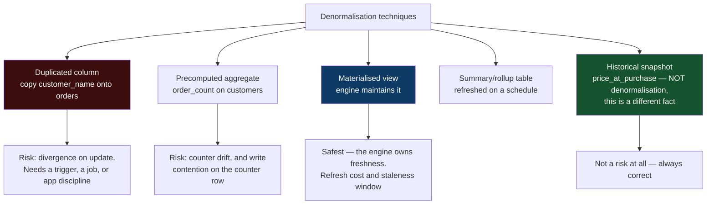
```mermaid
flowchart TD
    D["Denormalisation techniques"] --> D1["Duplicated column<br/>copy customer_name onto orders"]
    D --> D2["Precomputed aggregate<br/>order_count on customers"]
    D --> D3["Materialised view<br/>engine maintains it"]
    D --> D4["Summary/rollup table<br/>refreshed on a schedule"]
    D --> D5["Historical snapshot<br/>price_at_purchase — NOT denormalisation,<br/>this is a different fact"]

    D1 --> R1["Risk: divergence on update.<br/>Needs a trigger, a job, or app discipline"]
    D2 --> R2["Risk: counter drift, and write<br/>contention on the counter row"]
    D3 --> R3["Safest — the engine owns freshness.<br/>Refresh cost and staleness window"]
    D5 --> R5["Not a risk at all — always correct"]
    style D5 fill:#14532d,color:#fff
    style D3 fill:#0d3b66,color:#fff
    style D1 fill:#3b0d0d,color:#fff
```

### 4.1 The counter problem

A denormalised counter (`posts.comment_count`) looks harmless and is the single
most common source of write contention in OLTP systems.

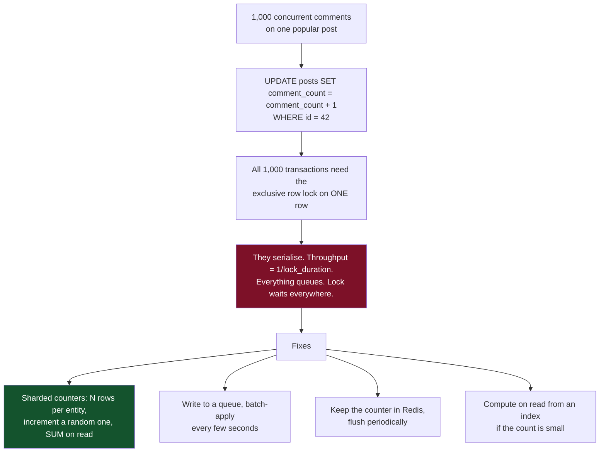
```mermaid
flowchart TD
    P["1,000 concurrent comments<br/>on one popular post"] --> U["UPDATE posts SET comment_count = comment_count + 1<br/>WHERE id = 42"]
    U --> L["All 1,000 transactions need the<br/>exclusive row lock on ONE row"]
    L --> S["They serialise. Throughput = 1/lock_duration.<br/>Everything queues. Lock waits everywhere."]
    S --> F["Fixes"]
    F --> F1["Sharded counters: N rows per entity,<br/>increment a random one, SUM on read"]
    F --> F2["Write to a queue, batch-apply<br/>every few seconds"]
    F --> F3["Keep the counter in Redis,<br/>flush periodically"]
    F --> F4["Compute on read from an index<br/>if the count is small"]
    style S fill:#7d1128,color:#fff
    style F1 fill:#14532d,color:#fff
```

### 4.2 When denormalisation is right

- The read is **very** frequent and the write is rare (a category name on a product).
- The join is genuinely expensive and a covering index cannot fix it — **verify with
  `EXPLAIN ANALYZE` first**.
- The value is a **historical fact** that must not change (price at purchase, address
  at time of shipping, tax rate applied). This is not redundancy at all.
- You are building a read model in a different store (search index, warehouse),
  where duplication is the entire point.

---

## 5. Data types and constraints

### 5.1 Type choices that matter

| Need | Use | Not |
|---|---|---|
| Money | `NUMERIC(19,4)` or integer minor units | `FLOAT`/`DOUBLE` — binary floating point cannot represent 0.10 |
| Timestamps | `TIMESTAMPTZ` (UTC) | `TIMESTAMP` without zone — ambiguous across DST and regions |
| Dates without time | `DATE` | A timestamp at midnight in some timezone |
| Booleans | `BOOLEAN` | `CHAR(1)` with 'Y'/'N'/'y'/null/'' |
| Enumerations | Lookup table with an FK, or a native `ENUM` | Free text |
| Identifiers | `BIGINT` or `UUID` | `VARCHAR` holding digits |
| Variable text | `TEXT` / `VARCHAR` (no length unless a real rule) | `CHAR(n)` — pads with spaces |
| IP addresses | `INET` where available | `VARCHAR(15)` — breaks on IPv6 |
| Semi-structured | `JSONB` | `TEXT` holding JSON — unqueryable and unindexable |

> **Floating point for money is a genuine, recurring production bug.** `0.1 + 0.2`
> is not `0.3` in IEEE 754. Ledgers built on `FLOAT` develop drift that grows with
> transaction volume and is essentially unauditable.

### 5.2 Constraints are cheap correctness

```sql
CREATE TABLE orders (
    id            BIGSERIAL PRIMARY KEY,
    customer_id   UUID        NOT NULL REFERENCES customers(id) ON DELETE RESTRICT,
    status        TEXT        NOT NULL
                              CHECK (status IN ('pending','paid','shipped','cancelled')),
    total_amount  NUMERIC(19,4) NOT NULL CHECK (total_amount >= 0),
    currency      CHAR(3)     NOT NULL CHECK (currency ~ '^[A-Z]{3}$'),
    placed_at     TIMESTAMPTZ NOT NULL DEFAULT now(),
    shipped_at    TIMESTAMPTZ,

    CONSTRAINT ship_after_place CHECK (shipped_at IS NULL OR shipped_at >= placed_at),
    CONSTRAINT shipped_has_date CHECK (status <> 'shipped' OR shipped_at IS NOT NULL)
);
```

Every constraint above is a bug that can now never reach the table — regardless of
which service, script, migration or console session tries to write it. The cost is
microseconds per row.

**Foreign key referential actions:**

| Action | Behaviour | Use for |
|---|---|---|
| `RESTRICT` / `NO ACTION` | Refuse the delete | The safe default — forces an explicit decision |
| `CASCADE` | Delete children too | True ownership (order → order_items) |
| `SET NULL` | Null the reference | Optional relationships (employee → manager) |
| `SET DEFAULT` | Set to the default | Rare |

`CASCADE` deserves caution: a single `DELETE` on a parent can cascade through
several levels and lock a very large number of rows, turning a routine cleanup into
a lock storm. Deleting a large parent tree should usually be batched explicitly.

### 5.3 NULL semantics

`NULL` means *unknown*, not *empty*, and it propagates through three-valued logic in
ways that surprise people:

```sql
NULL = NULL              → NULL (not true!)   use IS NULL
NULL <> 'x'              → NULL (not true!)
COUNT(col)               → ignores NULLs; COUNT(*) does not
SUM(col)                 → ignores NULLs; returns NULL if all are NULL
'abc' || NULL            → NULL   (concatenation is contaminated)
WHERE col NOT IN (1, NULL) → NEVER TRUE. This is a real, silent bug
UNIQUE constraint        → in standard SQL, permits multiple NULLs
```

The `NOT IN` case with a nullable subquery is worth internalising — it returns zero
rows and looks like correct behaviour. Prefer `NOT EXISTS`, which handles NULLs
correctly.

---

## Part II — Storage and access

## 6. Storage engines

### 6.1 Pages — the unit of everything

Databases do not read rows. They read **pages** (typically 4–16 KB), because disks
and the OS work in blocks and because a page is the unit of caching, locking and
logging.

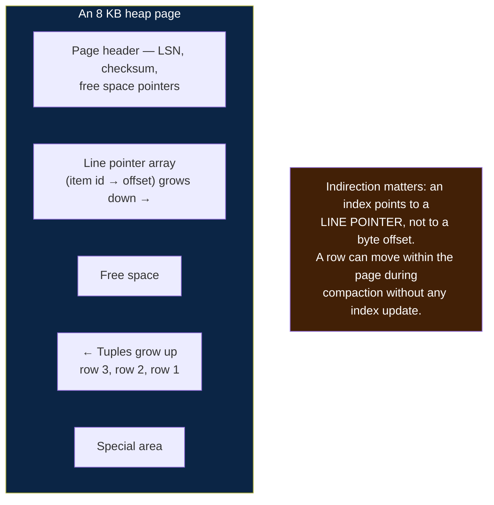
```mermaid
flowchart TD
    subgraph page["An 8 KB heap page"]
        H["Page header — LSN, checksum,<br/>free space pointers"]
        L["Line pointer array<br/>(item id → offset) grows down →"]
        F["Free space"]
        T["← Tuples grow up<br/>row 3, row 2, row 1"]
        S["Special area"]
    end
    N["Indirection matters: an index points to a<br/>LINE POINTER, not to a byte offset.<br/>A row can move within the page during<br/>compaction without any index update."]
    style page fill:#0b2545,color:#fff
    style N fill:#422006,color:#fff
```

Consequences that show up in production:

- **A row wider than a page** must be split or moved out of line (Postgres TOAST,
  InnoDB overflow pages). A large `TEXT` column can therefore cost an extra I/O per
  access even when you did not select it — or cost nothing, if the engine stores it
  out of line and you did not touch it. Knowing which matters.
- **Fill factor** leaves free space in each page so updates can stay in place. Too
  full and every update relocates the row; too empty and you waste cache.
- **Reading one row reads the whole page.** This is why row order on disk
  (clustering) has such a large effect on range scans.

### 6.2 Heap vs clustered (index-organised)

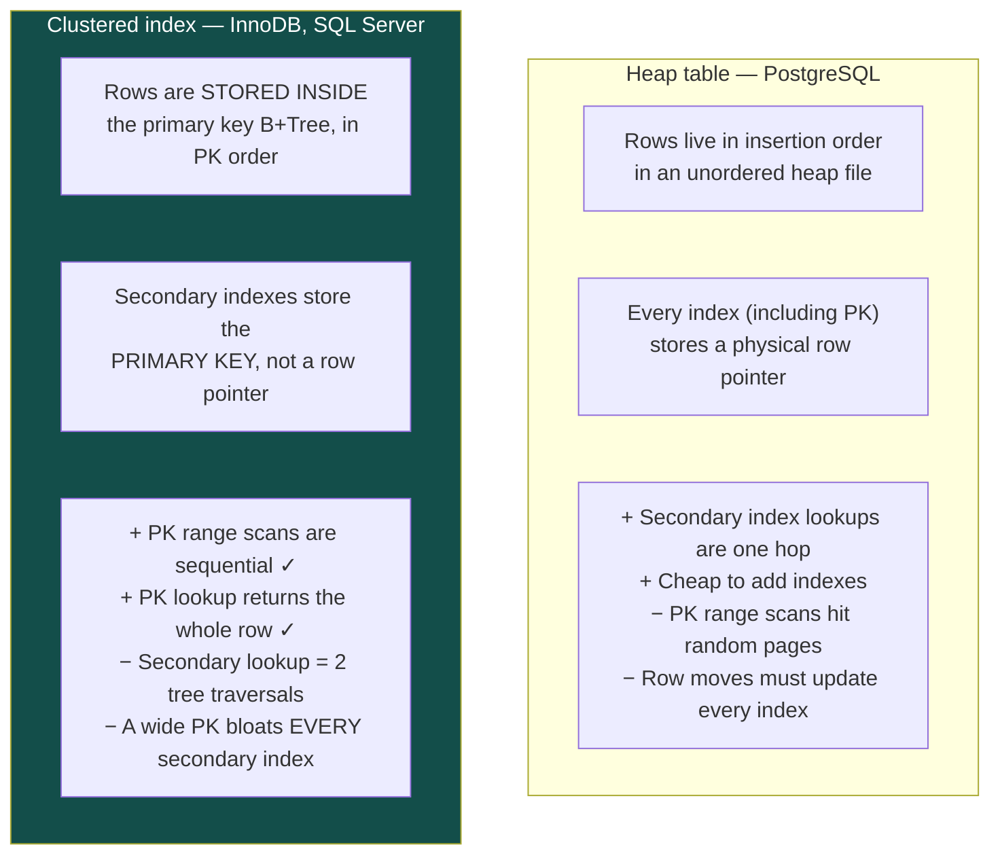
```mermaid
flowchart TD
    subgraph heap["Heap table — PostgreSQL"]
        H1["Rows live in insertion order<br/>in an unordered heap file"]
        H2["Every index (including PK)<br/>stores a physical row pointer"]
        H3["+ Secondary index lookups are one hop<br/>+ Cheap to add indexes<br/>− PK range scans hit random pages<br/>− Row moves must update every index"]
    end
    subgraph clus["Clustered index — InnoDB, SQL Server"]
        C1["Rows are STORED INSIDE<br/>the primary key B+Tree, in PK order"]
        C2["Secondary indexes store the<br/>PRIMARY KEY, not a row pointer"]
        C3["+ PK range scans are sequential ✓<br/>+ PK lookup returns the whole row ✓<br/>− Secondary lookup = 2 tree traversals<br/>− A wide PK bloats EVERY secondary index"]
    end
    style clus fill:#134e4a,color:#fff
```

The clustered-index consequence people miss: in InnoDB, **the primary key is copied
into every secondary index**. A 36-byte text PK on a table with six secondary
indexes adds ~216 bytes per row of pure index overhead versus an 8-byte `BIGINT`.
On 500 M rows that is over 100 GB of index that exists for no reason.

### 6.3 B+Tree vs LSM — the fundamental split

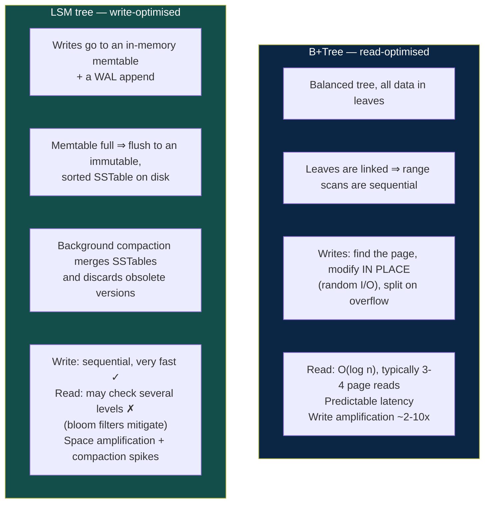
```mermaid
flowchart TD
    subgraph bt["B+Tree — read-optimised"]
        B1["Balanced tree, all data in leaves"]
        B2["Leaves are linked ⇒ range scans are sequential"]
        B3["Writes: find the page, modify IN PLACE<br/>(random I/O), split on overflow"]
        B4["Read: O(log n), typically 3-4 page reads<br/>Predictable latency<br/>Write amplification ~2-10x"]
    end
    subgraph lsm["LSM tree — write-optimised"]
        L1["Writes go to an in-memory memtable<br/>+ a WAL append"]
        L2["Memtable full ⇒ flush to an immutable,<br/>sorted SSTable on disk"]
        L3["Background compaction merges SSTables<br/>and discards obsolete versions"]
        L4["Write: sequential, very fast ✓<br/>Read: may check several levels ✗<br/>(bloom filters mitigate)<br/>Space amplification + compaction spikes"]
    end
    style bt fill:#0b2545,color:#fff
    style lsm fill:#134e4a,color:#fff
```

| | B+Tree | LSM tree |
|---|---|---|
| Write throughput | Good | **Excellent** |
| Point read | **Excellent, predictable** | Good; worse with more levels |
| Range scan | **Excellent** | Good — merge across levels |
| Write amplification | Moderate | Higher (compaction rewrites data repeatedly) |
| Space amplification | Low | Higher — obsolete versions persist until compacted |
| Latency predictability | **High** | Compaction causes periodic spikes |
| Compression | Moderate | **Better** — immutable sorted blocks compress well |
| Used by | Postgres, MySQL/InnoDB, Oracle, SQL Server | RocksDB, Cassandra, LevelDB, ScyllaDB, TiKV, ClickHouse (variant) |

**The reason LSM writes are fast** is that they are *sequential appends*. Sequential
I/O beats random by 10–100× on both SSD and spinning disk. LSM trades read
amplification (checking several levels) and compaction CPU for that write speed.

### 6.4 Row vs column storage

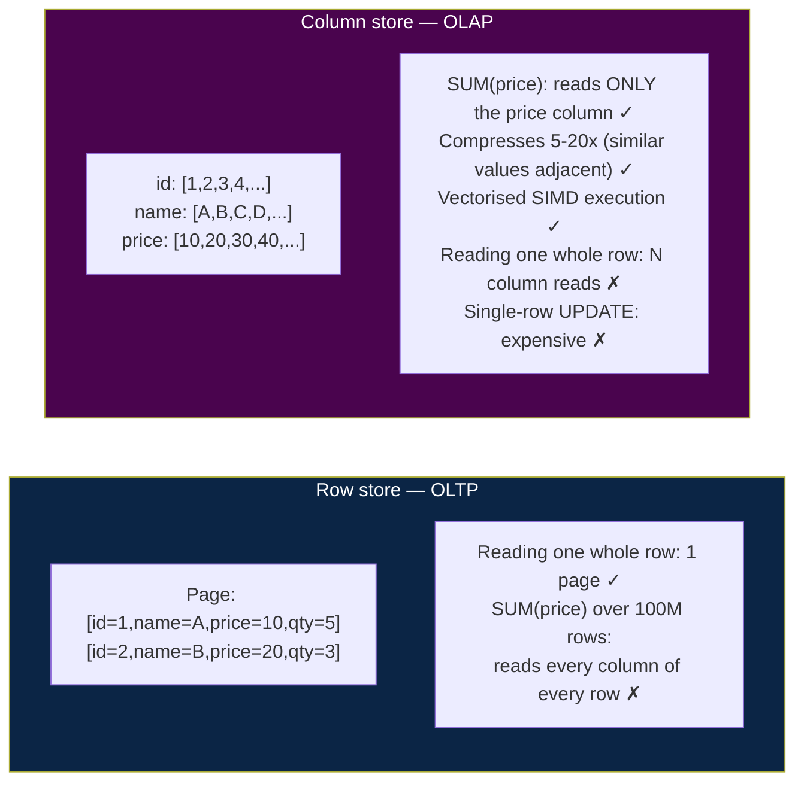
```mermaid
flowchart LR
    subgraph row["Row store — OLTP"]
        R1["Page: [id=1,name=A,price=10,qty=5]<br/>[id=2,name=B,price=20,qty=3]"]
        R2["Reading one whole row: 1 page ✓<br/>SUM(price) over 100M rows:<br/>reads every column of every row ✗"]
    end
    subgraph col["Column store — OLAP"]
        C1["id:    [1,2,3,4,...]<br/>name:  [A,B,C,D,...]<br/>price: [10,20,30,40,...]"]
        C2["SUM(price): reads ONLY the price column ✓<br/>Compresses 5-20x (similar values adjacent) ✓<br/>Vectorised SIMD execution ✓<br/>Reading one whole row: N column reads ✗<br/>Single-row UPDATE: expensive ✗"]
    end
    style row fill:#0b2545,color:#fff
    style col fill:#4a044e,color:#fff
```

---

## 7. Indexes

An index is a **redundant, ordered data structure that trades write cost and disk
space for read speed.** Every index makes every `INSERT`, `UPDATE` and `DELETE` on
that table slower. There is no such thing as a free index.

### 7.1 B+Tree mechanics

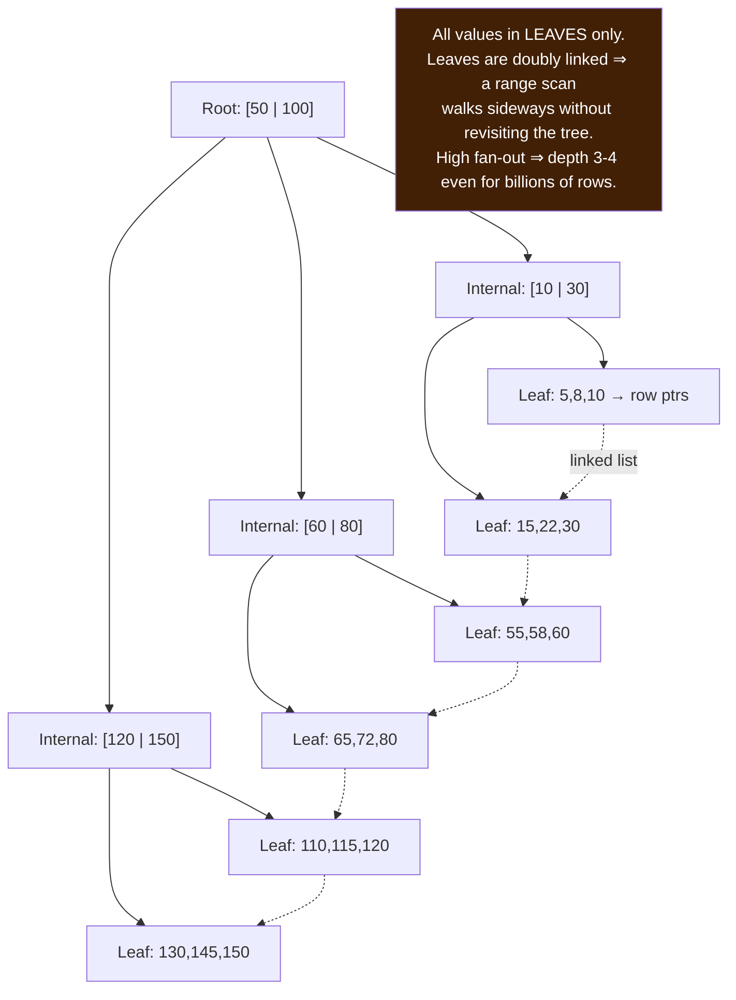
```mermaid
flowchart TD
    ROOT["Root: [50 | 100]"]
    I1["Internal: [10 | 30]"]
    I2["Internal: [60 | 80]"]
    I3["Internal: [120 | 150]"]
    L1["Leaf: 5,8,10 → row ptrs"]
    L2["Leaf: 15,22,30"]
    L3["Leaf: 55,58,60"]
    L4["Leaf: 65,72,80"]
    L5["Leaf: 110,115,120"]
    L6["Leaf: 130,145,150"]

    ROOT --> I1 & I2 & I3
    I1 --> L1 & L2
    I2 --> L3 & L4
    I3 --> L5 & L6
    L1 -.->|"linked list"| L2 -.-> L3 -.-> L4 -.-> L5 -.-> L6

    N["All values in LEAVES only.<br/>Leaves are doubly linked ⇒ a range scan<br/>walks sideways without revisiting the tree.<br/>High fan-out ⇒ depth 3-4 even for billions of rows."]
    style N fill:#422006,color:#fff
```

A B+Tree with a fan-out of 200 reaches:
- depth 2 → 40,000 rows
- depth 3 → 8,000,000 rows
- depth 4 → 1,600,000,000 rows

So **a lookup in a billion-row table is about four page reads**, and the top two
levels are always cached. That is why indexed point lookups are effectively free
regardless of table size — and why a *missing* index is so catastrophic by
comparison.

### 7.2 Why random keys hurt

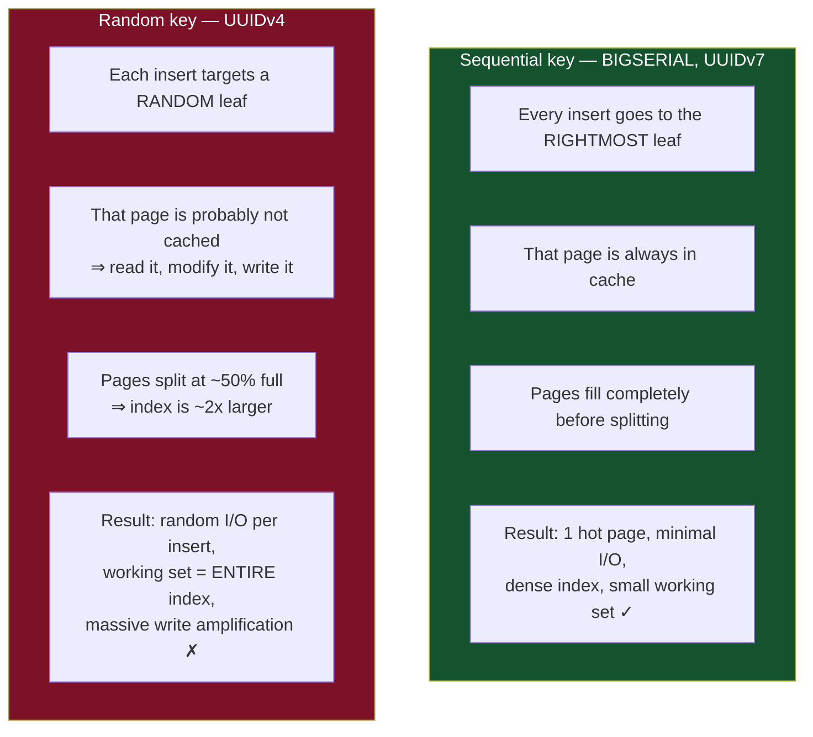
```mermaid
flowchart TD
    subgraph seq["Sequential key — BIGSERIAL, UUIDv7"]
        S1["Every insert goes to the RIGHTMOST leaf"]
        S2["That page is always in cache"]
        S3["Pages fill completely before splitting"]
        S4["Result: 1 hot page, minimal I/O,<br/>dense index, small working set ✓"]
    end
    subgraph rnd["Random key — UUIDv4"]
        R1["Each insert targets a RANDOM leaf"]
        R2["That page is probably not cached<br/>⇒ read it, modify it, write it"]
        R3["Pages split at ~50% full<br/>⇒ index is ~2x larger"]
        R4["Result: random I/O per insert,<br/>working set = ENTIRE index,<br/>massive write amplification ✗"]
    end
    style seq fill:#14532d,color:#fff
    style rnd fill:#7d1128,color:#fff
```

On a large table this is routinely a **3–10× difference in insert throughput** and a
similar difference in index size. UUIDv7 keeps the global-uniqueness and
no-coordinator benefits while restoring insert locality.

### 7.3 Index types

| Type | Structure | Supports | Use for |
|---|---|---|---|
| **B+Tree** | Balanced tree | `=`, `<`, `>`, `BETWEEN`, `IN`, prefix `LIKE 'a%'`, `ORDER BY` | The default for almost everything |
| **Hash** | Hash table | `=` only | Marginal gains over B-tree; rarely worth a separate index |
| **Bitmap** | Bit vector per value | Low-cardinality equality, `AND`/`OR` combinations | Warehouses. Terrible for OLTP — updates lock whole bitmaps |
| **GIN** (inverted) | Term → row list | Array containment, JSONB keys, full-text | `@>`, `?`, `to_tsvector` searches |
| **GiST** | Generalised search tree | Geometric, range, nearest-neighbour | PostGIS, range overlap, exclusion constraints |
| **SP-GiST** | Space-partitioned | Non-balanced structures: quadtrees, tries | IP prefixes, phone prefixes |
| **BRIN** | Min/max per block range | Huge, physically-correlated tables | Time-series appended in order. Index is *tiny* — kilobytes for terabytes |
| **Full-text** | Inverted index | Ranked text search | Search within the DB |
| **Vector** (HNSW/IVF) | ANN graph or clusters | Nearest neighbour on embeddings | Semantic search, RAG |

**BRIN is dramatically underused.** For an append-only events table keyed by time,
a BRIN index on `created_at` is a few hundred kilobytes where a B-tree would be tens
of gigabytes, and it prunes ranges nearly as well — *provided the physical order
correlates with the indexed column*, which append-only tables satisfy naturally.

### 7.4 Index variants

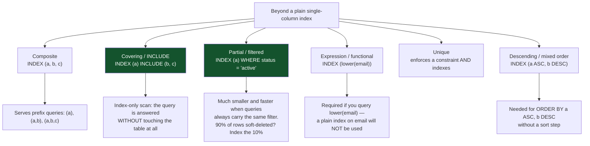
```mermaid
flowchart TD
    V["Beyond a plain single-column index"] --> C["Composite<br/>INDEX (a, b, c)"]
    V --> CV["Covering / INCLUDE<br/>INDEX (a) INCLUDE (b, c)"]
    V --> P["Partial / filtered<br/>INDEX (a) WHERE status = 'active'"]
    V --> F["Expression / functional<br/>INDEX (lower(email))"]
    V --> U["Unique<br/>enforces a constraint AND indexes"]
    V --> D["Descending / mixed order<br/>INDEX (a ASC, b DESC)"]

    C --> C1["Serves prefix queries: (a), (a,b), (a,b,c)"]
    CV --> CV1["Index-only scan: the query is answered<br/>WITHOUT touching the table at all"]
    P --> P1["Much smaller and faster when queries<br/>always carry the same filter.<br/>90% of rows soft-deleted? Index the 10%"]
    F --> F1["Required if you query lower(email) —<br/>a plain index on email will NOT be used"]
    D --> D1["Needed for ORDER BY a ASC, b DESC<br/>without a sort step"]
    style CV fill:#14532d,color:#fff
    style P fill:#14532d,color:#fff
```

### 7.5 What an index costs

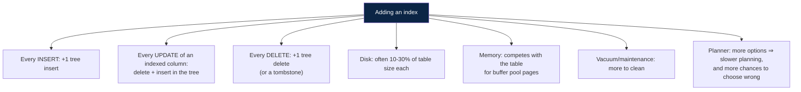
```mermaid
flowchart TD
    I["Adding an index"] --> W["Every INSERT: +1 tree insert"]
    I --> U["Every UPDATE of an indexed column:<br/>delete + insert in the tree"]
    I --> D["Every DELETE: +1 tree delete<br/>(or a tombstone)"]
    I --> S["Disk: often 10-30% of table size each"]
    I --> M["Memory: competes with the table<br/>for buffer pool pages"]
    I --> V["Vacuum/maintenance: more to clean"]
    I --> P["Planner: more options ⇒ slower planning,<br/>and more chances to choose wrong"]
    style I fill:#0b2545,color:#fff
```

A table with twelve indexes can be **an order of magnitude slower to write** than
the same table with two. Audit indexes regularly: every engine exposes index usage
statistics, and unused indexes are pure cost.

---

## 8. Index selection and the leftmost prefix

### 8.1 The rule

A composite index `(a, b, c)` is sorted by `a`, then `b` within equal `a`, then `c`.
It can therefore serve any **leftmost prefix** of the columns.

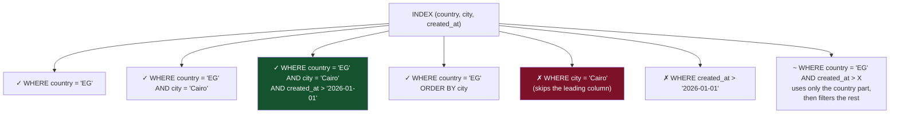
```mermaid
flowchart TD
    I["INDEX (country, city, created_at)"] --> Y1["✓ WHERE country = 'EG'"]
    I --> Y2["✓ WHERE country = 'EG' AND city = 'Cairo'"]
    I --> Y3["✓ WHERE country = 'EG' AND city = 'Cairo'<br/>AND created_at > '2026-01-01'"]
    I --> Y4["✓ WHERE country = 'EG' ORDER BY city"]
    I --> N1["✗ WHERE city = 'Cairo'<br/>(skips the leading column)"]
    I --> N2["✗ WHERE created_at > '2026-01-01'"]
    I --> P1["~ WHERE country = 'EG' AND created_at > X<br/>uses only the country part,<br/>then filters the rest"]
    style Y3 fill:#14532d,color:#fff
    style N1 fill:#7d1128,color:#fff
```

### 8.2 Column order

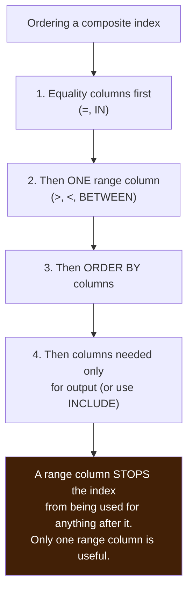
```mermaid
flowchart TD
    O["Ordering a composite index"] --> R1["1. Equality columns first<br/>(=, IN)"]
    R1 --> R2["2. Then ONE range column<br/>(&gt;, &lt;, BETWEEN)"]
    R2 --> R3["3. Then ORDER BY columns"]
    R3 --> R4["4. Then columns needed only<br/>for output (or use INCLUDE)"]
    R4 --> N["A range column STOPS the index<br/>from being used for anything after it.<br/>Only one range column is useful."]
    style N fill:#422006,color:#fff
```

Concretely, for:

```sql
SELECT id, total FROM orders
WHERE  tenant_id = $1 AND status = $2 AND placed_at >= $3
ORDER BY placed_at DESC
LIMIT 20;
```

the right index is:

```sql
CREATE INDEX ON orders (tenant_id, status, placed_at DESC) INCLUDE (total);
```

Two equality columns, then the range column which is also the sort column (so the
`ORDER BY` needs no sort step), and `total` included so the query never touches the
heap. This is an index-only scan of exactly 20 index entries.

### 8.3 Why an index is ignored

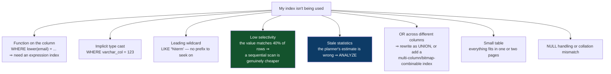
```mermaid
flowchart TD
    Q["My index isn't being used"] --> C1["Function on the column<br/>WHERE lower(email) = ... ⇒ need an expression index"]
    Q --> C2["Implicit type cast<br/>WHERE varchar_col = 123"]
    Q --> C3["Leading wildcard<br/>LIKE '%term' — no prefix to seek on"]
    Q --> C4["Low selectivity<br/>the value matches 40% of rows ⇒<br/>a sequential scan is genuinely cheaper"]
    Q --> C5["Stale statistics<br/>the planner's estimate is wrong ⇒ ANALYZE"]
    Q --> C6["OR across different columns<br/>⇒ rewrite as UNION, or add a<br/>multi-column/bitmap-combinable index"]
    Q --> C7["Small table<br/>everything fits in one or two pages"]
    Q --> C8["NULL handling or collation mismatch"]
    style C4 fill:#14532d,color:#fff
    style C5 fill:#0d3b66,color:#fff
```

> **Case 4 is not a bug.** When a predicate matches a large fraction of the table, a
> sequential scan reading pages in order beats an index scan that performs a random
> page read per matching row. The crossover is usually somewhere around 5–20% of
> rows. The planner is usually right; when it is wrong, the cause is almost always
> stale statistics or a correlation it cannot model.

---

## 9. The query planner and execution

SQL is declarative: you state *what*, and the planner decides *how*. Understanding
its decisions is the difference between guessing at performance and diagnosing it.

### 9.1 The pipeline

```mermaid
flowchart LR
    S["SQL text"] --> P["Parser<br/>→ syntax tree"]
    P --> A["Analyser<br/>resolve names, types,<br/>check permissions"]
    A --> R["Rewriter<br/>expand views, apply rules,<br/>flatten subqueries"]
    R --> O["Planner / Optimiser<br/>enumerate plans, estimate cost,<br/>pick the cheapest"]
    O --> E["Executor<br/>run the chosen plan tree"]
    E --> RES["Result"]
    style O fill:#0b2545,color:#fff
```

### 9.2 Cost estimation, and where it goes wrong

The planner never measures — it **estimates**, from statistics collected by
`ANALYZE`:

| Statistic | Used for |
|---|---|
| Table row count and page count | Sequential scan cost |
| Column **distinct values** (n_distinct) | Selectivity of `=` |
| **Histogram** of value distribution | Selectivity of ranges |
| **Most common values** and their frequencies | Skewed data |
| **Correlation** between column order and physical order | Whether an index scan will be sequential-ish |
| Index size and depth | Index scan cost |

```mermaid
flowchart TD
    E["Estimated rows: 12"] --> P["Planner picks a NESTED LOOP<br/>(great for 12 rows)"]
    A["Actual rows: 2,400,000"] --> D["The nested loop performs<br/>2.4 M index lookups"]
    P & A --> R["Query takes 40 minutes<br/>instead of 200 ms"]
    R --> C["ROOT CAUSE is nearly always one of:"]
    C --> C1["Stale statistics — run ANALYZE"]
    C --> C2["Correlated predicates the planner<br/>assumes are independent<br/>(city='Cairo' AND country='EG')"]
    C --> C3["A function or expression it cannot estimate"]
    C --> C4["Parameter sniffing — plan cached<br/>for an unrepresentative value"]
    style R fill:#7d1128,color:#fff
    style C2 fill:#0d3b66,color:#fff
```

**The independence assumption** is the most common structural cause. The planner
multiplies selectivities: `P(city='Cairo') × P(country='EG')`. Since every Cairo row
is also an EG row, the true selectivity is the first term alone — the planner
underestimates by a large factor. The fix in Postgres is extended statistics
(`CREATE STATISTICS ... (dependencies)`); elsewhere it may require a hint or a
rewrite.

### 9.3 Reading EXPLAIN properly

```sql
EXPLAIN (ANALYZE, BUFFERS, VERBOSE) SELECT ...;
```

`EXPLAIN` alone shows the plan and its estimates. **`EXPLAIN ANALYZE` actually runs
it** and shows reality. Always use `ANALYZE` when diagnosing; the gap between
estimate and actual is the diagnosis.

```
Limit  (cost=0.43..8.91 rows=20 width=24) (actual time=0.031..0.128 rows=20 loops=1)
  Buffers: shared hit=24
  ->  Index Scan using idx_orders_tenant_status_placed on orders
        (cost=0.43..4231.02 rows=9982 width=24)
        (actual time=0.029..0.121 rows=20 loops=1)
        Index Cond: ((tenant_id = 7) AND (status = 'paid') AND (placed_at >= '2026-01-01'))
        Buffers: shared hit=24
Planning Time: 0.184 ms
Execution Time: 0.156 ms
```

What to look at, in order:

| Look for | Meaning |
|---|---|
| **`rows=` estimated vs actual** | A gap over ~10× is your problem. Everything else follows from it |
| **`loops=`** | Actual time is *per loop*. `actual time=2.1 rows=1 loops=50000` is 105 seconds, not 2 ms |
| **`Buffers: shared hit` vs `read`** | `hit` = cache, `read` = disk. High `read` means the working set does not fit |
| **`Seq Scan` on a large table** | Missing index, or the predicate is not selective |
| **`Rows Removed by Filter`** | Rows fetched then discarded — an index could have excluded them |
| **`Sort` with `external merge Disk`** | `work_mem` too small; the sort spilled |
| **`Nested Loop` with large outer** | Usually the symptom of an underestimate |
| **`Heap Fetches` on an index-only scan** | Visibility map is stale — vacuum |

### 9.4 Scan types

```mermaid
flowchart TD
    S["Access methods"] --> S1["Sequential scan<br/>read every page in order"]
    S --> S2["Index scan<br/>walk the index, fetch each matching row"]
    S --> S3["Index-only scan<br/>answer entirely from the index — no heap access"]
    S --> S4["Bitmap heap scan<br/>collect row ids from index(es), sort them,<br/>then read heap pages IN PHYSICAL ORDER"]

    S1 --> N1["Best when returning a large fraction.<br/>Sequential I/O, no random seeks"]
    S2 --> N2["Best for high selectivity.<br/>One random page read per row"]
    S3 --> N3["FASTEST. Requires a covering index<br/>and a current visibility map"]
    S4 --> N4["The bridge between the two:<br/>converts random reads to sequential.<br/>Can combine MULTIPLE indexes with AND/OR"]
    style S3 fill:#14532d,color:#fff
    style S4 fill:#0d3b66,color:#fff
```

**Bitmap heap scan** is the answer to "why did it use my index but still read most
of the table?" — it is the planner deliberately choosing a middle path when
selectivity is moderate, and it is usually the right call.

---

## 10. Join algorithms

```mermaid
flowchart TD
    subgraph nl["Nested loop"]
        N1["for each row in OUTER:<br/>  for each match in INNER:<br/>    emit"]
        N2["Cost ≈ outer_rows x inner_lookup_cost"]
        N3["✓ Small outer + indexed inner<br/>✗ Catastrophic when the outer is large"]
    end
    subgraph hj["Hash join"]
        H1["Build a hash table on the SMALLER side,<br/>then probe it with the larger"]
        H2["Cost ≈ build + probe, roughly linear"]
        H3["✓ Large unindexed equality joins<br/>✗ Equality only; needs memory<br/>  (spills to disk in batches if short)"]
    end
    subgraph mj["Merge join"]
        M1["Sort both inputs on the join key,<br/>then walk them in lockstep"]
        M2["Cost ≈ sort + linear merge"]
        M3["✓ Both already sorted (index order)<br/>✓ Supports inequality joins<br/>✗ Sorting is expensive if not free"]
    end
    style hj fill:#134e4a,color:#fff
```

| | Nested loop | Hash join | Merge join |
|---|---|---|---|
| Best when | Outer is small, inner is indexed | Both large, equality, no useful index | Both sorted on the key |
| Memory | Minimal | Proportional to the build side | Proportional to sort |
| Join types | Any predicate | Equality only | Equality and range |
| Failure mode | Explodes when the outer is underestimated | Spills to disk; degrades gracefully | Sort dominates |

**The most common bad plan in production** is a nested loop chosen because the outer
side was estimated at 12 rows and actually returned 2 million. The join algorithm
was not wrong; the cardinality estimate was. Fix the estimate — `ANALYZE`, extended
statistics, or a rewrite — rather than forcing the join type.

### 10.1 Join order

For `N` tables there are up to `N!` join orders (and more with different shapes).
Planners use dynamic programming up to a threshold and switch to a genetic or
heuristic search beyond it (Postgres: `geqo_threshold`, default 12 tables). A query
joining twenty tables may therefore get a *heuristically* chosen order, which is one
concrete reason very wide joins behave unpredictably.

### 10.2 The N+1 problem

```mermaid
flowchart TD
    subgraph bad["N+1 — 1,001 round trips"]
        B1["SELECT * FROM orders LIMIT 1000"] --> B2["for each order:<br/>SELECT * FROM customers WHERE id = ?"]
        B2 --> B3["1,001 queries.<br/>At 1 ms network RTT each = 1 second<br/>of pure latency, all of it avoidable."]
    end
    subgraph good["Fixed — 2 round trips"]
        G1["SELECT * FROM orders LIMIT 1000"] --> G2["SELECT * FROM customers<br/>WHERE id = ANY($1)"]
        G2 --> G3["Or a single JOIN.<br/>Or a DataLoader-style batcher."]
    end
    style bad fill:#7d1128,color:#fff
    style good fill:#14532d,color:#fff
```

N+1 is the most common performance bug in applications using an ORM, and it is
invisible in single-row testing — it only appears with realistic list sizes. Detect
it by counting queries per request in your instrumentation, not by reading code.

---

## Part III — Correctness

## 11. Transactions and ACID

A transaction is a unit of work that is **all or nothing**, and that behaves
correctly even though hundreds of other transactions are running at the same
moment.

```mermaid
flowchart TD
    T["ACID"] --> A["ATOMICITY<br/>all operations commit, or none do"]
    T --> C["CONSISTENCY<br/>the database moves from one<br/>valid state to another"]
    T --> I["ISOLATION<br/>concurrent transactions do not<br/>corrupt each other"]
    T --> D["DURABILITY<br/>once committed, it survives<br/>crash, power loss, restart"]

    A --> A1["Mechanism: UNDO log / rollback segments.<br/>On abort, apply the inverse of every change."]
    C --> C1["Mechanism: constraints, FKs, triggers,<br/>types. NOTE: this is the APPLICATION's<br/>invariants, enforced by the DB.<br/>It is the odd letter out."]
    I --> I1["Mechanism: locks, MVCC, or OCC.<br/>Tunable via isolation LEVELS —<br/>you rarely get full isolation by default."]
    D --> D1["Mechanism: write-ahead log + fsync,<br/>then checkpoints, then replication."]
    style A fill:#0b2545,color:#fff
    style I fill:#7d1128,color:#fff
```

> **The C in ACID is not the C in CAP.** ACID consistency means "the database's
> declared invariants hold". CAP consistency means linearisability — that a read
> sees the most recent write. They are unrelated concepts that share a letter, and
> conflating them causes real confusion in design discussions.

### 11.1 Transaction lifecycle

```mermaid
stateDiagram-v2
    [*] --> Active: BEGIN
    Active --> Active: read / write
    Active --> PartiallyCommitted: final statement executes
    Active --> Failed: error, deadlock victim,<br/>constraint violation, timeout
    PartiallyCommitted --> Committed: WAL flushed to durable storage
    PartiallyCommitted --> Failed: flush fails
    Failed --> Aborted: ROLLBACK — undo all changes
    Committed --> [*]
    Aborted --> [*]

    note right of PartiallyCommitted
        The commit point is the fsync of the
        WAL record — not the last statement.
        Before that fsync, a crash loses everything.
    end note
```

### 11.2 Atomicity, mechanically

```mermaid
sequenceDiagram
    participant T as Transaction
    participant U as Undo log
    participant B as Buffer pool
    participant W as WAL

    T->>W: BEGIN record
    T->>U: save old value of row 5 (before image)
    T->>B: modify row 5 in memory
    T->>W: REDO record for row 5
    T->>U: save old value of row 9
    T->>B: modify row 9
    T->>W: REDO record for row 9

    alt COMMIT
        T->>W: COMMIT record
        W->>W: fsync — THE COMMIT POINT
        Note over T,W: durable. Undo can be discarded<br/>once no other transaction needs it.
    else ROLLBACK or crash
        T->>U: read the undo log BACKWARDS
        U->>B: restore row 9, then row 5
        T->>W: ABORT record
        Note over T,W: as if it never happened
    end
```

The undo log is not just for explicit rollbacks. In an MVCC engine, it is also what
lets other transactions **read the old version** of a row that you have modified but
not yet committed — the same structure serving atomicity and isolation.

### 11.3 Savepoints

```sql
BEGIN;
  INSERT INTO orders ...;
  SAVEPOINT after_order;
  INSERT INTO order_items ...;       -- fails
  ROLLBACK TO SAVEPOINT after_order; -- undo only the items
  INSERT INTO order_items ...;       -- corrected retry
COMMIT;                              -- the order still commits
```

Savepoints give partial rollback within a transaction. Two cautions: each savepoint
has a real cost (Postgres assigns a subtransaction id), and thousands of savepoints
in one transaction — which some ORMs generate implicitly per statement — cause
measurable performance degradation.

### 11.4 Long transactions are a systemic hazard

```mermaid
flowchart TD
    L["A transaction open for 30 minutes"] --> P1["Holds locks the whole time<br/>⇒ writers queue behind it"]
    L --> P2["Pins its MVCC snapshot<br/>⇒ vacuum cannot remove ANY row version<br/>newer than its start ⇒ table bloat"]
    L --> P3["Holds a connection from the pool"]
    L --> P4["Keeps WAL segments from being recycled<br/>⇒ disk fills"]
    L --> P5["On a replica: conflicts with apply,<br/>causing replication delay or query cancellation"]
    style L fill:#7d1128,color:#fff
```

**Never hold a transaction open across a network call to another service.** The
remote call's latency becomes your lock duration, and its timeout becomes your
bloat window. Read what you need, close the transaction, call out, then open a new
transaction to write — with optimistic concurrency to detect intervening changes.

---

## 12. Isolation levels and anomalies

### 12.1 The anomalies

**Dirty read** — reading uncommitted data.

```mermaid
sequenceDiagram
    participant A as Txn A
    participant D as Database
    participant B as Txn B

    A->>D: UPDATE accounts SET balance = 500 WHERE id = 1
    Note over D: uncommitted
    B->>D: SELECT balance WHERE id = 1
    D-->>B: 500  ⚠ never committed
    A->>D: ROLLBACK
    Note over B: B acted on a value that<br/>NEVER EXISTED in the database
```

**Non-repeatable read** — the same row read twice within one transaction returns
different values.

```mermaid
sequenceDiagram
    participant A as Txn A
    participant D as Database
    participant B as Txn B

    A->>D: SELECT balance WHERE id = 1  → 100
    B->>D: UPDATE balance = 200 WHERE id = 1
    B->>D: COMMIT
    A->>D: SELECT balance WHERE id = 1  → 200  ⚠ changed mid-transaction
    Note over A: a report computed across two reads<br/>is now internally inconsistent
```

**Phantom read** — the same *query* returns a different set of rows.

```mermaid
sequenceDiagram
    participant A as Txn A
    participant D as Database
    participant B as Txn B

    A->>D: SELECT count(*) FROM orders WHERE total > 100  → 42
    B->>D: INSERT INTO orders (total) VALUES (150)
    B->>D: COMMIT
    A->>D: SELECT count(*) FROM orders WHERE total > 100  → 43  ⚠ a phantom appeared
    Note over A,B: this is a RANGE problem, not a row problem —<br/>locking the 42 rows A read would not have prevented it
```

**Lost update** — two read-modify-write cycles interleave and one is silently
discarded.

```mermaid
sequenceDiagram
    participant A as Txn A
    participant D as Database
    participant B as Txn B

    A->>D: SELECT stock WHERE id = 1  → 10
    B->>D: SELECT stock WHERE id = 1  → 10
    A->>D: UPDATE stock = 10 - 1 = 9
    A->>D: COMMIT
    B->>D: UPDATE stock = 10 - 1 = 9
    B->>D: COMMIT
    Note over D: Two items sold. Stock says 9.<br/>Should be 8. NO ERROR WAS RAISED.
```

**Write skew** — the subtlest. Each transaction reads a set, checks an invariant,
and writes to a *different* row. Both are individually valid; together they break
the invariant.

```mermaid
sequenceDiagram
    participant A as Dr. Alice
    participant D as Database
    participant B as Dr. Bob

    Note over D: rule — at least ONE doctor must be on call.<br/>Currently: Alice and Bob, both on call.
    A->>D: SELECT count(*) WHERE on_call = true  → 2
    B->>D: SELECT count(*) WHERE on_call = true  → 2
    A->>D: "2 > 1, safe" → UPDATE alice SET on_call = false
    B->>D: "2 > 1, safe" → UPDATE bob SET on_call = false
    A->>D: COMMIT
    B->>D: COMMIT
    Note over D: ZERO doctors on call.<br/>Snapshot isolation permits this —<br/>they wrote DIFFERENT rows, so nothing conflicted.
```

Write skew is the anomaly that snapshot isolation **does not prevent** and that
catches out experienced engineers. It is the reason `SERIALIZABLE` exists.

### 12.2 The isolation levels

```mermaid
flowchart TD
    RU["READ UNCOMMITTED<br/>no read locks at all"] --> RC["READ COMMITTED<br/>read only committed data;<br/>a fresh snapshot PER STATEMENT"]
    RC --> RR["REPEATABLE READ<br/>one snapshot for the whole transaction"]
    RR --> SER["SERIALIZABLE<br/>equivalent to some serial execution"]

    RU --> RU1["Permits: dirty read, and everything below"]
    RC --> RC1["Prevents: dirty read<br/>Permits: non-repeatable, phantom,<br/>lost update, write skew"]
    RR --> RR1["Prevents: + non-repeatable read<br/>(and phantoms in MVCC engines)<br/>Permits: write skew"]
    SER --> SER1["Prevents: everything"]

    style RU fill:#7d1128,color:#fff
    style RC fill:#3b0d0d,color:#fff
    style RR fill:#0d3b66,color:#fff
    style SER fill:#14532d,color:#fff
```

| Level | Dirty read | Non-repeatable | Phantom | Lost update | Write skew |
|---|---|---|---|---|---|
| READ UNCOMMITTED | ✗ possible | ✗ | ✗ | ✗ | ✗ |
| READ COMMITTED | ✓ prevented | ✗ | ✗ | ✗ | ✗ |
| REPEATABLE READ | ✓ | ✓ | ✗ (standard) / ✓ (MVCC) | ✓ (engine-dependent) | ✗ |
| SNAPSHOT ISOLATION | ✓ | ✓ | ✓ | ✓ | **✗** |
| SERIALIZABLE | ✓ | ✓ | ✓ | ✓ | ✓ |

### 12.3 What your engine actually does

The SQL standard describes levels in terms of anomalies; engines implement them
differently. **The name does not tell you the behaviour.**

| Engine | Default | Notes |
|---|---|---|
| **PostgreSQL** | READ COMMITTED | `REPEATABLE READ` is true snapshot isolation and **does prevent phantoms**. `SERIALIZABLE` uses SSI — optimistic, detects dangerous structures, aborts with `40001` |
| **MySQL / InnoDB** | REPEATABLE READ | Prevents phantoms via **next-key (gap) locks**, not by snapshot alone. `SERIALIZABLE` converts plain `SELECT` into `SELECT ... LOCK IN SHARE MODE` |
| **Oracle** | READ COMMITTED | Never has dirty reads; `SERIALIZABLE` is really snapshot isolation, so write skew is possible |
| **SQL Server** | READ COMMITTED (locking) | Optional `READ_COMMITTED_SNAPSHOT` changes behaviour substantially. `SNAPSHOT` isolation permits write skew |
| **SQLite** | SERIALIZABLE | Single writer, so it is nearly free |

Two practical consequences: Oracle and SQL Server's `SERIALIZABLE`/`SNAPSHOT` do
**not** give you serialisability in the strict sense; and Postgres's true
`SERIALIZABLE` will abort transactions at commit time, so **every application using
it must implement retry on serialisation failure**.

### 12.4 Preventing lost updates

```mermaid
flowchart TD
    L["Read-modify-write concurrency"] --> S1["1. Atomic in-database update<br/>UPDATE t SET n = n - 1 WHERE id = ? AND n > 0"]
    L --> S2["2. Pessimistic lock<br/>SELECT ... FOR UPDATE"]
    L --> S3["3. Optimistic concurrency<br/>UPDATE ... WHERE version = $old<br/>0 rows ⇒ someone else won ⇒ retry"]
    L --> S4["4. SERIALIZABLE + retry on 40001"]

    S1 --> N1["Best when expressible.<br/>No round trip, no lock held across<br/>the application's thinking time"]
    S2 --> N2["Simple and correct.<br/>Holds a lock; deadlock risk;<br/>NEVER hold it across a network call"]
    S3 --> N3["No locks. Great under low contention.<br/>Wasted work under high contention"]
    S4 --> N4["Correct for everything including<br/>write skew. Costs aborts and retries"]
    style S1 fill:#14532d,color:#fff
    style S3 fill:#0d3b66,color:#fff
```

---

## 13. Locks

### 13.1 Lock modes and compatibility

```mermaid
flowchart TD
    M["Lock modes"] --> S["SHARED (S) — read<br/>many readers may hold it together"]
    M --> X["EXCLUSIVE (X) — write<br/>only one holder, excludes everything"]
    M --> U["UPDATE (U) — read with intent to write<br/>prevents the conversion deadlock"]
    M --> IS["INTENT SHARED (IS)"]
    M --> IX["INTENT EXCLUSIVE (IX)"]
    M --> SIX["SHARED + INTENT EXCLUSIVE (SIX)"]
    style X fill:#7d1128,color:#fff
    style U fill:#0d3b66,color:#fff
```

**Compatibility matrix** — can the requested mode be granted while the held mode
exists?

| Held ↓ / Requested → | IS | IX | S | SIX | X |
|---|---|---|---|---|---|
| **IS** | ✓ | ✓ | ✓ | ✓ | ✗ |
| **IX** | ✓ | ✓ | ✗ | ✗ | ✗ |
| **S** | ✓ | ✗ | ✓ | ✗ | ✗ |
| **SIX** | ✓ | ✗ | ✗ | ✗ | ✗ |
| **X** | ✗ | ✗ | ✗ | ✗ | ✗ |

**The UPDATE lock exists to prevent a specific deadlock.** Two transactions both
take an S lock on a row intending to upgrade to X. Neither can upgrade, because the
other holds S. They deadlock. A U lock is compatible with S but not with another U,
so only one transaction can be in the "about to write" state — the deadlock cannot
form.

### 13.2 Granularity and intent locks

```mermaid
flowchart TD
    D["Database"] --> T["Table"] --> P["Page"] --> R["Row"]
    R --> RN["Finest granularity<br/>Maximum concurrency<br/>Most lock-manager memory and CPU"]
    T --> TN["Coarsest practical granularity<br/>Minimal overhead<br/>Blocks everyone"]

    I["Why INTENT locks exist"] --> I1["To lock a whole table, the engine must know<br/>no row locks conflict — checking every row<br/>would be O(rows)"]
    I1 --> I2["So a row lock also sets an INTENT lock<br/>on the page and the table"]
    I2 --> I3["A table-level X request checks ONE<br/>table-level entry and sees the IX. O(1)."]
    style I3 fill:#14532d,color:#fff
```

### 13.3 Row, gap and next-key locks

This is the mechanism behind InnoDB's phantom prevention, and the source of many
puzzling deadlocks.

```mermaid
flowchart LR
    subgraph idx["Index values: 10, 20, 30"]
        G0["gap (−∞,10)"] --- V1["10"] --- G1["gap (10,20)"] --- V2["20"] --- G2["gap (20,30)"] --- V3["30"] --- G3["gap (30,+∞)"]
    end
    R["RECORD lock<br/>locks the index record 20 only"]
    G["GAP lock<br/>locks the open interval (10,20) —<br/>prevents INSERT of 11..19"]
    NK["NEXT-KEY lock<br/>= record + preceding gap = (10,20]<br/>InnoDB's default at REPEATABLE READ"]
    style NK fill:#0d3b66,color:#fff
```

```sql
-- REPEATABLE READ, InnoDB
SELECT * FROM t WHERE id BETWEEN 15 AND 25 FOR UPDATE;
-- takes next-key locks covering (10,20] and (20,30]
-- ⇒ INSERT id=17 or id=23 by another transaction BLOCKS
-- ⇒ phantoms are prevented, at the cost of locking rows that do not exist
```

Two consequences engineers meet in the wild:

- **Locking rows that do not exist.** A `SELECT ... FOR UPDATE` on a range with no
  matches still gap-locks, so it blocks inserts into that range. This looks like
  "the database is locking nothing and yet blocking me".
- **Unindexed predicates lock everything.** If the `WHERE` column has no index,
  InnoDB must scan and lock every row it examines — effectively a table lock. **An
  update without a usable index is a concurrency catastrophe**, not merely slow.

### 13.4 Explicit locking

```sql
SELECT ... FOR UPDATE;              -- exclusive; others block
SELECT ... FOR NO KEY UPDATE;       -- weaker; allows concurrent FK checks
SELECT ... FOR SHARE;               -- shared; blocks writers, allows readers
SELECT ... FOR UPDATE NOWAIT;       -- fail immediately instead of waiting
SELECT ... FOR UPDATE SKIP LOCKED;  -- skip rows others hold — QUEUE PATTERN
```

`SKIP LOCKED` turns a table into a work queue with no external broker:

```sql
-- each worker atomically claims a distinct batch
WITH claimed AS (
  SELECT id FROM jobs
  WHERE status = 'pending'
  ORDER BY priority DESC, created_at
  FOR UPDATE SKIP LOCKED
  LIMIT 10
)
UPDATE jobs SET status = 'running', claimed_at = now()
WHERE id IN (SELECT id FROM claimed)
RETURNING *;
```

For moderate volumes this is genuinely better than adding a message broker: it is
transactional with the rest of your work, it needs no extra infrastructure, and
`SKIP LOCKED` guarantees no two workers claim the same job.

### 13.5 Advisory locks

Application-defined locks with no relation to any row:

```sql
SELECT pg_try_advisory_lock(hashtext('nightly-billing-run'));
-- ... do the work ...
SELECT pg_advisory_unlock(hashtext('nightly-billing-run'));
```

Useful for single-instance jobs, leader election within a small deployment, and
serialising a process across application nodes. Session-scoped advisory locks
survive transaction rollback and are released on disconnect — which is both the
feature and the footgun, since a connection returned to a pool with a lock still
held will poison the next borrower.

### 13.6 Lock escalation

```mermaid
flowchart TD
    S["Transaction locks row after row"] --> C{"Lock count exceeds threshold<br/>(e.g. 5,000 in SQL Server)"}
    C -->|"yes"| E["ESCALATE: release the row locks,<br/>take ONE table lock"]
    E --> B["Memory saved.<br/>Concurrency destroyed —<br/>the whole table is now blocked."]
    C -->|"no"| K["Keep row locks"]
    style B fill:#7d1128,color:#fff
```

SQL Server and DB2 escalate; **PostgreSQL never does** (it stores row locks in the
tuple header itself, so they cost no lock-manager memory). Where escalation exists,
the fix is to batch large `DELETE`/`UPDATE` operations into chunks of a few thousand
rows with a commit between them — which is good practice regardless, since it also
bounds WAL growth and replication lag.

---

## 14. Concurrency control: 2PL, MVCC, OCC

Three families of answer to "how do we let many transactions run at once and still
get a correct result?"

```mermaid
flowchart TD
    C["Concurrency control"] --> P["PESSIMISTIC — 2PL<br/>assume conflict; lock first"]
    C --> M["MULTI-VERSION — MVCC<br/>readers see a snapshot;<br/>writers create new versions"]
    C --> O["OPTIMISTIC — OCC<br/>assume no conflict;<br/>validate at commit"]

    P --> P1["Readers block writers<br/>Writers block readers<br/>Deadlocks possible<br/>Predictable, no aborts from conflict"]
    M --> M1["READERS NEVER BLOCK WRITERS<br/>WRITERS NEVER BLOCK READERS<br/>Storage for old versions<br/>Requires garbage collection"]
    O --> O1["No locks during execution<br/>Aborts at commit on conflict<br/>Excellent under low contention<br/>Wasteful under high contention"]
    style M fill:#14532d,color:#fff
```

### 14.1 Two-phase locking

```mermaid
flowchart LR
    subgraph g["Growing phase"]
        G["Acquire locks freely.<br/>NEVER release one."]
    end
    subgraph s["Shrinking phase"]
        S["Release locks.<br/>NEVER acquire one."]
    end
    g -->|"lock point — the peak"| s
    N["The rule 'no acquire after the first release'<br/>is what guarantees SERIALISABILITY.<br/>Strict 2PL holds ALL locks until commit,<br/>which additionally guarantees recoverability."]
    style N fill:#422006,color:#fff
```

Virtually every locking engine implements **strict 2PL**: all locks are held until
commit or abort. This prevents cascading aborts (nobody has read your uncommitted
data, so nobody must be rolled back with you) at the cost of holding locks longer.

### 14.2 MVCC

The dominant design in modern databases. Instead of overwriting a row, a write
creates a **new version**; each transaction reads the version that was visible when
its snapshot was taken.

```mermaid
flowchart TD
    subgraph chain["Version chain for row id = 42"]
        V1["v1: balance=100<br/>xmin=100, xmax=105"]
        V2["v2: balance=150<br/>xmin=105, xmax=112"]
        V3["v3: balance=90<br/>xmin=112, xmax=null (current)"]
        V1 --> V2 --> V3
    end
    T1["Txn 103 (snapshot before 105)<br/>sees v1 → 100"]
    T2["Txn 108 (snapshot before 112)<br/>sees v2 → 150"]
    T3["Txn 115<br/>sees v3 → 90"]
    chain --> T1 & T2 & T3
    N["xmin = the transaction that created this version<br/>xmax = the transaction that deleted/superseded it<br/>Visibility = xmin committed and visible to me,<br/>AND xmax is null or not visible to me"]
    style N fill:#0b2545,color:#fff
```

```mermaid
flowchart LR
    subgraph pg["PostgreSQL — versions in the heap"]
        P1["New version written into the table itself"]
        P2["+ Old versions readable with no extra hop<br/>− Table BLOATS; needs VACUUM<br/>− Every index must point to the new version too<br/>  (mitigated by HOT updates when no<br/>  indexed column changed)"]
    end
    subgraph iu["InnoDB / Oracle — versions in undo"]
        I1["Row updated in place;<br/>old image goes to the undo/rollback segment"]
        I2["+ Table stays compact<br/>− Reading an old version walks the undo chain<br/>− A long transaction grows undo without bound"]
    end
    style pg fill:#0b2545,color:#fff
    style iu fill:#134e4a,color:#fff
```

**The MVCC tax is garbage collection.** Old versions must eventually be reclaimed,
and they can only be reclaimed once no running transaction could still need them.
Hence the single most important operational rule in an MVCC database:

> **One long-running transaction blocks cleanup for the entire database.** A
> forgotten `BEGIN` in a psql session, a stuck analytics query, or an idle-in-
> transaction connection will grow your tables and your undo segments without limit
> until it ends. Monitor the age of the oldest running transaction and alert on it.

### 14.3 Vacuum and bloat

```mermaid
flowchart TD
    U["1,000 UPDATEs to one row"] --> V["1,000 dead versions in the heap"]
    V --> W["VACUUM marks their space reusable<br/>(does NOT return it to the OS)"]
    W --> R["New rows reuse the space —<br/>the table stops growing"]
    V --> B{"Vacuum cannot run<br/>or falls behind"}
    B --> B1["Table grows without bound"]
    B1 --> B2["Sequential scans read mostly dead space"]
    B2 --> B3["Cache fills with dead tuples"]
    B3 --> B4["Everything slows down"]
    B --> B5["Transaction id wraparound risk —<br/>the database will refuse writes<br/>to protect itself"]
    style B4 fill:#7d1128,color:#fff
    style B5 fill:#7d1128,color:#fff
```

Bloat's causes, in order of frequency: a long-running or idle-in-transaction session
holding an old snapshot; autovacuum not keeping up with a very high update rate
(tune its cost limits and per-table thresholds); an abandoned replication slot
holding WAL and snapshots; and long-lived prepared transactions.

### 14.4 Optimistic concurrency control

```mermaid
flowchart LR
    R["READ phase<br/>work on a private copy,<br/>record the read set"] --> V["VALIDATE phase<br/>did anything I read change?"]
    V -->|"no"| W["WRITE phase — commit"]
    V -->|"yes"| A["ABORT and retry"]
    style W fill:#14532d,color:#fff
    style A fill:#7d1128,color:#fff
```

At the application level this is the **version column** pattern:

```sql
-- read
SELECT id, quantity, version FROM inventory WHERE id = 42;   -- version = 7

-- write, conditional on nothing having changed
UPDATE inventory
   SET quantity = 9, version = 8
 WHERE id = 42 AND version = 7;
-- 0 rows affected ⇒ someone else committed first ⇒ re-read and retry
```

Zero rows updated is the conflict signal. It requires no lock, no round trip while
holding one, and works across HTTP request boundaries — which is exactly why it is
the right pattern for "user opens an edit form, thinks for four minutes, submits".

### 14.5 Serializable Snapshot Isolation

Postgres's `SERIALIZABLE` is OCC applied to snapshot isolation. It runs at snapshot
isolation speed and, at commit, checks for the specific structure that causes
anomalies: a **dangerous pattern** of read-write dependencies (two consecutive
rw-antidependency edges in the conflict graph).

```mermaid
flowchart TD
    S["SSI monitors read/write dependencies<br/>between concurrent transactions"] --> D["Detects the dangerous structure<br/>that permits write skew"]
    D --> A["Aborts one participant with<br/>SQLSTATE 40001 — serialization_failure"]
    A --> R["The APPLICATION MUST RETRY.<br/>This is not optional — it is the contract."]
    style R fill:#7d1128,color:#fff
```

The trade: no locks and no blocking, but false positives are possible (some aborted
transactions would in fact have been safe), and abort rates rise sharply under
contention. Every application that sets `SERIALIZABLE` needs a retry wrapper with
backoff and a bounded attempt count.

---

## 15. Deadlocks

```mermaid
flowchart LR
    T1["Txn 1<br/>holds lock on A<br/>wants lock on B"] -->|"waits for"| T2["Txn 2<br/>holds lock on B<br/>wants lock on A"]
    T2 -->|"waits for"| T1
    C["A cycle in the wait-for graph.<br/>Neither can ever proceed."]
    style C fill:#7d1128,color:#fff
```

```mermaid
sequenceDiagram
    participant A as Txn A
    participant D as Database
    participant B as Txn B

    A->>D: UPDATE accounts SET bal = bal - 100 WHERE id = 1
    Note over D: A holds X lock on row 1
    B->>D: UPDATE accounts SET bal = bal - 50 WHERE id = 2
    Note over D: B holds X lock on row 2
    A->>D: UPDATE accounts SET bal = bal + 100 WHERE id = 2
    Note over A: A blocks — B holds row 2
    B->>D: UPDATE accounts SET bal = bal + 50 WHERE id = 1
    Note over B: B blocks — A holds row 1
    D->>D: deadlock detector finds the cycle
    D-->>B: ERROR 40P01 deadlock detected — B chosen as victim
    Note over B: B rolls back. A proceeds.<br/>B's application MUST retry.
```

### 15.1 Detection vs prevention

| Strategy | How | Used by |
|---|---|---|
| **Detection** | Build a wait-for graph, look for cycles, abort a victim | PostgreSQL (after `deadlock_timeout`, default 1 s), InnoDB (immediately, via graph) |
| **Timeout** | Abort anything waiting too long | Simple; cannot distinguish a deadlock from mere slowness |
| **Prevention (wait-die)** | An older transaction waits; a younger one aborts | Some distributed systems |
| **Prevention (wound-wait)** | An older transaction aborts the younger holder; a younger one waits | Spanner |

### 15.2 Avoiding deadlocks

```mermaid
flowchart TD
    P["Prevention in application code"] --> P1["1. CONSISTENT LOCK ORDERING<br/>always touch rows in ascending id order.<br/>This eliminates the majority of deadlocks."]
    P --> P2["2. Keep transactions short<br/>less time holding = less time to collide"]
    P --> P3["3. Lock everything up front<br/>SELECT ... FOR UPDATE the whole set<br/>in one ordered statement"]
    P --> P4["4. Lower the isolation level<br/>where correctness permits"]
    P --> P5["5. Index the predicates —<br/>an unindexed UPDATE locks rows<br/>it never needed to touch"]
    P --> P6["6. ALWAYS RETRY on 40001/40P01.<br/>Deadlocks are normal, not exceptional."]
    style P1 fill:#14532d,color:#fff
    style P6 fill:#14532d,color:#fff
```

The transfer example above is fixed by one line of discipline:

```sql
-- always lock the lower id first, regardless of transfer direction
SELECT * FROM accounts
 WHERE id IN (LEAST($from, $to), GREATEST($from, $to))
 ORDER BY id
   FOR UPDATE;
```

Both transactions now request row 1 before row 2, so one simply waits for the other.
The cycle cannot form.

---

## 16. WAL, durability and recovery

### 16.1 Write-ahead logging

The rule: **log the intent to change before changing anything.** A sequential append
to a log is fast; scattered page writes are slow. WAL converts random durability
into sequential durability.

```mermaid
sequenceDiagram
    participant T as Transaction
    participant B as Buffer pool (RAM)
    participant W as WAL buffer
    participant D as WAL file (disk)
    participant H as Data files (disk)

    T->>B: modify page 42 in memory (now "dirty")
    T->>W: append REDO record for page 42
    T->>B: modify page 87
    T->>W: append REDO record for page 87
    T->>W: append COMMIT record
    W->>D: fsync
    D-->>T: durable
    T-->>T: NOW the client is told "committed"
    Note over B,H: dirty pages are still only in RAM.<br/>The checkpointer writes them later, lazily.
    B-->>H: background checkpoint writes page 42, 87
```

Two invariants make this correct:

- **WAL rule:** a log record must reach disk *before* the corresponding data page
  does. Otherwise a crash could leave a changed page with no log record explaining
  it.
- **Commit rule:** the commit record must be durable before the client is told the
  transaction committed. This fsync **is** the commit point.

### 16.2 Group commit

fsync is expensive (0.1–10 ms depending on hardware). Doing one per transaction caps
throughput at a few thousand per second.

```mermaid
flowchart TD
    subgraph no["One fsync per commit"]
        N1["100 transactions"] --> N2["100 fsyncs x 1 ms"] --> N3["100 ms total<br/>~1,000 TPS ceiling"]
    end
    subgraph yes["Group commit"]
        Y1["100 transactions arrive within a small window"] --> Y2["Their WAL records batch together"] --> Y3["ONE fsync durably commits all 100"] --> Y4["1 ms total<br/>~100,000 TPS possible"]
    end
    style yes fill:#14532d,color:#fff
```

This is why database throughput often **improves** with more concurrent clients up
to a point: more clients means larger commit groups means fewer fsyncs per
transaction.

### 16.3 The durability stack — where writes actually go

```mermaid
flowchart TD
    A["Application: COMMIT"] --> B["DB WAL buffer (process memory)"]
    B --> C["write() → OS page cache (kernel memory)"]
    C --> D["fsync() → storage device"]
    D --> E["Device write cache (volatile!)"]
    E --> F["Persistent media"]

    W1["Crash here loses data<br/>unless fsync completed"] -.-> C
    W2["A device with a volatile write cache and no<br/>power-loss protection can ACK an fsync<br/>before the data is durable.<br/>Enterprise SSDs have PLP capacitors;<br/>consumer SSDs often do not."] -.-> E
    style D fill:#14532d,color:#fff
    style W2 fill:#7d1128,color:#fff
```

This is why `fsync = off` (or `innodb_flush_log_at_trx_commit = 0/2`) is a
throughput setting that trades away durability, and why lying storage hardware is a
genuine source of "impossible" data loss after a power failure.

### 16.4 Checkpoints

```mermaid
flowchart LR
    C["Checkpoint"] --> C1["Flush all dirty buffer pages to data files"]
    C --> C2["Write a checkpoint record to the WAL"]
    C --> C3["WAL before this point can be recycled"]
    C3 --> T["TRADE-OFF"]
    T --> T1["Frequent: fast recovery, but<br/>constant I/O spikes hurting live queries"]
    T --> T2["Infrequent: smooth steady-state I/O,<br/>but long recovery and large WAL"]
    style T fill:#0b2545,color:#fff
```

Checkpoint I/O spikes are a common and misdiagnosed cause of periodic latency
spikes. The remedy is to **spread the checkpoint** over most of the interval
(Postgres `checkpoint_completion_target = 0.9`) so the writes trickle out rather
than arriving as a burst.

### 16.5 ARIES recovery

```mermaid
flowchart LR
    C["CRASH"] --> A["1. ANALYSIS<br/>scan WAL from the last checkpoint.<br/>Determine which pages were dirty and<br/>which transactions were in flight."]
    A --> R["2. REDO<br/>replay ALL logged changes from the<br/>earliest dirty page — including those of<br/>transactions that later aborted.<br/>Restores the exact pre-crash state."]
    R --> U["3. UNDO<br/>roll back every transaction that had<br/>not committed, in reverse order,<br/>writing compensation log records."]
    U --> D["Consistent database"]
    style R fill:#0d3b66,color:#fff
    style D fill:#14532d,color:#fff
```

Redoing the work of transactions that aborted looks wasteful and is the key
insight — it makes recovery **idempotent and restartable**. If the machine crashes
*during* recovery, you simply start again: repeating redo is harmless because each
page records the LSN it has already applied, and compensation log records ensure
undo is never done twice.

### 16.6 WAL's other jobs

The write-ahead log is not only a recovery mechanism. It is the backbone of nearly
every scale-out feature:

| Feature | How it uses the WAL |
|---|---|
| **Physical replication** | Stream WAL records to replicas and replay them |
| **Logical replication / CDC** | Decode WAL into row-level change events |
| **Point-in-time recovery** | Restore a base backup, replay WAL to a chosen instant |
| **Standby / failover** | A replica applying WAL is a warm standby |
| **Incremental backup** | Archive WAL segments between full backups |

This is why WAL configuration touches so much: `wal_level`, retention, archiving and
replication slots are the same subsystem serving five different features.

---

## Part IV — Scale

## 17. Replication

Replication copies data to more machines. It buys **availability**, **read
capacity**, **geographic locality** and **backup isolation** — and it costs
consistency, complexity, and a set of new failure modes.

### 17.1 What gets shipped

```mermaid
flowchart TD
    R["Replication method"] --> S["Statement-based<br/>ship the SQL text"]
    R --> P["Physical / WAL shipping<br/>ship byte-level page changes"]
    R --> L["Logical / row-based<br/>ship before/after row images"]
    R --> T["Trigger-based<br/>application-level capture"]

    S --> S1["Compact. BREAKS on non-determinism:<br/>NOW(), RANDOM(), UUID(), auto-increment,<br/>triggers, and anything order-dependent."]
    P --> P1["Exact and cheap. Replica is a byte-identical<br/>copy — SAME major version, same platform,<br/>whole cluster only, no filtering."]
    L --> L1["Version-independent. Can filter tables,<br/>replicate to a DIFFERENT system,<br/>and drive CDC. Larger volume."]
    T --> T1["Fully flexible, slow, invasive.<br/>Legacy approach."]
    style P fill:#0b2545,color:#fff
    style L fill:#14532d,color:#fff
```

### 17.2 Synchronicity

```mermaid
sequenceDiagram
    participant C as Client
    participant P as Primary
    participant R1 as Replica 1
    participant R2 as Replica 2

    Note over C,R2: ASYNCHRONOUS
    C->>P: COMMIT
    P->>P: fsync WAL locally
    P-->>C: OK
    P->>R1: stream WAL (whenever)
    P->>R2: stream WAL
    Note over P,R2: fastest. If the primary dies now,<br/>this committed write is LOST.

    Note over C,R2: SEMI-SYNCHRONOUS
    C->>P: COMMIT
    P->>P: fsync locally
    P->>R1: stream
    R1-->>P: acked (durable on R1)
    P-->>C: OK
    Note over P,R2: one replica always has it.<br/>+1 network RTT. R2 catches up later.

    Note over C,R2: FULLY SYNCHRONOUS
    C->>P: COMMIT
    P->>R1: stream
    P->>R2: stream
    R1-->>P: acked
    R2-->>P: acked
    P-->>C: OK
    Note over P,R2: no loss possible. But the SLOWEST replica<br/>determines commit latency, and one dead<br/>replica blocks ALL writes.
```

| Mode | Data loss on primary failure | Write latency | Availability risk |
|---|---|---|---|
| Async | Up to the replication lag | Lowest | None from replicas |
| **Semi-sync (any 1 of N)** | **None** | +1 RTT | A slow replica adds latency; quorum-based configs avoid stalls |
| Full sync (all) | None | Slowest replica's | **One dead replica stops all writes** |

Semi-synchronous with a quorum (`ANY 1 (r1, r2, r3)` rather than a named replica) is
the configuration that gets durability without letting one sick replica become a
write outage.

### 17.3 Replication lag

```mermaid
flowchart TD
    L["Why replicas fall behind"] --> L1["Single-threaded apply<br/>while the primary wrote in parallel<br/>— the classic cause"]
    L --> L2["A long-running query on the replica<br/>conflicts with apply"]
    L --> L3["Replica hardware is weaker<br/>(a common false economy)"]
    L --> L4["A huge transaction — one 50 M-row<br/>UPDATE arrives as one unit"]
    L --> L5["Network saturation between sites"]
    L --> L6["Lock contention on the replica"]

    L1 --> F["Fixes: parallel apply where supported,<br/>batch large writes into chunks,<br/>match replica hardware,<br/>and eject lagging replicas from the read pool"]
    style L1 fill:#0d3b66,color:#fff
    style F fill:#14532d,color:#fff
```

**The read-your-writes problem** is lag made visible to users:

```mermaid
sequenceDiagram
    participant U as User
    participant A as App
    participant P as Primary
    participant R as Replica

    U->>A: save profile
    A->>P: UPDATE profiles ...
    P-->>A: OK
    A-->>U: "Saved"
    U->>A: reload the page
    A->>R: SELECT profile   (load balancer chose a replica)
    R-->>A: the OLD value (300 ms behind)
    A-->>U: shows the old bio ⚠ "it didn't save"
```

| Fix | Mechanism | Cost |
|---|---|---|
| **Read from primary after write** | Session flag or cookie for N seconds | Extra primary load; simplest and most common |
| **LSN token** | The write returns its log position; reads require a replica at or beyond it | Correct and precise; needs plumbing through the app |
| **Sticky sessions** | Pin the user to one replica | Gives monotonic reads but not read-your-writes |
| **Lag-aware routing** | Eject replicas beyond a threshold | Should be in place regardless |

### 17.4 Failover

```mermaid
flowchart TD
    F["Primary fails"] --> D["Detect — is it dead or just slow?"]
    D --> E["Elect: the replica with the<br/>highest applied LSN"]
    E --> FEN["FENCE the old primary —<br/>it must not accept writes if it returns"]
    FEN --> PR["Promote the chosen replica"]
    PR --> RE["Repoint the other replicas"]
    RE --> RT["Repoint applications<br/>(DNS, proxy, virtual IP, service discovery)"]
    RT --> V["Verify and monitor"]

    D --> SB["Getting 'dead vs slow' wrong<br/>⇒ SPLIT BRAIN: two primaries,<br/>divergent data, id collisions"]
    style SB fill:#7d1128,color:#fff
    style FEN fill:#14532d,color:#fff
```

The specific hazard worth naming: after promoting an async replica that was behind,
**auto-increment sequences can hand out ids that the old primary already issued**.
Those duplicates then point at different rows in the application, the cache, the
search index and every downstream consumer. It is one of the strongest practical
arguments for UUIDv7/Snowflake identifiers over bare database sequences in any
system that will ever fail over.

Split-brain prevention requires a majority: an odd number of voting members, or a
witness/arbiter node outside both data centres. Two nodes cannot safely elect
anything — each sees exactly one failure and cannot tell which side is isolated.

---

## 18. Partitioning

Partitioning splits **one table** into multiple physical pieces **within one
database**. It is not sharding — there is still one server, one connection, one
transaction scope, and the application does not know it happened.

```mermaid
flowchart TD
    T["orders — 2 billion rows"] --> P["PARTITION BY RANGE (placed_at)"]
    P --> P1["orders_2026_01"]
    P --> P2["orders_2026_02"]
    P --> P3["orders_2026_03"]
    P --> P4["... one per month"]

    Q["WHERE placed_at >= '2026-03-01'"] --> PR["PARTITION PRUNING:<br/>the planner touches ONLY orders_2026_03"]
    PR --> B["Scans 60 M rows instead of 2 B ✓<br/>Indexes per partition stay small ✓<br/>DROP an old month = instant, no DELETE ✓<br/>VACUUM and ANALYZE per partition ✓"]
    style PR fill:#14532d,color:#fff
```

### 18.1 Strategies

| Strategy | Definition | Best for | Watch out for |
|---|---|---|---|
| **Range** | Contiguous value ranges | Time-series, archival, anything with a natural ordering | The newest partition is a write hotspot |
| **List** | Explicit value sets | Region, tenant tier, status | Needs a default partition for unexpected values |
| **Hash** | `hash(key) % n` | Even spread when there is no natural range | No pruning for range queries; changing `n` reshuffles everything |
| **Composite** | Range then hash, or list then range | Time plus tenant | Complexity grows quickly |

### 18.2 The real wins

```mermaid
flowchart TD
    W["What partitioning actually buys"] --> W1["Pruning — scan one partition, not the table"]
    W --> W2["Cheap bulk deletion — DROP PARTITION is<br/>metadata-only. A DELETE of 60 M rows<br/>writes 60 M dead tuples and a WAL flood."]
    W --> W3["Smaller per-partition indexes<br/>⇒ shallower trees, better cache locality"]
    W --> W4["Parallel maintenance — vacuum, analyze,<br/>reindex, backup per partition"]
    W --> W5["Tiered storage — old partitions on<br/>cheap disks, recent ones on NVMe"]
    style W2 fill:#14532d,color:#fff
```

**Retention by `DROP PARTITION` is the killer feature.** Deleting a month of data
from an unpartitioned table is one of the most disruptive operations you can run: it
takes hours, bloats the table, floods the WAL, and lags every replica. Dropping a
partition is a catalogue update measured in milliseconds.

### 18.3 Local vs global indexes

```mermaid
flowchart LR
    subgraph loc["Local index — one per partition"]
        L1["Each partition has its own index"]
        L2["+ DROP/ATTACH partition is instant<br/>+ Maintenance is parallel and independent<br/>− A query without the partition key<br/>  must search EVERY partition"]
    end
    subgraph glob["Global index — one across all"]
        G1["Single index spanning every partition"]
        G2["+ Non-partition-key lookups are one seek<br/>− DROP PARTITION must delete its entries<br/>  ⇒ no longer instant<br/>− A global uniqueness constraint<br/>  requires this"]
    end
    style loc fill:#14532d,color:#fff
```

PostgreSQL uses local indexes, which is why **a unique constraint must include the
partition key** — global uniqueness across partitions cannot be enforced by local
indexes alone. This constraint frequently forces a rethink of the partition key.

### 18.4 Choosing the partition key

The key must appear in **most** queries' `WHERE` clauses, or you get no pruning and
have paid the complexity for nothing. Verify with `EXPLAIN` that pruning actually
happens for your real query mix before committing — a partitioned table whose
queries never prune is strictly worse than an unpartitioned one.

---

## 19. Sharding

Sharding splits data across **independent database servers**. This is a qualitative
change, not a quantitative one: you lose cross-shard transactions, cross-shard
joins, global uniqueness, and global ordering.

```mermaid
flowchart TD
    A["Application"] --> R["Routing layer<br/>proxy, or a library in the app"]
    R -->|"shard_key → shard"| S1[("Shard 1<br/>primary + replicas<br/>users 0-2.5M")]
    R --> S2[("Shard 2<br/>users 2.5-5M")]
    R --> S3[("Shard 3<br/>users 5-7.5M")]
    R --> S4[("Shard 4<br/>users 7.5-10M")]
    R --> M[("Shard map<br/>authoritative,<br/>cached everywhere")]
    style R fill:#0b2545,color:#fff
```

### 19.1 Before you shard

```mermaid
flowchart TD
    Q["Do I need to shard?"] --> A1["Have you added the right indexes?"]
    A1 --> A2["Have you added read replicas?"]
    A2 --> A3["Have you added a cache?"]
    A3 --> A4["Have you archived or partitioned old data?"]
    A4 --> A5["Have you tried a bigger machine?<br/>(128 cores / 2 TB RAM / NVMe<br/>is a very large amount of database)"]
    A5 --> A6["Have you moved analytics off<br/>the OLTP instance?"]
    A6 --> A7["Have you split by FUNCTION first?<br/>(orders DB, catalogue DB, auth DB)"]
    A7 --> Y["Only now: shard."]
    style Y fill:#7d1128,color:#fff
    style A5 fill:#14532d,color:#fff
```

Every step above is reversible in an afternoon. Sharding is not — it changes your
data model, your queries, your transactions, your migrations and your operations,
permanently.

### 19.2 Choosing a shard key

| Criterion | Failure if violated |
|---|---|
| **High cardinality** | `country` has ~200 values; you cannot spread across 1,000 shards |
| **Even distribution** | Any popularity-correlated key produces hot shards |
| **In most queries** | Absent key ⇒ every query scatters to every shard |
| **Immutable** | Changing it means delete-and-reinsert across servers |
| **Groups data that is used together** | Otherwise every operation is cross-shard |

```mermaid
flowchart TD
    K["Common shard keys"] --> K1["user_id / tenant_id<br/>✓ Best for most SaaS and consumer apps —<br/>a user's data lives together"]
    K --> K2["Geographic region<br/>✓ Data residency, latency locality<br/>✗ Very uneven population"]
    K --> K3["Hash of the entity id<br/>✓ Perfectly even<br/>✗ No range queries, related data scatters"]
    K --> K4["Timestamp<br/>✗✗ ALL writes hit today's shard.<br/>Never shard on time alone."]
    style K1 fill:#14532d,color:#fff
    style K4 fill:#7d1128,color:#fff
```

### 19.3 Routing

```mermaid
flowchart TD
    R["Mapping a key to a shard"] --> M1["Modulo: hash(key) % N"]
    R --> M2["Range: lookup table of key ranges"]
    R --> M3["Directory: explicit key → shard map"]
    R --> M4["Consistent hashing ring + vnodes"]

    M1 --> N1["Simple. Changing N remaps<br/>~ALL keys. Effectively unresharding."]
    M2 --> N2["Range queries work.<br/>Ranges can be split when hot."]
    M3 --> N3["Total flexibility, per-key placement,<br/>easy migration. The map is a<br/>dependency on every query."]
    M4 --> N4["Adding a node moves only K/N keys.<br/>The standard for large fleets."]
    style M4 fill:#14532d,color:#fff
    style M1 fill:#3b0d0d,color:#fff
```

### 19.4 What you lose

```mermaid
flowchart TD
    L["Losses"] --> L1["Cross-shard JOIN<br/>→ query each shard, join in the app,<br/>or denormalise, or keep a<br/>replicated reference table on every shard"]
    L --> L2["Cross-shard TRANSACTION<br/>→ 2PC (slow, blocking) or a saga<br/>(eventual, compensating)"]
    L --> L3["Global UNIQUE / AUTO_INCREMENT<br/>→ UUIDv7 or Snowflake ids"]
    L --> L4["Global ORDER BY + LIMIT<br/>→ fetch top-N from EVERY shard,<br/>merge, then take N. Deep pages are brutal."]
    L --> L5["Global aggregates<br/>→ scatter-gather, or a<br/>pre-aggregated summary store"]
    L --> L6["Simple schema migration<br/>→ now N migrations with partial-failure states"]
    style L2 fill:#7d1128,color:#fff
    style L4 fill:#7d1128,color:#fff
```

### 19.5 Hot shards

```mermaid
flowchart TD
    H["One shard takes 40% of traffic"] --> C1["Cause: a celebrity tenant,<br/>a viral entity, a skewed key"]
    C1 --> F1["Split that shard alone<br/>(needs range or directory routing)"]
    C1 --> F2["Give the outlier a dedicated shard"]
    C1 --> F3["Sub-key it: shard on<br/>(tenant_id, bucket) with N buckets<br/>for large tenants only"]
    C1 --> F4["Cache it so the shard is never touched"]
    C1 --> F5["Read replicas for that shard"]
    style H fill:#7d1128,color:#fff
    style F3 fill:#14532d,color:#fff
```

### 19.6 Resharding without downtime

```mermaid
flowchart LR
    S1["1. Add the new shards,<br/>register them in the map"] --> S2["2. DUAL WRITE:<br/>write to both old and new locations"]
    S2 --> S3["3. BACKFILL historical data<br/>in batches, verifying as you go"]
    S3 --> S4["4. SHADOW READ:<br/>read both, compare, log mismatches.<br/>Serve the OLD result."]
    S4 --> S5["5. Cut reads over per cohort,<br/>watching error rates"]
    S5 --> S6["6. Stop dual writing"]
    S6 --> S7["7. Drop the old data<br/>— after a safe delay"]
    style S4 fill:#0d3b66,color:#fff
    style S7 fill:#14532d,color:#fff
```

Step 4 is the one teams skip and the one that catches the bugs. Shadow reads let you
prove the new path is correct on **real production traffic** before anyone depends
on it, at the cost of doubled read load for a period.

---

## 20. Distributed databases

Distributed SQL systems (Spanner, CockroachDB, TiDB, YugabyteDB) aim to give you
horizontal scale **without** giving up transactions and SQL.

```mermaid
flowchart TD
    T["Table"] --> R["Split into RANGES<br/>(contiguous key spans, ~64-512 MB)"]
    R --> R1["Range A — replicas on nodes 1,3,5<br/>Raft group, leader = node 1"]
    R --> R2["Range B — replicas on nodes 2,4,6<br/>Raft group, leader = node 4"]
    R --> R3["Range C — replicas on nodes 1,4,5<br/>Raft group, leader = node 5"]

    N["Each range is INDEPENDENTLY replicated<br/>by consensus. Ranges split when large<br/>and merge when small, automatically.<br/>Leaders rebalance across nodes for load."]

    TX["A transaction touching A and C<br/>runs 2PC across those two Raft groups —<br/>and the COORDINATOR is itself<br/>consensus-replicated, so no single<br/>failure can block it."]
    style TX fill:#14532d,color:#fff
    style N fill:#0b2545,color:#fff
```

### 20.1 The clock problem, and TrueTime

To order transactions globally you need a global notion of time — and machine clocks
disagree.

```mermaid
flowchart TD
    C["Ordering across machines"] --> W["Wall clocks<br/>NTP skew of tens of ms is routine.<br/>UNUSABLE for correctness."]
    C --> H["Hybrid logical clocks<br/>physical time + logical counter.<br/>Causally correct, close to real time.<br/>Used by CockroachDB, MongoDB, YugabyteDB."]
    C --> TT["TrueTime — Google Spanner<br/>GPS + atomic clocks in every datacentre.<br/>Returns an INTERVAL [earliest, latest],<br/>typically ~1-7 ms wide."]
    TT --> CW["COMMIT WAIT: after choosing a timestamp,<br/>sleep until the interval has certainly passed.<br/>⇒ no two transactions can overlap<br/>⇒ EXTERNAL CONSISTENCY globally"]
    style TT fill:#0b2545,color:#fff
    style CW fill:#14532d,color:#fff
```

TrueTime's contribution is not precision but **honesty about uncertainty**: rather
than pretending the clock is exact, it exposes the error bound and waits it out. The
cost is a few milliseconds added to every commit; the benefit is globally
consistent snapshots without any coordination between transactions.

### 20.2 What distributed SQL costs

| Property | Reality |
|---|---|
| Single-row write latency | One consensus round trip — fine in one region, 50–200 ms across regions |
| Multi-range transaction | 2PC over multiple Raft groups — more round trips |
| Read latency | Follower/stale reads are fast; consistent reads may need the leader |
| Contention | A hot row is now hot *and* replicated — worse than single-node |
| Operations | Easier than DIY sharding, harder than a single Postgres |
| **Locality matters enormously** | Keep transactions inside a region; co-locate related rows in the same range |

> **The honest summary:** distributed SQL removes the *application-level* pain of
> sharding — you keep SQL, transactions and secondary indexes — but does not remove
> the physics. Cross-region consensus is still a network round trip, and a design
> that ignores data locality will be slow no matter what the marketing says.

---

## 21. Connection pooling

```mermaid
flowchart TD
    N["Why pool?"] --> C1["A Postgres connection = one OS process<br/>≈ 5-10 MB, plus per-connection work_mem"]
    N --> C2["TCP + TLS + auth handshake<br/>≈ 5-50 ms per new connection"]
    N --> C3["Beyond ~2-4x the core count,<br/>more connections REDUCE throughput —<br/>context switching and lock contention"]

    C3 --> G["Correct sizing:<br/>connections ≈ (2 x cores) + effective_spindles<br/>Often 20-50, not 500."]
    style G fill:#14532d,color:#fff
    style C3 fill:#7d1128,color:#fff
```

The counterintuitive result, repeatedly demonstrated in benchmarks: **a pool of 30
connections usually outperforms a pool of 300** on the same hardware. Queueing at
the pool is cheap; queueing inside the database — where each waiter holds a process,
memory and lock-manager entries — is expensive.

### 21.1 Pooling modes

```mermaid
flowchart TD
    M["Pooling mode"] --> S["SESSION<br/>a client holds a server connection<br/>until it disconnects"]
    M --> T["TRANSACTION<br/>a server connection is assigned<br/>per transaction"]
    M --> ST["STATEMENT<br/>per individual statement"]

    S --> S1["Fully compatible: temp tables,<br/>prepared statements, SET, advisory locks.<br/>Poor multiplexing."]
    T --> T1["BEST ratio for most apps —<br/>1,000 clients over 30 server connections.<br/>BREAKS: session state, session-level<br/>advisory locks, LISTEN/NOTIFY,<br/>and naive prepared statements."]
    ST --> ST1["Maximum multiplexing.<br/>NO multi-statement transactions."]
    style T fill:#14532d,color:#fff
```

Transaction pooling is the right default, but it changes semantics. Anything
session-scoped — `SET`, `LISTEN`, session advisory locks, server-side prepared
statements — may land on a different backend next time, or leak to another client.
Use `SET LOCAL` inside transactions, and check your driver's prepared-statement mode.

### 21.2 Sizing across a fleet

```
50 application pods x 20 connections each = 1,000 connections
Database maximum                          = 200
⇒ the database rejects connections under load, at exactly the wrong moment
```

Either cap the per-pod pool at `db_max / pod_count` with headroom, or — better — put
a **pooler between the application and the database** so the fleet multiplexes onto
a bounded set of server connections. This is the single most common scaling mistake
in containerised deployments, because pod counts change and connection maths does
not get revisited.

---

## 22. Caching around the database

```mermaid
flowchart TD
    Q["Query"] --> L1["1. Application memory<br/>~100 ns"]
    L1 -->|"miss"| L2["2. Distributed cache — Redis<br/>~0.5 ms"]
    L2 -->|"miss"| L3["3. Database buffer pool<br/>~1 µs if the page is resident"]
    L3 -->|"miss"| L4["4. OS page cache"]
    L4 -->|"miss"| L5["5. Disk<br/>~0.1-10 ms"]
    style L2 fill:#14532d,color:#fff
    style L5 fill:#7d1128,color:#fff
```

### 22.1 The buffer pool is your first cache

Before adding Redis, check the database's own cache hit ratio. A buffer pool sized
at 25–40% of RAM (Postgres `shared_buffers`, relying on the OS cache too) or 70–80%
(InnoDB `innodb_buffer_pool_size`, which does not rely on the OS cache) frequently
eliminates the problem an external cache was going to solve — with no invalidation
logic, no extra failure mode, and no stale data.

```sql
-- PostgreSQL: cache hit ratio (target > 0.99 for OLTP)
SELECT sum(heap_blks_hit) / nullif(sum(heap_blks_hit + heap_blks_read), 0)
FROM pg_statio_user_tables;
```

### 22.2 Materialised views

```mermaid
flowchart LR
    V["Regular VIEW<br/>a stored query — re-executed every time"] --> M["MATERIALISED VIEW<br/>results stored physically, indexable"]
    M --> R1["REFRESH MATERIALIZED VIEW<br/>— takes an exclusive lock"]
    M --> R2["REFRESH ... CONCURRENTLY<br/>— no lock, slower, needs a unique index"]
    M --> T["Trade: query cost moves from<br/>read time to refresh time.<br/>Data is stale between refreshes."]
    style R2 fill:#14532d,color:#fff
```

Materialised views are the safest denormalisation because **the database owns
correctness** — you cannot forget to update them, only to refresh them. For dashboard
aggregates over large tables they routinely turn a 30-second query into a 5 ms one.

### 22.3 Invalidation, again

The cache-aside anomaly (a reader repopulating a stale value after a writer's
delete) applies exactly as described in the system design handbook. The
database-specific improvement available to you: **drive invalidation from the WAL
via CDC**, so invalidations are ordered after the commit that caused them and cannot
race a concurrent read. It is more infrastructure, and it is the only version that
is actually correct rather than merely usually correct.

---

## Part V — Beyond the relational model

## 23. NoSQL families

```mermaid
flowchart TD
    N["NoSQL"] --> KV["Key-value<br/>Redis, DynamoDB, Riak"]
    N --> DOC["Document<br/>MongoDB, Couchbase, Firestore"]
    N --> WC["Wide-column<br/>Cassandra, HBase, Bigtable, ScyllaDB"]
    N --> GR["Graph<br/>Neo4j, Neptune, JanusGraph"]
    N --> TS["Time-series<br/>InfluxDB, TimescaleDB, Prometheus"]
    N --> VEC["Vector<br/>pgvector, Qdrant, Milvus, Pinecone"]

    KV --> KV1["Model: opaque value by key<br/>Access: GET/SET/DEL only<br/>Use: sessions, counters, flags, caches"]
    DOC --> DOC1["Model: nested JSON, per-document schema<br/>Access: by id, or by indexed field<br/>Use: catalogues, profiles, CMS, event payloads"]
    WC --> WC1["Model: partition key + clustering key → wide rows<br/>Access: point, or range WITHIN a partition<br/>Use: time series, messages, event history"]
    GR --> GR1["Model: nodes and edges with properties<br/>Access: traversal, pattern matching<br/>Use: social graph, fraud rings, permissions"]
    TS --> TS1["Model: (metric, tags, timestamp, value)<br/>Access: range + aggregate by time<br/>Use: monitoring, IoT, financial ticks"]
    VEC --> VEC1["Model: high-dimensional embeddings<br/>Access: approximate nearest neighbour<br/>Use: semantic search, RAG, recommendations"]
    style WC fill:#134e4a,color:#fff
```

### 23.1 The modelling inversion

This is the point that trips up people coming from relational modelling:

```mermaid
flowchart LR
    subgraph rel["Relational"]
        R1["1. Model the entities"] --> R2["2. Normalise"] --> R3["3. Write any query<br/>the planner figures it out"]
    end
    subgraph nos["NoSQL — wide-column and KV especially"]
        N1["1. List every access pattern"] --> N2["2. Design the key structure<br/>to serve them"] --> N3["3. DUPLICATE data into<br/>as many tables as needed"]
        N4["A query you did not design for<br/>is a query you cannot run efficiently."]
    end
    style nos fill:#134e4a,color:#fff
    style N4 fill:#422006,color:#fff
```

Concretely, in Cassandra you might write the same message three times — once keyed
by conversation, once by sender, once by mention — because there is no planner to
reorganise data for you at query time. Storage is cheap; a scatter-gather over
every node is not.

### 23.2 Cassandra's key structure — worth understanding even if you never use it

```
PRIMARY KEY ((conversation_id), sent_at, message_id)
             ^^^^^^^^^^^^^^^^^  ^^^^^^^^^^^^^^^^^^^
             partition key       clustering keys
             decides WHICH NODE  decides ORDER WITHIN the node
```

```mermaid
flowchart TD
    PK["Partition key → hash → node"] --> P1["All rows with the same partition key<br/>live together, on the same node,<br/>physically sorted by the clustering keys"]
    P1 --> G["✓ 'Last 50 messages in conversation X'<br/>= ONE node, ONE sequential read"]
    P1 --> B["✗ 'All messages by user Y across<br/>conversations' = every node.<br/>Write a SECOND table keyed by user."]
    P1 --> W["⚠ Unbounded partitions are the classic<br/>failure: a conversation with 10 M messages<br/>becomes one enormous row on one node.<br/>Bucket it: ((conversation_id, month), ...)"]
    style G fill:#14532d,color:#fff
    style W fill:#7d1128,color:#fff
```

This composite structure — hash for distribution, sort key for ordering within a
partition — is the single most transferable idea in NoSQL modelling. DynamoDB uses
exactly the same shape.

### 23.3 Choosing

| Question | If yes |
|---|---|
| Multi-entity transactions and ad-hoc queries? | Relational |
| Only ever key lookups, at extreme throughput? | Key-value |
| Documents with varying shapes, queried by field? | Document |
| Enormous write volume with time-ordered reads per entity? | Wide-column |
| Queries are traversals of depth > 2? | Graph |
| Everything is timestamped measurements with aggregation? | Time-series |
| Similarity search over embeddings? | Vector |
| Scans and aggregates over billions of rows? | Columnar |

> **Start relational.** Postgres covers JSON documents, full-text search, geospatial,
> time-series (Timescale), and vectors (pgvector) competently. Every additional
> store is another backup regime, another failure mode, another runbook, another
> consistency boundary. Adopt a specialist store when a *measured* limit forces it —
> and expect to keep the relational database anyway.

---

## 24. OLTP vs OLAP

```mermaid
flowchart TD
    subgraph oltp["OLTP — transactional"]
        T1["Many small reads and writes"]
        T2["Point lookups by key"]
        T3["Latency: milliseconds"]
        T4["Normalised, row-oriented"]
        T5["Current state; indexes everywhere"]
    end
    subgraph olap["OLAP — analytical"]
        A1["Few enormous read queries"]
        A2["Full scans and aggregations<br/>over selected columns"]
        A3["Latency: seconds to minutes"]
        A4["Denormalised, column-oriented"]
        A5["Historical; compression over indexing"]
    end
    W["Running OLAP on your OLTP database<br/>evicts the hot working set from the buffer pool,<br/>holds long snapshots that block vacuum,<br/>and makes user-facing latency unpredictable."]
    oltp -.->|"ETL / ELT / CDC"| olap
    style W fill:#7d1128,color:#fff
    style olap fill:#4a044e,color:#fff
```

### 24.1 Dimensional modelling

```mermaid
erDiagram
    FACT_SALES }o--|| DIM_DATE : "on"
    FACT_SALES }o--|| DIM_PRODUCT : "of"
    FACT_SALES }o--|| DIM_CUSTOMER : "to"
    FACT_SALES }o--|| DIM_STORE : "at"

    FACT_SALES {
        bigint sale_id PK
        int date_key FK
        int product_key FK
        int customer_key FK
        int store_key FK
        int quantity
        numeric unit_price
        numeric discount
        numeric total
    }
    DIM_DATE {
        int date_key PK
        date full_date
        int year
        int quarter
        int month
        int day_of_week
        boolean is_holiday
    }
    DIM_PRODUCT {
        int product_key PK
        text sku
        text name
        text category
        text brand
        date valid_from
        date valid_to
        boolean is_current
    }
```

**Star schema:** one central fact table (the measurements) surrounded by
denormalised dimension tables (the descriptions). Deliberately not normalised —
dimensions are small, read constantly, and joining a normalised snowflake at query
time costs more than the storage saved.

**Slowly changing dimensions** are the subtlety. When a product moves category, do
historical sales belong to the old category or the new one?

| Type | Behaviour |
|---|---|
| **Type 1** | Overwrite. History is rewritten — simple, and usually wrong for analysis |
| **Type 2** | New row with `valid_from`/`valid_to`/`is_current`. **The standard** — preserves history correctly |
| **Type 3** | Add a `previous_value` column. Keeps only one prior state |

### 24.2 Why columnar wins for analytics

```
SELECT category, sum(total) FROM fact_sales WHERE year = 2026 GROUP BY category;

Row store:   reads all 40 columns of every 2026 row → ~800 GB
Column store: reads year, category, total only      → ~12 GB
              + compression (sorted, repetitive)    → ~2 GB
              + vectorised SIMD execution
⇒ often a 50-400x difference on the same hardware
```

Columnar storage compresses well precisely because similar values sit adjacent:
run-length encoding for sorted columns, dictionary encoding for low-cardinality
strings, delta encoding for timestamps and sequential ids.

---

## 25. Change data capture and ETL

### 25.1 ETL vs ELT

```mermaid
flowchart LR
    subgraph etl["ETL — classic"]
        E1["Extract"] --> T1["Transform<br/>in a separate engine"] --> L1["Load into the warehouse"]
        N1["Transform before load.<br/>Only clean data lands.<br/>Reprocessing means re-extracting."]
    end
    subgraph elt["ELT — modern"]
        E2["Extract"] --> L2["Load RAW into the warehouse"] --> T2["Transform IN the warehouse<br/>with SQL"]
        N2["Warehouse compute is cheap and elastic.<br/>Raw data is retained, so you can<br/>reprocess with new logic. ✓"]
    end
    style elt fill:#14532d,color:#fff
```

ELT won because warehouse compute became cheap and elastic, and because keeping the
raw layer means a transformation bug is fixable by re-running SQL rather than
re-extracting from source systems that may no longer hold the data.

### 25.2 CDC

```mermaid
flowchart TD
    subgraph poll["Query-based polling"]
        P1["SELECT * WHERE updated_at > :last"] --> P2["✗ Misses DELETEs entirely<br/>✗ Misses intra-poll updates<br/>✗ Adds load to the source<br/>✗ Needs a reliable updated_at<br/>✓ Trivial to implement"]
    end
    subgraph cdcl["Log-based CDC"]
        C1["Read the WAL / binlog directly"] --> C2["✓ Captures INSERT, UPDATE and DELETE<br/>✓ Exact commit ORDER<br/>✓ Before AND after images<br/>✓ Near-zero load on the source<br/>✓ Sub-second latency<br/>− A replication slot to operate carefully"]
    end
    style cdcl fill:#14532d,color:#fff
    style poll fill:#3b0d0d,color:#fff
```

```mermaid
flowchart LR
    DB[("PostgreSQL<br/>wal_level = logical")] -->|"replication slot"| DBZ["Debezium connector"]
    DBZ --> K["Kafka topic per table"]
    K --> S1["Search index"]
    K --> S2["Cache invalidator"]
    K --> S3["Data warehouse"]
    K --> S4["Downstream microservices"]
    K --> S5["Audit / compliance log"]
    style DBZ fill:#0b2545,color:#fff
```

**The operational warning that matters most:** a logical replication slot holds WAL
until its consumer confirms it. **If the consumer stops, WAL accumulates until the
disk fills and the primary database goes down.** Monitor slot lag as a first-class
alert, and configure `max_slot_wal_keep_size` so a dead consumer degrades into a
broken slot rather than a broken database.

---

## Part VI — Operating it

## 26. Schema migrations

The constraint that governs everything: during a deploy, **the old and new
application versions run at the same time against the same schema**. Every
migration must therefore be compatible with both.

### 26.1 Expand and contract

```mermaid
flowchart LR
    E1["1. EXPAND<br/>add the new nullable column.<br/>Old code ignores it."] --> E2["2. DUAL WRITE<br/>new code writes both<br/>old and new."]
    E2 --> E3["3. BACKFILL<br/>populate historical rows<br/>in batches."]
    E3 --> E4["4. MIGRATE READS<br/>new code reads the new column.<br/>Verify."]
    E4 --> E5["5. STOP writing the old column."]
    E5 --> E6["6. CONTRACT<br/>drop the old column."]
    N["Each step is a SEPARATE, independently<br/>reversible deploy. Never combine them."]
    style E1 fill:#14532d,color:#fff
    style E6 fill:#0b2545,color:#fff
    style N fill:#422006,color:#fff
```

Renaming `email` to `email_address` in one migration breaks every request served by
the old version still running — which, for the first several minutes of a rolling
deploy, is most of them.

### 26.2 Which operations are safe

| Operation | Safe online? | Notes |
|---|---|---|
| `ADD COLUMN` nullable, no default | ✅ | Metadata only |
| `ADD COLUMN` with a default | ✅ modern engines | Postgres 11+ and MySQL 8+ store the default in the catalogue; older versions rewrite the whole table |
| `ADD COLUMN NOT NULL` without a default | ❌ | Fails on existing rows. Add nullable, backfill, then set NOT NULL |
| `DROP COLUMN` | ✅ | Metadata only — but the old code must already have stopped using it |
| `RENAME COLUMN` | ❌ | Breaks the running old version. Use expand/contract |
| `ALTER TYPE` widening (`int` → `bigint`) | ⚠️ | Usually a full table rewrite with a strong lock. Do it as a new column |
| `CREATE INDEX` | ❌ **blocks writes** | Use `CREATE INDEX CONCURRENTLY` (Postgres) or an online DDL tool |
| `ADD CONSTRAINT` (CHECK, FK) | ⚠️ | Add as `NOT VALID`, then `VALIDATE CONSTRAINT` separately — the second step takes only a weak lock |
| `ADD PRIMARY KEY` | ❌ | Build a unique index concurrently first, then attach it |

### 26.3 The lock-queue trap

```mermaid
sequenceDiagram
    participant L as Long SELECT
    participant M as ALTER TABLE
    participant Q as 500 normal queries

    L->>L: running for 30 s (holds ACCESS SHARE)
    M->>M: requests ACCESS EXCLUSIVE → must wait
    Note over M: the ALTER is now QUEUED
    Q->>Q: 500 ordinary queries arrive
    Note over Q: they queue BEHIND the ALTER —<br/>lock requests are FIFO
    Note over L,Q: a "metadata-only, instant" migration<br/>has now stalled the entire application<br/>for 30 seconds
```

This is the mechanism behind most "the migration was instant in staging and took the
site down in production" incidents. The defences:

```sql
SET lock_timeout = '3s';          -- give up rather than queue behind a long query
SET statement_timeout = '30s';
ALTER TABLE orders ADD COLUMN note text;
-- if it times out, retry. Retrying a fast DDL is free; blocking the site is not.
```

Combine with a retry loop, and ensure long-running analytics queries do not run
against the primary during deploy windows.

### 26.4 Backfills

```sql
-- ✗ locks millions of rows, floods the WAL, lags every replica, may never finish
UPDATE orders SET status_v2 = status;

-- ✓ batched, bounded, resumable, replication-friendly
DO $$
DECLARE
  rows_updated int;
BEGIN
  LOOP
    UPDATE orders SET status_v2 = status
     WHERE id IN (
       SELECT id FROM orders
        WHERE status_v2 IS NULL
        ORDER BY id
        LIMIT 5000
     );
    GET DIAGNOSTICS rows_updated = ROW_COUNT;
    EXIT WHEN rows_updated = 0;
    COMMIT;
    PERFORM pg_sleep(0.05);   -- let replicas and vacuum keep up
  END LOOP;
END $$;
```

The three properties that make a backfill safe: **bounded batch size** (predictable
lock duration and WAL volume), **a resumable predicate** (`WHERE status_v2 IS NULL`,
so a crash simply continues), and **a deliberate pause** between batches so
replication and autovacuum are not starved.

### 26.5 Migration discipline

```
□ Every migration is backwards compatible with the currently deployed code
□ Every migration has a tested rollback (or is provably forward-only and safe)
□ lock_timeout is set — never queue indefinitely behind a long query
□ Indexes created CONCURRENTLY / with an online DDL tool
□ Large data changes are batched, resumable and throttled
□ Tested against a production-sized copy — not a 100-row dev database
□ Replication lag watched during and after
□ Migrations run separately from application deploys, not as a startup hook
```

---

## 27. Performance tuning

### 27.1 The diagnostic order

```mermaid
flowchart TD
    S["It's slow"] --> M["1. MEASURE — which query?<br/>pg_stat_statements / slow query log"]
    M --> E["2. EXPLAIN ANALYZE it"]
    E --> C{"3. Estimated vs actual rows"}
    C -->|"way off"| ST["Statistics problem<br/>→ ANALYZE, extended statistics"]
    C -->|"close"| P{"4. What dominates the time?"}
    P -->|"Seq Scan"| IX["Missing or unusable index"]
    P -->|"Sort spilling to disk"| WM["work_mem too small"]
    P -->|"Nested Loop, huge loops"| J["Bad join order — usually cardinality"]
    P -->|"high Buffers: read"| MEM["Working set exceeds the buffer pool"]
    P -->|"Heap Fetches high"| VAC["Vacuum / visibility map"]
    P -->|"plan is fine, still slow"| APP["It's not the query —<br/>N+1, network, or serialisation"]
    style M fill:#14532d,color:#fff
    style C fill:#0b2545,color:#fff
```

**Never tune without measuring.** The query you believe is slow is usually not the
one consuming the time; `pg_stat_statements` ranked by `total_exec_time` routinely
surprises people by putting a 2 ms query called 50,000 times per minute above the
5-second report everyone was worried about.

### 27.2 The usual culprits

| Symptom | Likely cause | Fix |
|---|---|---|
| One query slow | Missing index, or a bad plan | Index, or fix statistics |
| Everything slow, together | Resource saturation, lock contention, or a checkpoint storm | Look at waits and I/O, not at queries |
| Slow only at peak | Connection pool exhaustion, or lock queueing | Pool sizing, shorter transactions |
| Gradually degrading | Bloat, index bloat, or data growth past the buffer pool | Vacuum, reindex, more RAM, partitioning |
| Fast alone, slow under load | Lock contention on a hot row, or LWLock contention | Sharded counters, shorter transactions, batching |
| Slow after a deploy | New N+1, a lost index, a changed plan | Compare query counts per request |
| Periodic latency spikes | Checkpoints, autovacuum, or a cron job | Spread checkpoints, tune autovacuum cost limits |

### 27.3 Pagination

```mermaid
flowchart LR
    subgraph o["OFFSET 100000 LIMIT 20"]
        O1["The engine must fetch and discard<br/>100,000 rows first"]
        O2["Cost grows linearly with depth"]
        O3["Concurrent inserts shift the window<br/>⇒ duplicated and skipped rows"]
    end
    subgraph k["Keyset / cursor"]
        K1["WHERE (created_at, id) < (:ts, :id)<br/>ORDER BY created_at DESC, id DESC<br/>LIMIT 20"]
        K2["Index seek — constant cost at any depth"]
        K3["Stable under concurrent inserts"]
        K4["Cannot jump to an arbitrary page"]
    end
    style o fill:#7d1128,color:#fff
    style k fill:#14532d,color:#fff
```

Always include a **unique tiebreaker** in both the `ORDER BY` and the cursor.
Sorting on `created_at` alone means rows sharing a timestamp can appear on two pages
or on none.

### 27.4 Bulk operations

| Operation | Slow way | Fast way |
|---|---|---|
| Insert 1 M rows | 1 M `INSERT`s | `COPY` / `LOAD DATA` — often 10–100× faster |
| Insert with indexes | Indexes maintained per row | Drop indexes, load, rebuild |
| Update every row | One statement | Batches of ~5,000 with commits |
| Delete most of a table | `DELETE` | `CREATE TABLE new AS SELECT ... keep`, swap; or partition and `DROP` |
| Many small inserts | One round trip each | Multi-row `INSERT`, or a prepared batch |

### 27.5 Configuration that matters most

| Setting | Guidance |
|---|---|
| `shared_buffers` (PG) | 25–40% of RAM. The OS cache handles the rest |
| `innodb_buffer_pool_size` | 70–80% of RAM. InnoDB does not use the OS cache the same way |
| `work_mem` (PG) | Per sort/hash **per node per connection** — a query with 5 sorts × 100 connections can use 500× this value. Raise it per-session for heavy queries rather than globally |
| `effective_cache_size` (PG) | Tells the planner how much cache exists. ~50–75% of RAM. Costs nothing, changes plans |
| `max_connections` | Low, with a pooler in front |
| `random_page_cost` | Lower it (1.1–2.0) on SSD; the default of 4.0 assumes spinning disks and discourages index scans |
| `checkpoint_completion_target` | 0.9 — spread checkpoint I/O instead of bursting |
| `autovacuum_vacuum_cost_limit` | Raise it. The defaults are conservative for modern hardware and are why vacuum falls behind |

---

## 28. Backup and recovery

```mermaid
flowchart TD
    B["Backup strategy"] --> F["Full — a complete copy"]
    B --> I["Incremental — changes since the last backup"]
    B --> W["Continuous WAL archiving"]

    F --> F1["Simple restore. Large and slow."]
    I --> I1["Small and fast. Restore needs the<br/>full plus every increment since —<br/>ONE missing increment breaks the chain."]
    W --> W1["Base backup + continuous WAL<br/>⇒ POINT-IN-TIME RECOVERY:<br/>restore to any instant, including<br/>'one second before the bad DELETE'"]
    style W fill:#14532d,color:#fff
```

### 28.1 What a backup strategy must state

| Question | Must be answered |
|---|---|
| **RPO** — how much data may we lose? | Determines WAL archive frequency and replication mode |
| **RTO** — how long may recovery take? | Determines backup format, storage tier, and automation |
| Retention | Daily for a month, monthly for a year, plus regulatory holds |
| Location | A different region, a different account, ideally a different provider |
| Encryption | At rest and in transit, with keys stored separately from the backups |
| Immutability | Object lock — ransomware deletes backups first |
| **Restore testing** | **On a schedule, into a real environment, with verification queries** |

> **An untested backup is not a backup — it is a hypothesis.** The failure modes are
> mundane and universal: the backup silently stopped weeks ago, it excludes a
> tablespace, the encryption key is stored only in the environment being restored,
> or the restore takes eleven hours and the RTO was one. All of these are found in
> ten minutes by a restore test and never found any other way.

### 28.2 Replicas are not backups

```mermaid
flowchart LR
    E["DELETE FROM orders;  -- no WHERE"] --> P["Primary"] --> R1["Replica 1<br/>faithfully deletes everything"]
    P --> R2["Replica 2<br/>same"]
    N["Replication propagates MISTAKES<br/>with perfect fidelity and sub-second latency.<br/>Only a point-in-time backup can undo this."]
    style N fill:#7d1128,color:#fff
```

Replicas protect against **hardware and availability** failures. Backups protect
against **logical** failures: a bad migration, a wrong `DELETE`, application
corruption, ransomware. You need both, and a delayed replica (applying WAL with a
deliberate one-hour lag) is a cheap, valuable third layer that gives you a warm
copy of the recent past.

---

## 29. Security

```mermaid
flowchart TD
    L1["Network — private subnets, no public endpoint,<br/>IP allowlists, TLS required"] --> L2["Authentication — per-service accounts,<br/>certificate or IAM auth, no shared passwords"]
    L2 --> L3["Authorisation — least privilege per role.<br/>The app does NOT need DDL or superuser."]
    L3 --> L4["Row-level security — tenant isolation<br/>enforced by the DATABASE"]
    L4 --> L5["Column encryption — PII encrypted with<br/>keys held in a KMS, not in the database"]
    L5 --> L6["Audit — who read or changed what, immutably"]
    L6 --> L7["Backups — encrypted, key stored separately"]
    style L3 fill:#0b2545,color:#fff
    style L4 fill:#14532d,color:#fff
```

### 29.1 Least privilege in practice

```sql
-- application role: DML only, no schema changes, no superuser
CREATE ROLE app_rw LOGIN PASSWORD :'pw';
GRANT CONNECT ON DATABASE appdb TO app_rw;
GRANT USAGE  ON SCHEMA public   TO app_rw;
GRANT SELECT, INSERT, UPDATE, DELETE ON ALL TABLES IN SCHEMA public TO app_rw;
ALTER DEFAULT PRIVILEGES IN SCHEMA public
  GRANT SELECT, INSERT, UPDATE, DELETE ON TABLES TO app_rw;

-- read-only role for analytics and dashboards
CREATE ROLE app_ro LOGIN PASSWORD :'pw2';
GRANT SELECT ON ALL TABLES IN SCHEMA public TO app_ro;

-- migrations run as a SEPARATE role with DDL rights, used only by CI
CREATE ROLE app_ddl LOGIN PASSWORD :'pw3';
GRANT ALL ON SCHEMA public TO app_ddl;
```

Separating the migration role from the application role means an SQL injection in the
application cannot `DROP TABLE`, and it means schema changes have an audit trail
distinct from ordinary traffic.

### 29.2 Row-level security

```sql
ALTER TABLE invoices ENABLE ROW LEVEL SECURITY;

CREATE POLICY tenant_isolation ON invoices
  USING (tenant_id = current_setting('app.tenant_id')::uuid);

-- per transaction, from the application:
BEGIN;
SET LOCAL app.tenant_id = '7f3a-...';
SELECT * FROM invoices;   -- automatically scoped, no WHERE needed
COMMIT;
```

RLS moves tenant isolation from *every developer remembering a `WHERE` clause* into
the database. Two cautions: use `SET LOCAL` (transaction-scoped) rather than `SET`
with a transaction pooler, or the tenant context leaks to the next borrower of that
connection; and remember that a table owner bypasses RLS unless you set `FORCE ROW
LEVEL SECURITY`.

### 29.3 The rest

- **Parameterised queries only.** String concatenation into SQL remains the most
  exploited vulnerability class in existence.
- **Encrypt PII at the column level** with keys in a KMS, so a database dump alone
  is not a breach. Per-user keys additionally enable crypto-shredding for deletion
  requests that must reach immutable backups.
- **Never store secrets in the database** that the database itself needs to decrypt.
- **Audit reads, not just writes,** for regulated data. "Who looked at this record"
  is the question compliance actually asks.
- **Redact in logs.** Query logs with parameter values will contain PII; either
  disable parameter logging or route those logs to the same protection tier as the
  data.

---

## 30. Observability

### 30.1 The metrics that matter

| Metric | Why | Alert when |
|---|---|---|
| **Cache hit ratio** | Working set vs RAM | < 0.95 for OLTP |
| **Active connections / max** | Pool exhaustion | > 80% |
| **Longest running transaction** | Bloat, lock, and vacuum blocker | > 5 minutes |
| **Replication lag (bytes and seconds)** | Read staleness, failover RPO | > SLO threshold |
| **Deadlocks per minute** | Lock ordering problems | Any sustained rate |
| **Lock waits / blocked sessions** | Contention | Any query blocked > 10 s |
| **Table and index bloat** | Vacuum health | > 20–30% |
| **Transaction id age** | **Wraparound risk** | > 1 billion |
| **Replication slot lag** | **WAL accumulation → disk full** | > a few GB |
| **Checkpoint frequency and duration** | I/O spikes | Checkpoints triggered by WAL volume rather than time |
| **Disk usage and growth rate** | Days-until-full | < 20% free, or < 14 days projected |

The two marked in bold cause **total outages** rather than degradation, and both are
silent until the moment they are not.

### 30.2 Queries worth keeping

```sql
-- top queries by total time (the real answer to "what's slow")
SELECT queryid, calls, round(total_exec_time::numeric, 1) AS total_ms,
       round(mean_exec_time::numeric, 2) AS mean_ms, rows,
       left(query, 90) AS query
FROM pg_stat_statements
ORDER BY total_exec_time DESC
LIMIT 20;

-- who is blocking whom, right now
SELECT blocked.pid AS blocked_pid, blocked.query AS blocked_query,
       blocking.pid AS blocking_pid, blocking.query AS blocking_query,
       now() - blocking.xact_start AS blocking_duration
FROM pg_stat_activity blocked
JOIN pg_stat_activity blocking
  ON blocking.pid = ANY(pg_blocking_pids(blocked.pid))
WHERE cardinality(pg_blocking_pids(blocked.pid)) > 0;

-- long-running transactions (the cause of most bloat)
SELECT pid, state, now() - xact_start AS duration, left(query, 80)
FROM pg_stat_activity
WHERE xact_start IS NOT NULL AND now() - xact_start > interval '1 minute'
ORDER BY xact_start;

-- indexes nobody uses (pure write cost)
SELECT relname, indexrelname, idx_scan, pg_size_pretty(pg_relation_size(indexrelid))
FROM pg_stat_user_indexes
WHERE idx_scan < 50
ORDER BY pg_relation_size(indexrelid) DESC;

-- tables most in need of vacuum
SELECT relname, n_live_tup, n_dead_tup,
       round(100.0 * n_dead_tup / nullif(n_live_tup + n_dead_tup, 0), 1) AS dead_pct,
       last_autovacuum
FROM pg_stat_user_tables
WHERE n_dead_tup > 10000
ORDER BY dead_pct DESC NULLS LAST;
```

---

## Part VII — Judgement

## 31. Anti-patterns

```mermaid
flowchart TD
    subgraph S["Schema"]
        S1["EAV — entity-attribute-value<br/>'flexible' schema that defeats types,<br/>constraints, indexes and the planner"]
        S2["Comma-separated values in a column<br/>violates 1NF; unindexable; unjoinable"]
        S3["Polymorphic FK — owner_type + owner_id<br/>no referential integrity possible"]
        S4["Every column nullable<br/>NULL stops meaning 'unknown'"]
        S5["FLOAT for money"]
    end
    subgraph Q["Query"]
        Q1["SELECT * everywhere<br/>defeats covering indexes,<br/>breaks on schema change"]
        Q2["N+1 queries"]
        Q3["OFFSET for deep pagination"]
        Q4["Functions on indexed columns<br/>in the WHERE clause"]
        Q5["Unbounded result sets"]
    end
    subgraph I["Index"]
        I1["Index every column 'just in case'"]
        I2["No index on foreign keys<br/>⇒ parent deletes scan the child table"]
        I3["Redundant indexes:<br/>(a) alongside (a,b)"]
        I4["UUIDv4 primary keys on hot tables"]
    end
    subgraph T["Transaction"]
        T1["Long transactions holding locks"]
        T2["Network calls inside a transaction"]
        T3["No retry on serialisation failure<br/>or deadlock"]
        T4["Application-level uniqueness checks<br/>instead of a UNIQUE constraint"]
    end
    style S fill:#7d1128,color:#fff
    style Q fill:#7d1128,color:#fff
    style I fill:#7d1128,color:#fff
    style T fill:#7d1128,color:#fff
```

| Anti-pattern | Why it hurts | Do instead |
|---|---|---|
| **EAV** | No types, no constraints, no useful indexes, every query is a self-join pile | Real columns; `JSONB` with a GIN index for the genuinely dynamic part |
| **CSV in a column** | Cannot index, cannot join, cannot constrain | A junction table, or a native array with a GIN index |
| **Polymorphic FK** | The database cannot enforce the reference at all | One FK column per target type with a CHECK, or a supertype table |
| **`SELECT *`** | Fetches unused columns, breaks index-only scans, breaks silently when the schema changes | List the columns |
| **Missing FK index** | Every parent `DELETE`/`UPDATE` scans the child table for referencing rows | Index every foreign key column |
| **UUIDv4 PK** | Random inserts across the whole index — page splits, write amplification, huge working set | UUIDv7, ULID, or `BIGINT` |
| **App-level uniqueness** | A check-then-insert is a race, not a guarantee | `UNIQUE` constraint — let the database win the race |
| **Soft delete everywhere** | Every query needs `WHERE deleted_at IS NULL`; one forgotten clause is a data leak | Partial indexes plus a view, or archive to a history table |
| **`ORDER BY RANDOM()`** | Sorts the entire table to return one row | `TABLESAMPLE`, or a random offset against a known count |
| **Storing files as BLOBs** | Bloats backups, buffer pool and replication for data that never needed a database | Object storage; keep the reference and metadata in the database |
| **No connection pooler** | Connection storms; 500 connections perform worse than 30 | PgBouncer / ProxySQL / RDS Proxy |
| **Ignoring `40001`/`40P01`** | Serialisation failures and deadlocks are *normal* | A retry wrapper with backoff on every transaction |

---

## 32. Decision guides

### 32.1 Which store

```mermaid
flowchart TD
    Q["Start here"] --> A{"Do I need multi-row<br/>transactions or ad-hoc queries?"}
    A -->|"yes"| REL{"Does it fit one node?<br/>(remember: 2 TB RAM, 100 TB NVMe)"}
    REL -->|"yes"| PG["PostgreSQL / MySQL<br/>+ replicas + partitioning"]
    REL -->|"no"| DSQL["Distributed SQL<br/>CockroachDB, TiDB, Spanner, Yugabyte"]
    A -->|"no"| B{"Access shape?"}
    B -->|"key lookups only"| KV["Key-value"]
    B -->|"documents by field"| DOC["Document"]
    B -->|"massive writes,<br/>ordered reads per entity"| WC["Wide-column"]
    B -->|"traversals"| GR["Graph"]
    B -->|"metrics over time"| TS["Time-series"]
    B -->|"analytical scans"| COL["Columnar warehouse"]
    style PG fill:#14532d,color:#fff
```

### 32.2 Which index

| Predicate shape | Index |
|---|---|
| `col = ?` | B-tree |
| `col > ?`, `BETWEEN`, `ORDER BY` | B-tree |
| `a = ? AND b = ? AND c > ?` | B-tree `(a, b, c)` |
| `LIKE 'prefix%'` | B-tree (with the right collation / `text_pattern_ops`) |
| `LIKE '%infix%'` | Trigram (GIN) |
| `lower(col) = ?` | Expression index on `lower(col)` |
| Always filtered by `status='active'` | Partial index `WHERE status='active'` |
| Array containment `@>`, JSONB keys | GIN |
| Geometric, ranges, nearest-neighbour | GiST |
| Huge append-only table, time-correlated | BRIN |
| Full-text search | GIN on `tsvector` |
| Vector similarity | HNSW / IVFFlat |
| Query needs only indexed columns | Add `INCLUDE` for an index-only scan |

### 32.3 Which isolation level

| Requirement | Level |
|---|---|
| Read-only reporting, staleness fine | READ COMMITTED |
| Standard OLTP writes | READ COMMITTED + optimistic version column |
| A consistent multi-statement report | REPEATABLE READ / SNAPSHOT |
| Inventory, seats, balances — no oversell | READ COMMITTED + `SELECT FOR UPDATE`, or an atomic conditional `UPDATE` |
| An invariant across rows (write skew risk) | SERIALIZABLE + retry |
| Anything where you cannot enumerate the conflicts | SERIALIZABLE + retry |

### 32.4 Scaling ladder

```mermaid
flowchart LR
    S0["Index correctly"] --> S1["Tune configuration<br/>buffer pool, work_mem, autovacuum"] --> S2["Connection pooler"] --> S3["Cache (buffer pool first,<br/>then Redis)"] --> S4["Read replicas"] --> S5["Partition large tables"] --> S6["Split by function<br/>separate databases per domain"] --> S7["Shard, or move to<br/>distributed SQL"]
    style S0 fill:#14532d,color:#fff
    style S7 fill:#7d1128,color:#fff
```

Each rung is cheap and reversible until the last two. Most teams that shard did not
need to; almost none that skipped indexing and pooling were happy afterwards.

### 32.5 Which replication mode

| Need | Mode |
|---|---|
| Read scaling, some staleness fine | Async replicas |
| No committed write may be lost | Semi-sync with a quorum |
| Different major version, or filtered subset, or a different target system | Logical replication |
| Warm standby, byte-identical | Physical streaming |
| Feed a search index / warehouse / cache invalidator | Logical CDC (Debezium) |
| Multi-region writes | Multi-leader with conflict resolution, or distributed SQL |

---

## 33. Glossary

| Term | Meaning |
|---|---|
| **ACID** | Atomicity, Consistency, Isolation, Durability |
| **ARIES** | The standard crash-recovery algorithm: analysis, redo, undo |
| **Bloat** | Space occupied by dead row versions not yet reclaimed |
| **BRIN** | Block Range Index — min/max per block range; tiny, for correlated data |
| **Buffer pool** | The database's in-memory page cache |
| **B+Tree** | Balanced tree with all values in linked leaves; the default index |
| **CDC** | Change Data Capture — streaming changes from the transaction log |
| **Checkpoint** | Flushing dirty pages so the WAL before that point can be recycled |
| **Clustered index** | An index that physically contains the table rows |
| **Covering index** | An index containing every column a query needs — enables index-only scans |
| **Deadlock** | A cycle of transactions each waiting on a lock another holds |
| **Denormalisation** | Deliberate redundancy traded for read speed |
| **Fill factor** | Free space left in each page for in-place updates |
| **Gap lock** | A lock on the interval between index values; prevents phantom inserts |
| **HOT update** | An update that stays in the same page and touches no indexed column |
| **Index-only scan** | Answering a query entirely from an index |
| **Intent lock** | A coarse-grained marker that a finer-grained lock exists below |
| **LSM tree** | Log-Structured Merge tree — write-optimised, compaction-based storage |
| **LSN** | Log Sequence Number — a position in the write-ahead log |
| **MVCC** | Multi-Version Concurrency Control — readers see a snapshot, writers add versions |
| **Next-key lock** | A record lock plus the gap before it |
| **Normalisation** | Structuring so each fact is stored exactly once |
| **OCC** | Optimistic Concurrency Control — validate at commit instead of locking |
| **Partition pruning** | The planner skipping partitions that cannot match |
| **Phantom read** | A query returning a different *set* of rows on re-execution |
| **PITR** | Point-in-time recovery — base backup plus WAL replay to a chosen instant |
| **Replication lag** | How far behind a replica is, in bytes and in seconds |
| **RLS** | Row-level security — per-row access policies enforced by the database |
| **Selectivity** | The fraction of rows a predicate matches |
| **Sharding** | Splitting data across independent database servers |
| **SSI** | Serializable Snapshot Isolation — snapshot isolation plus conflict detection |
| **SSTable** | Sorted String Table — an immutable sorted file in an LSM tree |
| **TOAST** | Postgres's out-of-line storage for oversized values |
| **Two-phase locking (2PL)** | Acquire all locks before releasing any |
| **Vacuum** | Reclaiming space from dead row versions |
| **WAL** | Write-Ahead Log — durability by logging intent before applying it |
| **Write skew** | Two transactions each reading a set and writing different rows, jointly breaking an invariant |
| **Wraparound** | Transaction id exhaustion; the database refuses writes to protect itself |

---

## Repository layout

```
Database-Design/
├── README.md            this handbook
├── diagrams/            every diagram as a standalone .mmd source
└── docs/                sixteen deep dives
```

## Diagram index

Every Mermaid diagram in this README is also kept standalone in
[`diagrams/`](diagrams/), numbered in reading order.

## Contributing

Corrections welcome — particularly engine-specific behaviour that has changed
between versions, and anything stated more confidently than the evidence supports.

## Further reading

- *Designing Data-Intensive Applications* — Martin Kleppmann
- *Database Internals* — Alex Petrov
- *SQL Performance Explained* — Markus Winand (and [use-the-index-luke.com](https://use-the-index-luke.com))
- *Transaction Processing: Concepts and Techniques* — Gray and Reuter
- *The Data Warehouse Toolkit* — Kimball and Ross
- *ARIES: A Transaction Recovery Method* (Mohan et al., 1992)
- *A Critique of ANSI SQL Isolation Levels* (Berenson et al., 1995)
- *Serializable Snapshot Isolation in PostgreSQL* (Ports and Grittner, 2012)
- *Spanner: Google's Globally-Distributed Database* (2012)
- *Dynamo: Amazon's Highly Available Key-value Store* (2007)

## License

MIT — see [LICENSE](LICENSE).
