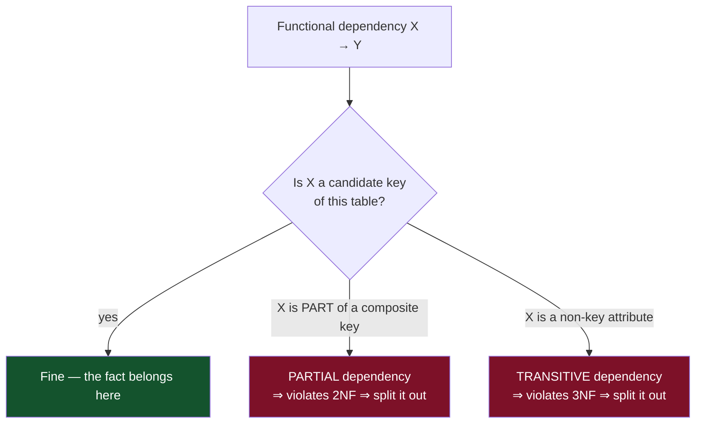
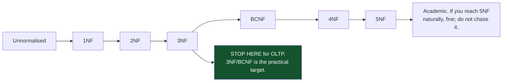
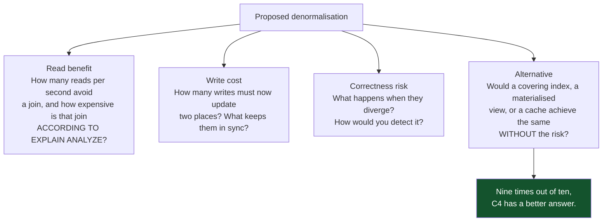
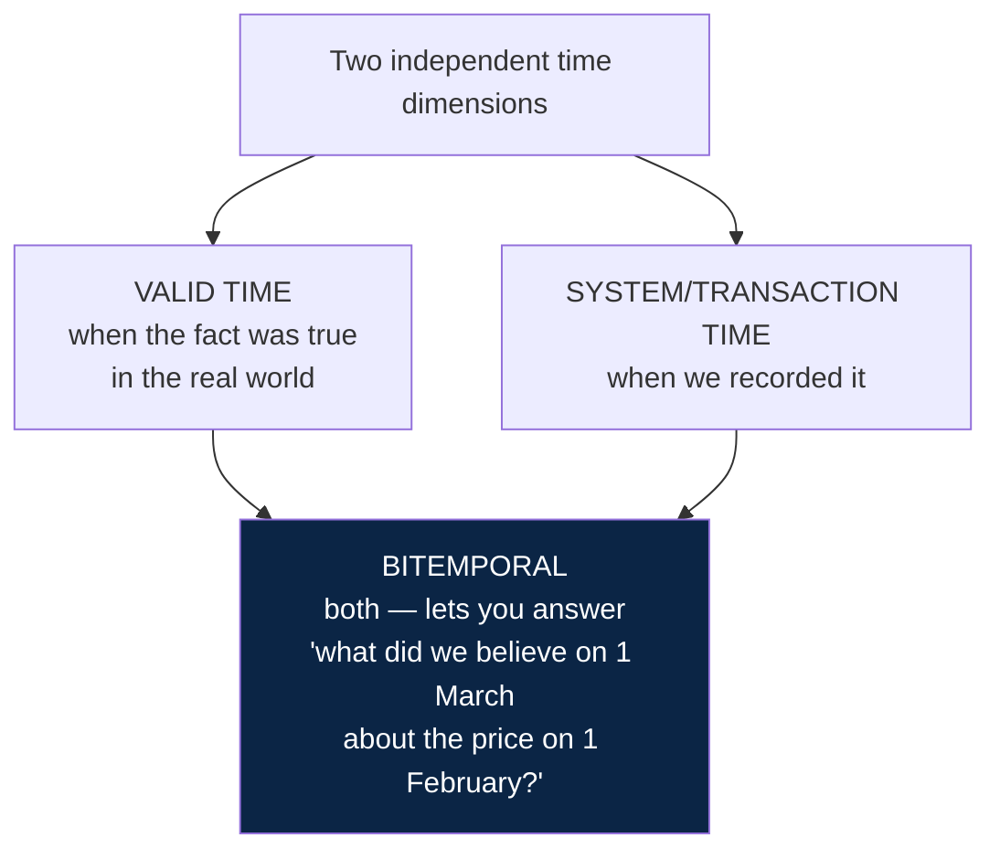
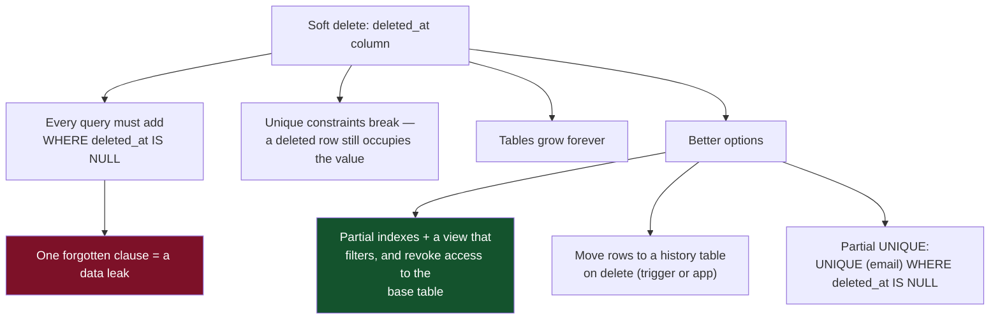

# 01 — Data Modelling and Normalisation

*Functional dependencies, every normal form worked through, and the economics of denormalisation.*

[← back to the handbook](../README.md)

---

## 1. Functional dependencies

Normalisation is built on one idea: **X → Y** ("X determines Y") means that for any
two rows with the same X, the Y values must also be the same.

```
order_id      → customer_id, placed_at, status
customer_id   → customer_name, customer_email
product_id    → product_name, current_price
(order_id, product_id) → quantity, unit_price_at_purchase
```

A **candidate key** is a minimal set of attributes that functionally determines every
other attribute. Normalisation is the process of ensuring that **every functional
dependency has a candidate key on its left-hand side** — that every fact depends on
the key, the whole key, and nothing but the key.



---

## 2. The normal forms, worked

Start from a single flat table and normalise it step by step.

### 2.0 Unnormalised

| order_id | customer | cust_email | cust_city | items | order_total |
|---|---|---|---|---|---|
| 1 | Ahmed | a@x.com | Cairo | "Widget:2:10, Gadget:1:25" | 45 |
| 2 | Sara | s@y.com | Giza | "Widget:1:10" | 10 |

Problems: `items` is not atomic; customer facts repeat per order; `order_total` is
derivable.

### 2.1 → 1NF: atomic values, no repeating groups

```sql
orders(order_id PK, customer, cust_email, cust_city, order_total)
order_items(order_id, product, qty, unit_price)   -- PK (order_id, product)
```

| order_id | product | qty | unit_price |
|---|---|---|---|
| 1 | Widget | 2 | 10 |
| 1 | Gadget | 1 | 25 |
| 2 | Widget | 1 | 10 |

> **What 1NF actually forbids** is a *repeating group* — several values of the same
> kind crammed into one cell or spread over `item1`, `item2`, `item3` columns. A
> native array or JSONB column used as a genuine single value (a set of tags, a
> configuration blob) is not a 1NF violation in modern practice; a comma-separated
> string you intend to search is.

### 2.2 → 2NF: no partial dependencies on a composite key

In `order_items`, the key is `(order_id, product)`. But `unit_price` at the time of
this schema depends only on `product` — half the key. That is a partial dependency.

```sql
products(product_id PK, name, current_price)
order_items(order_id, product_id, qty, unit_price_at_purchase)  -- PK (order_id, product_id)
```

Note the rename: `unit_price_at_purchase` now depends on the *whole* key, because the
price paid genuinely varies per order. Recognising that distinction is the modelling
work; 2NF is just the trigger that made you look.

### 2.3 → 3NF: no transitive dependencies

In `orders`, `order_id → cust_email` only *through* the customer:
`order_id → customer → cust_email`. That is transitive.

```sql
customers(customer_id PK, name, email UNIQUE, city)
orders(order_id PK, customer_id FK, placed_at, status)
```

`order_total` is also removed — it is derivable from `order_items`. (Keeping it is a
legitimate *denormalisation* decision, discussed below; it is not part of the
normalised model.)

### 2.4 → BCNF: every determinant is a candidate key

3NF permits one residual anomaly. Consider course enrolment where each course is
taught in one room, and each room hosts one course:

```
enrolment(student_id, course_id, room)
FDs:  (student_id, course_id) → room      -- key determines room ✓
      room → course_id                    -- room determines course, but room is NOT a key ✗
```

This satisfies 3NF (`course_id` is a prime attribute) but still permits
inconsistency. BCNF requires splitting:

```sql
room_assignment(room PK, course_id)
enrolment(student_id, room)   -- course derived via room
```

BCNF decomposition can be **non-dependency-preserving** — some functional
dependencies may no longer be enforceable by a single table's constraints. That is
the reason 3NF, not BCNF, is the practical target for most designs.

### 2.5 → 4NF: no multi-valued dependencies

```
teacher_skills(teacher, subject, language)
-- a teacher's subjects and spoken languages are INDEPENDENT
-- storing them together forces a cartesian product:
--   Ahmed | Maths   | Arabic
--   Ahmed | Maths   | English
--   Ahmed | Physics | Arabic
--   Ahmed | Physics | English
```

Adding one language adds a row per subject. Split into two tables. 5NF handles the
rarer case where a table can be losslessly decomposed into three or more tables but
not into two; it is almost never encountered in practice.

---

## 3. Where to stop



For analytical schemas the answer inverts entirely: **star schemas are deliberately
denormalised to 2NF or lower**, because dimensions are read constantly, updated
rarely, and joining a normalised snowflake at query time costs far more than the
duplicated storage.

---

## 4. Denormalisation economics

Denormalisation is a trade with a measurable price on both sides.



### 4.1 The four legitimate cases

| Case | Example | Why it is safe |
|---|---|---|
| **Historical fact** | `unit_price_at_purchase`, `shipping_address_at_time` | Not redundancy at all — a different fact from the current value |
| **Engine-maintained** | Materialised view, generated column | The database owns correctness |
| **Read model in another store** | Search index, warehouse, cache | Duplication is the entire point; rebuild path is designed in |
| **Measured hot path** | A category name on a product page rendered 50k times/second | Verified with `EXPLAIN`, and the source column changes rarely |

### 4.2 Generated columns — denormalisation without the risk

```sql
-- PostgreSQL 12+
ALTER TABLE order_items
  ADD COLUMN line_total NUMERIC(19,4)
  GENERATED ALWAYS AS (qty * unit_price_at_purchase) STORED;

CREATE INDEX ON order_items (line_total);
```

The value is stored (so it is indexable and fast to read) and maintained by the
engine (so it cannot diverge). This is strictly better than an application-maintained
duplicate whenever the value is a pure function of other columns in the same row.

### 4.3 Counters, properly

The naive denormalised counter is the most common source of write contention in OLTP
systems. Three correct alternatives:

```sql
-- 1. Sharded counter — spread contention across N rows
CREATE TABLE post_comment_counts (
  post_id  bigint NOT NULL,
  shard    smallint NOT NULL,
  count    bigint NOT NULL DEFAULT 0,
  PRIMARY KEY (post_id, shard)
);
-- increment a random shard:
UPDATE post_comment_counts SET count = count + 1
 WHERE post_id = $1 AND shard = floor(random() * 16);
-- read:
SELECT sum(count) FROM post_comment_counts WHERE post_id = $1;

-- 2. Deferred aggregation — insert an event, roll up periodically
INSERT INTO counter_events (post_id, delta) VALUES ($1, 1);
-- a job every few seconds: aggregate and apply, then delete the events

-- 3. Compute on read when the count is small and indexed
SELECT count(*) FROM comments WHERE post_id = $1;   -- fine up to thousands
```

Option 3 is under-used. With an index on `comments(post_id)`, counting a few thousand
rows is an index-only scan taking well under a millisecond — and it can never be
wrong.

---

## 5. Modelling patterns worth knowing

### 5.1 Temporal data



```sql
CREATE TABLE product_prices (
  product_id  bigint      NOT NULL,
  price       numeric(19,4) NOT NULL,
  valid_from  timestamptz NOT NULL,
  valid_to    timestamptz,               -- NULL = currently valid
  recorded_at timestamptz NOT NULL DEFAULT now(),
  EXCLUDE USING gist (
    product_id WITH =,
    tstzrange(valid_from, valid_to) WITH &&
  )   -- the database itself forbids overlapping validity periods
);
```

The `EXCLUDE` constraint is the point: overlapping price periods become *impossible*
rather than merely discouraged. This is the kind of invariant that application code
gets wrong under concurrency and the database gets right by construction.

### 5.2 Soft deletion



### 5.3 Audit trails

```sql
CREATE TABLE orders_history (
  history_id  bigserial PRIMARY KEY,
  order_id    bigint      NOT NULL,
  operation   char(1)     NOT NULL CHECK (operation IN ('I','U','D')),
  changed_at  timestamptz NOT NULL DEFAULT now(),
  changed_by  text        NOT NULL,
  old_row     jsonb,
  new_row     jsonb
);
```

A trigger-based audit table captures everything including changes made from a console
session — which is precisely the case an application-level audit misses and
compliance asks about. The cost is a write amplification of roughly 2× on audited
tables, so audit selectively.

---

## 6. Checklist

```
□ Every table has a primary key
□ Primary keys are surrogate, narrow and immutable (BIGINT or UUIDv7)
□ Natural keys have UNIQUE constraints
□ Schema is at 3NF unless a denormalisation is documented with a reason
□ Historical facts (price paid, address used) are stored, not derived from current state
□ Every foreign key column is indexed
□ NOT NULL wherever the value is genuinely required
□ CHECK constraints encode the business rules that can be expressed
□ Money is NUMERIC or integer minor units, never FLOAT
□ Timestamps are TIMESTAMPTZ
□ Enumerations are constrained, not free text
□ Derived values are GENERATED columns or materialised views, not app-maintained copies
□ Soft deletion, if used, is protected by partial unique indexes and a filtered view
```

---

[← back to the handbook](../README.md) · [next: Storage engines and indexes →](02-storage-engines-and-indexes.md)
