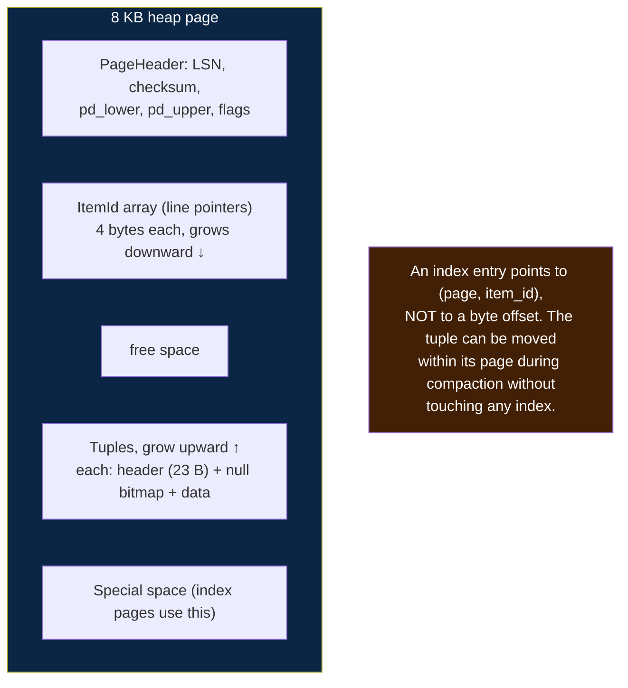
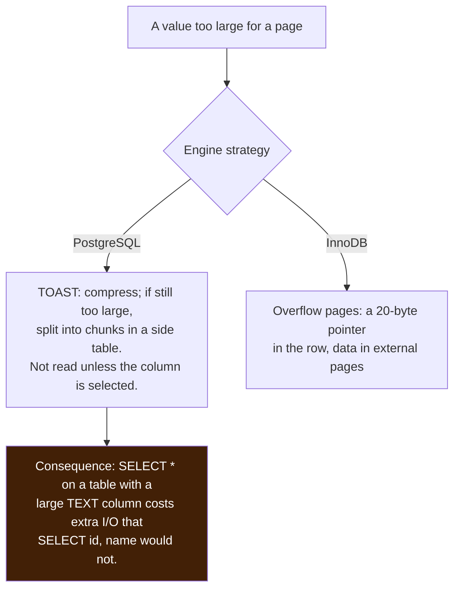
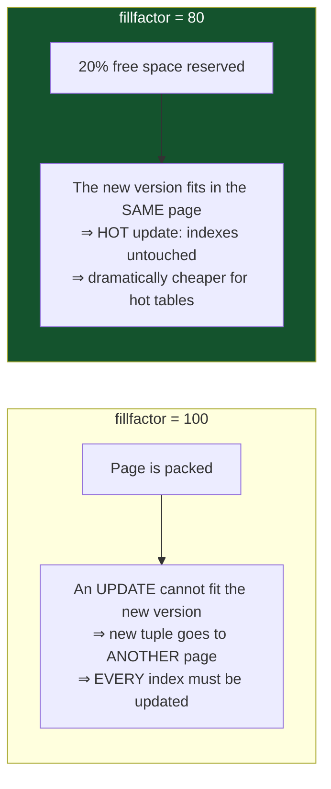
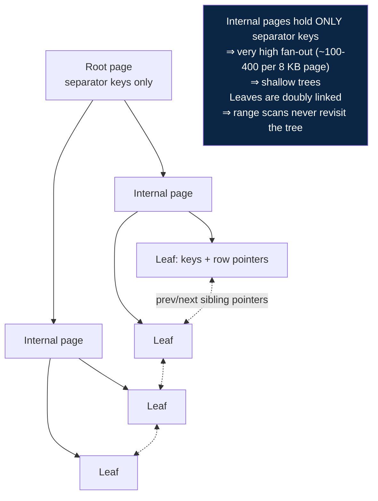
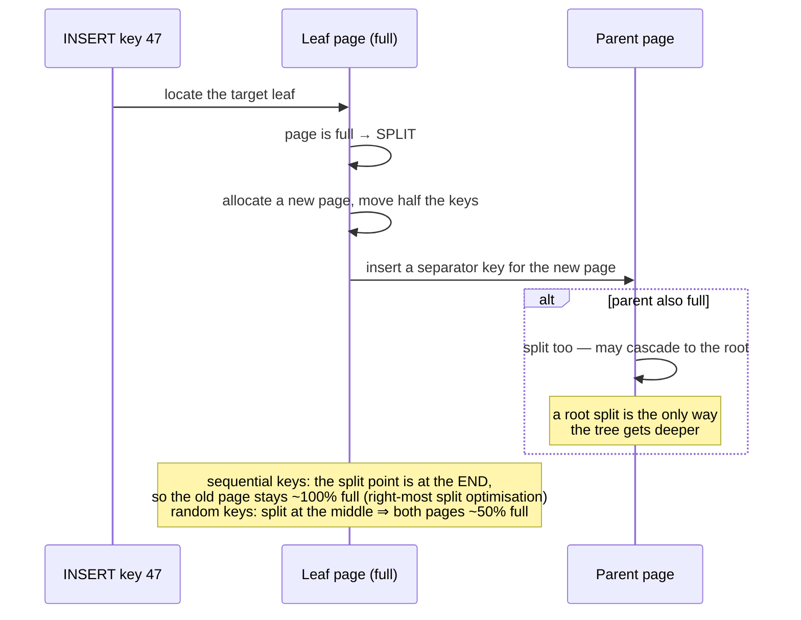
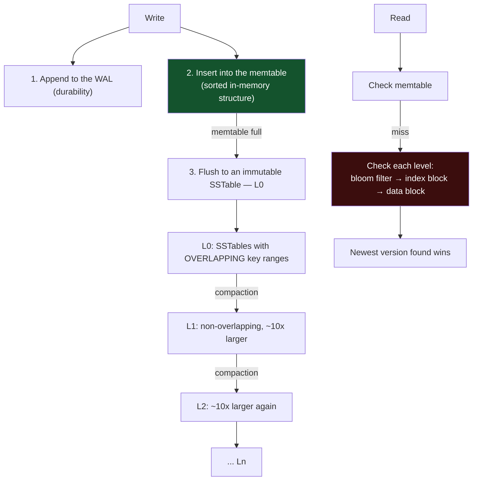
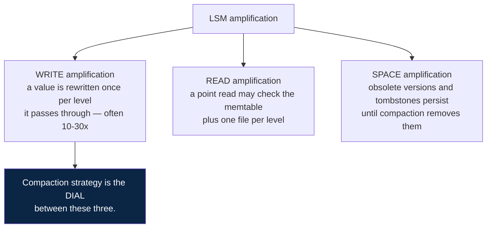
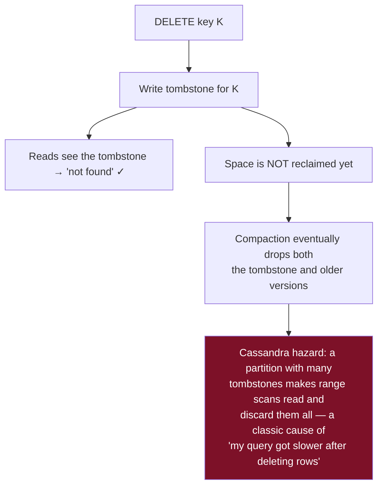
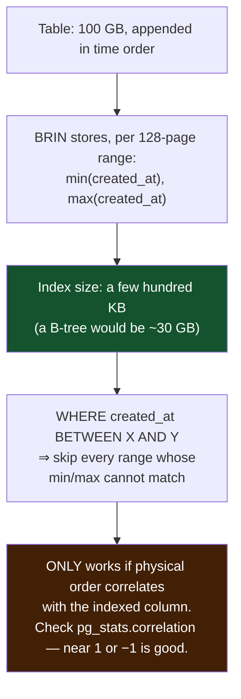
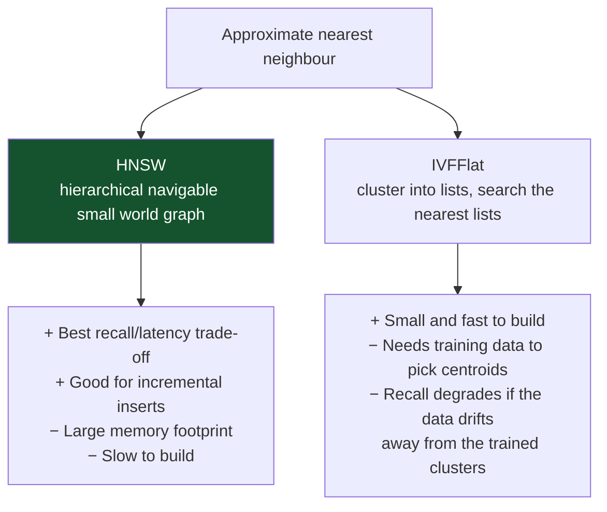

# 02 — Storage Engines and Indexes

*Pages, heap files, B+Tree mechanics, LSM and compaction, and every index type in depth.*

[← back to the handbook](../README.md)

---

## 1. Pages and tuples



### 1.1 Per-row overhead is not negligible

A PostgreSQL heap tuple carries a 23-byte header plus alignment padding, plus a
4-byte line pointer. A table of `(bigint, bigint)` — 16 bytes of actual data — costs
roughly 40 bytes per row on disk. **Narrow tables are dominated by overhead**, which
is one reason very wide "one row per metric" designs perform poorly compared with
storing an array or using a purpose-built time-series layout.

Column order matters too, because of alignment:

```sql
-- 24 bytes of data, but padding pushes it higher
CREATE TABLE bad  (a smallint, b bigint, c smallint, d bigint);
-- same columns, ordered widest-first: less padding
CREATE TABLE good (b bigint, d bigint, a smallint, c smallint);
```

On a billion-row table this is gigabytes of pure padding.

### 1.2 Oversized values



### 1.3 Fill factor and HOT updates



A **HOT (Heap-Only Tuple) update** requires two conditions: the new version fits in
the same page, and **no indexed column changed**. When both hold, the update costs one
page write instead of one page write plus N index writes. Lowering `fillfactor` to
70–90 on frequently-updated tables is one of the cheapest wins available — and it is
also why you should avoid indexing columns that change constantly.

---

## 2. B+Tree in depth

### 2.1 Structure and fan-out



| Rows | Fan-out 200 | Page reads for a lookup |
|---|---|---|
| 40,000 | depth 2 | 2 (both cached) |
| 8,000,000 | depth 3 | 3 (top 2 cached) |
| 1,600,000,000 | depth 4 | 4 (top 2–3 cached) |

**This is why table size barely affects indexed lookup latency.** A billion-row table
costs one more page read than an eight-million-row table.

### 2.2 Splits and their cost



This is the mechanism behind the UUIDv4 penalty: random inserts split pages in the
middle, so the index settles at roughly 50–70% fill and occupies nearly twice the
space, with correspondingly worse cache behaviour.

### 2.3 Index maintenance costs on write

| Operation | Index work |
|---|---|
| `INSERT` | One tree descent + leaf insert per index, plus splits |
| `UPDATE` of an unindexed column (HOT) | **Zero index work** |
| `UPDATE` of an indexed column | Delete + insert in that index, and in a non-HOT case, in *every* index |
| `DELETE` | Mark dead; actual removal happens at vacuum/purge time |

The asymmetry between the second and third rows is why "which columns do we index?"
is really the question "which columns change rarely?"

---

## 3. LSM trees in depth



### 3.1 The three amplifications



| Strategy | Write amp | Read amp | Space amp | Use for |
|---|---|---|---|---|
| **Levelled** | High | **Low** | **Low** | Read-heavy; the default in RocksDB |
| **Size-tiered** | **Low** | High | High (up to 2×) | Write-heavy; Cassandra's default |
| **Time-window** | Low | Low for time queries | Low | Time-series with TTL — whole SSTables expire together |
| **Universal / hybrid** | Medium | Medium | Medium | General purpose |

### 3.2 Bloom filters

Without a bloom filter, a point read for a non-existent key must check every level.
A bloom filter per SSTable answers "definitely not present" in constant time with no
I/O.

```
false positive rate ≈ (1 − e^(−kn/m))^k
  m = bits, n = keys, k = hash functions
  ~10 bits per key ⇒ ~1% false positives
  ~15 bits per key ⇒ ~0.1%
```

No false negatives means a "not present" answer is always trustworthy, which is
exactly the guarantee needed to skip a file safely.

### 3.3 Tombstones

Deleting in an LSM writes a **tombstone**, not a removal. The tombstone must survive
until compaction has merged past every older version of that key across all levels —
otherwise the deleted value would resurface.



---

## 4. Index types in depth

### 4.1 GIN — inverted index


```sql
CREATE INDEX ON articles USING gin (tags);              -- array containment
CREATE INDEX ON articles USING gin (metadata jsonb_path_ops);  -- JSONB @>
CREATE INDEX ON articles USING gin (to_tsvector('english', body));  -- full text
CREATE INDEX ON products USING gin (name gin_trgm_ops); -- LIKE '%infix%'
```

GIN is slow to update (each row touches many posting lists), which is why Postgres
buffers pending insertions in a "fastupdate" list and merges them in batches. That
buffer is also why GIN index size and query speed can fluctuate until a vacuum runs.

### 4.2 GiST — generalised search tree

A framework, not one structure: it lets a data type define `consistent`, `union`,
`penalty` and `picksplit` operations, and gets a balanced tree for free. Used by:

| Use | Operator |
|---|---|
| Geometric containment / overlap (PostGIS) | `&&`, `@>`, `<->` for nearest neighbour |
| Range overlap | `&&` on `tstzrange`, `int4range` |
| **Exclusion constraints** | The mechanism behind "no two bookings may overlap" |
| Trigram similarity | `%`, `<->` |

```sql
-- the database refuses overlapping bookings for the same room
ALTER TABLE bookings ADD CONSTRAINT no_double_booking
  EXCLUDE USING gist (room_id WITH =, during WITH &&);
```

### 4.3 BRIN — block range index



BRIN is the right answer for append-only event and log tables and is almost always
overlooked. Its weakness is precisely its strength inverted: after heavy updates or
random inserts, correlation degrades and the index becomes useless without a
`CLUSTER` or a rewrite.

### 4.4 Hash indexes

Support only `=`. In PostgreSQL they became WAL-logged and crash-safe in version 10,
but their advantage over a B-tree is small (a B-tree equality lookup is already 3–4
page reads) and they cannot be used for sorting, ranges, or uniqueness. They are
worth considering only for very large keys where the hash is much smaller than the
value.

### 4.5 Vector indexes



Both are **approximate**: they trade recall for speed, tuned by parameters
(`ef_search` for HNSW, `probes` for IVFFlat). A vector index that returns the wrong
neighbours is not broken — it is configured for speed. Measure recall against an
exact brute-force baseline on a sample before choosing parameters.

---

## 5. Index strategy

### 5.1 Finding the indexes you need

```sql
-- queries doing the most sequential scanning
SELECT relname, seq_scan, seq_tup_read,
       seq_tup_read / nullif(seq_scan, 0) AS avg_rows_per_scan,
       idx_scan
FROM pg_stat_user_tables
WHERE seq_scan > 0
ORDER BY seq_tup_read DESC
LIMIT 20;

-- foreign keys with no index (a very common, very expensive omission)
SELECT c.conrelid::regclass AS table, a.attname AS column
FROM pg_constraint c
JOIN unnest(c.conkey) WITH ORDINALITY AS k(attnum, ord) ON true
JOIN pg_attribute a ON a.attrelid = c.conrelid AND a.attnum = k.attnum
WHERE c.contype = 'f'
  AND NOT EXISTS (
    SELECT 1 FROM pg_index i
    WHERE i.indrelid = c.conrelid
      AND (i.indkey::smallint[])[0] = k.attnum
  );
```

### 5.2 Finding the indexes you do not need

```sql
-- unused indexes: pure write cost and disk
SELECT s.relname, s.indexrelname, s.idx_scan,
       pg_size_pretty(pg_relation_size(s.indexrelid)) AS size
FROM pg_stat_user_indexes s
JOIN pg_index i ON i.indexrelid = s.indexrelid
WHERE s.idx_scan < 50
  AND NOT i.indisunique          -- keep unique indexes; they enforce constraints
  AND NOT i.indisprimary
ORDER BY pg_relation_size(s.indexrelid) DESC;
```

Also look for **redundant** indexes: an index on `(a)` is redundant if `(a, b)`
exists, since the composite serves every query the single-column index would. Dropping
the redundant one reduces write cost with no read regression.

Caveat before dropping anything: `idx_scan` counters reset on restart and are
per-instance. Check across replicas and over a full business cycle — an index used
only by the monthly reporting job will look unused for 29 days.

### 5.3 A worked index design

```sql
-- the query
SELECT o.id, o.total, o.placed_at
FROM orders o
WHERE o.tenant_id = $1
  AND o.status IN ('paid','shipped')
  AND o.placed_at >= $2
ORDER BY o.placed_at DESC
LIMIT 50;

-- the index
CREATE INDEX orders_tenant_status_placed
  ON orders (tenant_id, status, placed_at DESC)
  INCLUDE (total);
```

Why this shape:

1. `tenant_id` — equality, highest selectivity, always present. First.
2. `status` — equality (an `IN` list works as a series of equality probes). Second.
3. `placed_at DESC` — the range predicate *and* the sort. Third, in the sort's
   direction, so no separate sort step is needed.
4. `INCLUDE (total)` — needed for output but not for filtering, so it rides in the
   leaf without widening the tree's internal pages. This makes the query an
   **index-only scan**: 50 index entries read, heap never touched.

---

[← previous: Data modelling](01-data-modelling-and-normalization.md) · [back to the handbook](../README.md) · [next: Query planning →](03-query-planning-and-optimization.md)
