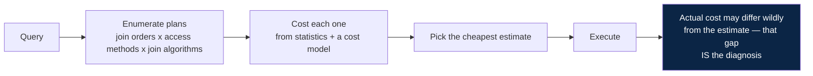
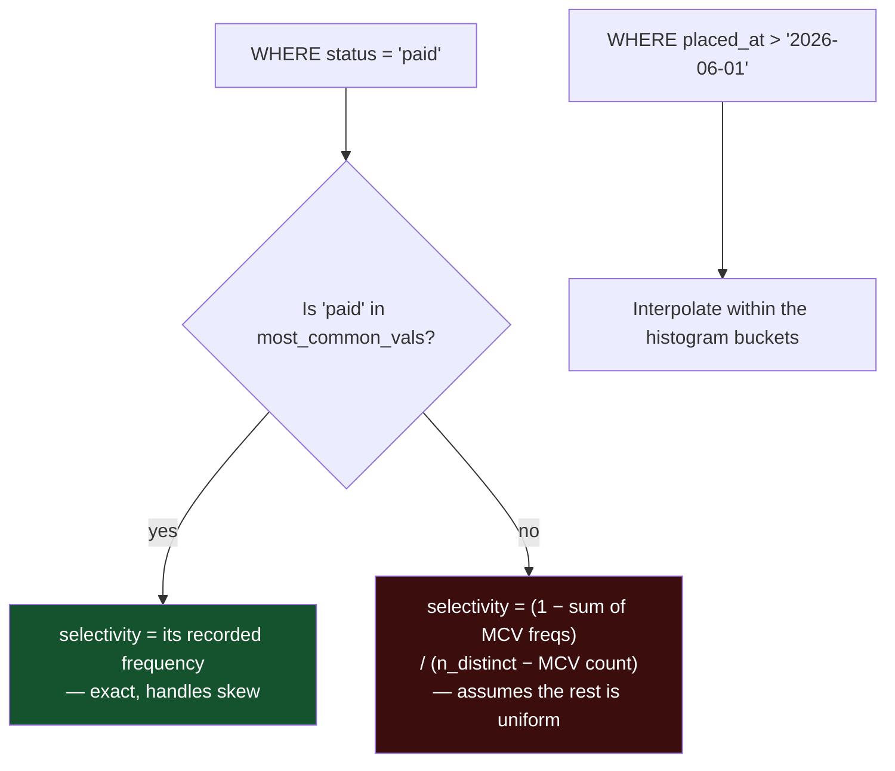
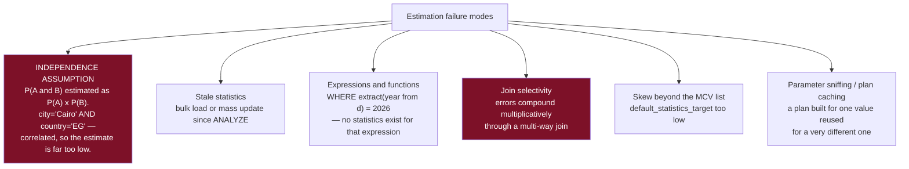
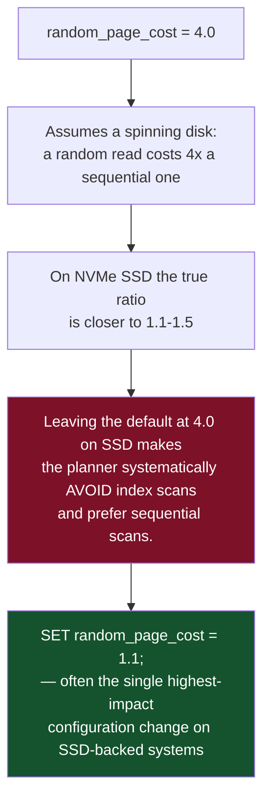
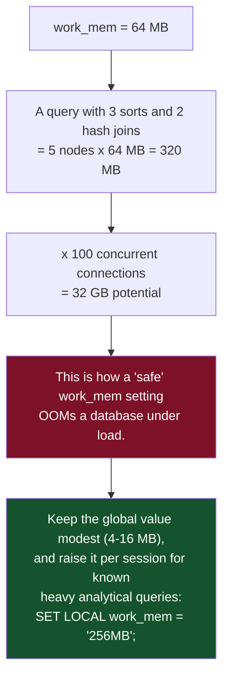
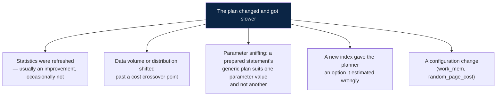

# 03 — Query Planning and Optimisation

*Statistics, cardinality estimation, cost models, and reading EXPLAIN like a diagnostic tool.*

[← back to the handbook](../README.md)

---

## 1. Why the planner exists

SQL says *what*, not *how*. For a five-table join there may be hundreds of valid
execution strategies differing in runtime by four orders of magnitude. The planner's
job is to pick one without running any of them — which means every decision rests on
**estimates**, and every bad plan is ultimately an estimation failure.



---

## 2. Statistics

### 2.1 What is collected

`ANALYZE` samples the table (Postgres: `default_statistics_target × 300` rows,
default 30,000) and stores:

| Statistic | Column | Used for |
|---|---|---|
| `reltuples`, `relpages` | `pg_class` | Sequential scan cost |
| `n_distinct` | `pg_stats` | Selectivity of `col = ?` ≈ `1/n_distinct` |
| `most_common_vals` / `most_common_freqs` | `pg_stats` | Exact selectivity for skewed values |
| `histogram_bounds` | `pg_stats` | Selectivity of ranges |
| `correlation` | `pg_stats` | Whether an index scan will read pages sequentially |
| `null_frac` | `pg_stats` | `IS NULL` selectivity |
| `avg_width` | `pg_stats` | Row width, memory estimates |

```sql
SELECT attname, n_distinct, null_frac, correlation,
       most_common_vals[1:3] AS top_values,
       most_common_freqs[1:3] AS top_freqs
FROM pg_stats
WHERE tablename = 'orders';
```

### 2.2 How selectivity is computed



### 2.3 Where estimation breaks



### 2.4 Fixing estimates

```sql
-- 1. Refresh statistics
ANALYZE orders;

-- 2. More detail on a skewed column
ALTER TABLE orders ALTER COLUMN status SET STATISTICS 1000;
ANALYZE orders;

-- 3. Teach the planner about correlation (PostgreSQL 10+)
CREATE STATISTICS orders_geo (dependencies, ndistinct, mcv)
  ON city, country FROM orders;
ANALYZE orders;

-- 4. Index the expression so statistics exist for it
CREATE INDEX ON orders (extract(year FROM placed_at));
ANALYZE orders;
```

Extended statistics are consistently under-used and frequently fix a "the planner is
stupid" complaint outright. `dependencies` handles functional dependence between
columns; `mcv` handles skewed *combinations*; `ndistinct` fixes `GROUP BY` estimates
on multiple columns.

---

## 3. The cost model

```
cost = seq_page_cost      x sequential pages read      (default 1.0)
     + random_page_cost   x random pages read          (default 4.0)
     + cpu_tuple_cost     x rows processed             (default 0.01)
     + cpu_index_tuple_cost x index entries processed  (default 0.005)
     + cpu_operator_cost  x operators evaluated        (default 0.0025)
```



`effective_cache_size` is the other under-set parameter. It does not allocate
anything — it tells the planner how much data is likely cached, which strongly
influences whether repeated index lookups are considered cheap. Set it to roughly
50–75% of system RAM.

---

## 4. Reading EXPLAIN

### 4.1 The right invocation

```sql
EXPLAIN (ANALYZE, BUFFERS, VERBOSE, SETTINGS, FORMAT TEXT)
SELECT ...;
```

| Option | Gives you |
|---|---|
| `ANALYZE` | **Actually runs it** — real times and row counts |
| `BUFFERS` | Cache hits vs disk reads per node — reveals I/O problems |
| `VERBOSE` | Output column lists, schema-qualified names |
| `SETTINGS` | Non-default parameters affecting the plan |
| `WAL` | WAL generated (for write statements) |

> `EXPLAIN ANALYZE` on an `INSERT`/`UPDATE`/`DELETE` **executes it**. Wrap it in a
> transaction and roll back.

### 4.2 A plan with a problem

```
Nested Loop  (cost=0.86..4821.03 rows=12 width=48)
             (actual time=0.042..38294.117 rows=1284003 loops=1)
  Buffers: shared hit=2841002 read=193884
  ->  Index Scan using idx_orders_status on orders o
        (cost=0.43..982.11 rows=12 width=24)
        (actual time=0.021..412.882 rows=1284003 loops=1)
        Index Cond: (status = 'pending'::text)
  ->  Index Scan using customers_pkey on customers c
        (cost=0.43..0.52 rows=1 width=32)
        (actual time=0.026..0.028 rows=1 loops=1284003)
        Index Cond: (id = o.customer_id)
Planning Time: 0.412 ms
Execution Time: 38491.203 ms
```

Diagnosis, in order:

1. **`rows=12` estimated, `rows=1284003` actual** — a 107,000× underestimate. That is
   the whole problem; everything else is a consequence.
2. Because it expected 12 rows, the planner chose a **nested loop**. Twelve index
   lookups would be ideal.
3. `loops=1284003` on the inner node — 1.28 million index lookups. Each takes
   0.028 ms, which is fast; 1.28 million of them take 36 seconds.
4. Root cause: `status = 'pending'` was estimated as rare. Either statistics are stale
   (a backlog built up since the last `ANALYZE`) or `'pending'` fell outside the MCV
   list.

Fix the estimate (`ANALYZE`, raise the statistics target) and the planner will switch
to a hash join on its own. Forcing the join type would treat the symptom.

### 4.3 What to look for, ranked

| Signal | Meaning | Action |
|---|---|---|
| Estimated vs actual rows differ >10× | Estimation failure | `ANALYZE`, extended statistics, rewrite |
| High `loops=` on an inner node | Nested loop over a large outer | Fix the estimate |
| `Seq Scan` on a large table with a selective filter | Missing or unusable index | Add or fix the index |
| `Rows Removed by Filter` large | Rows fetched then thrown away | Move the predicate into the index |
| `Sort Method: external merge Disk: NkB` | Sort spilled | Raise `work_mem` for this query |
| `Buffers: read` high relative to `hit` | Working set exceeds cache | More RAM, or reduce data touched |
| `Heap Fetches:` high on an index-only scan | Visibility map stale | `VACUUM` the table |
| `Batches: 4` on a hash join | Hash spilled to disk | Raise `work_mem` |
| Planning time comparable to execution time | Very short query, many partitions or indexes | Prepared statements, fewer partitions |

### 4.4 work_mem is per-node, per-connection



---

## 5. Rewrites that change plans

### 5.1 `NOT IN` vs `NOT EXISTS`

```sql
-- ✗ returns ZERO rows if the subquery yields any NULL. Silent, total, wrong.
SELECT * FROM orders WHERE customer_id NOT IN (SELECT id FROM banned_customers);

-- ✓ NULL-safe, and usually plans as an anti-join
SELECT * FROM orders o
WHERE NOT EXISTS (SELECT 1 FROM banned_customers b WHERE b.id = o.customer_id);
```

### 5.2 `OR` across columns

```sql
-- ✗ often forces a sequential scan — no single index serves both branches
SELECT * FROM users WHERE email = $1 OR phone = $1;

-- ✓ each branch uses its own index
SELECT * FROM users WHERE email = $1
UNION
SELECT * FROM users WHERE phone = $1;
```

Postgres can sometimes combine two indexes with a **bitmap OR**, so check `EXPLAIN`
before rewriting — but when it does not, the `UNION` form is reliable.

### 5.3 Sargable predicates

```sql
-- ✗ not sargable — the function blocks index use
WHERE date_trunc('day', created_at) = '2026-08-20'
WHERE created_at + interval '1 day' > now()
WHERE upper(email) = 'A@X.COM'
WHERE cast(id AS text) = '42'

-- ✓ sargable — the column stands alone on one side
WHERE created_at >= '2026-08-20' AND created_at < '2026-08-21'
WHERE created_at > now() - interval '1 day'
WHERE email = lower('A@X.COM')       -- with a lower(email) expression index
WHERE id = 42
```

### 5.4 Lateral joins for top-N-per-group

```sql
-- ✗ window function: sorts EVERY order for every customer, then filters
SELECT * FROM (
  SELECT o.*, row_number() OVER (PARTITION BY customer_id ORDER BY placed_at DESC) rn
  FROM orders o
) t WHERE rn <= 3;

-- ✓ lateral: 3 index reads per customer, stops early
SELECT c.id, o.*
FROM customers c
CROSS JOIN LATERAL (
  SELECT * FROM orders o
  WHERE o.customer_id = c.id
  ORDER BY o.placed_at DESC
  LIMIT 3
) o;
```

With an index on `orders(customer_id, placed_at DESC)`, the lateral form is
frequently one to two orders of magnitude faster because it never materialises or
sorts the full set.

### 5.5 Existence checks

```sql
-- ✗ counts every matching row just to compare against zero
SELECT count(*) FROM orders WHERE customer_id = $1;   -- then: if count > 0

-- ✓ stops at the first match
SELECT EXISTS (SELECT 1 FROM orders WHERE customer_id = $1);
```

---

## 6. Plan stability



PostgreSQL's prepared statements use custom plans for the first five executions, then
compare against a generic plan and choose. For a query whose selectivity varies
enormously by parameter — `WHERE tenant_id = ?` where one tenant holds 90% of rows —
the generic plan can be badly wrong for some callers. `plan_cache_mode =
force_custom_plan` disables the generic plan at the cost of replanning each time.

Postgres has no hints by design; the intended levers are statistics, indexes, cost
parameters, and query rewriting. MySQL, Oracle and SQL Server all offer hints, which
are useful for firefighting and become a maintenance liability if left in place —
they freeze a decision that was correct for last year's data.

---

## 7. A tuning procedure

```
1. Find the query           pg_stat_statements ORDER BY total_exec_time DESC
                            (not mean_exec_time — frequency matters more than duration)
2. Reproduce it             with realistic parameters, on realistic data volume
3. EXPLAIN (ANALYZE, BUFFERS)
4. Compare estimated vs actual rows at every node — find the FIRST divergence
5. If estimates are wrong   → ANALYZE, statistics target, extended statistics
   If estimates are right   → the plan is genuinely the best available:
                              add an index, rewrite the query, or reduce the data touched
6. Re-measure               same query, same parameters, cold and warm cache
7. Check for regressions    did the new index slow down writes? did the rewrite
                            change results at the edges (NULLs, empty sets)?
```

Step 4 — finding the **first** divergence, working from the leaves upward — is the
skill. Errors propagate upward through a plan, so the topmost wrong estimate is
usually a symptom of a lower one.

---

[← previous: Storage engines and indexes](02-storage-engines-and-indexes.md) · [back to the handbook](../README.md) · [next: Transactions and ACID →](04-transactions-and-acid.md)
