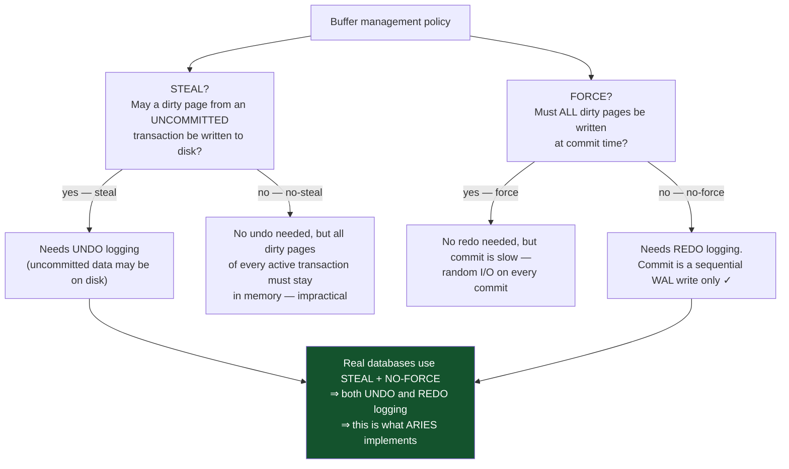
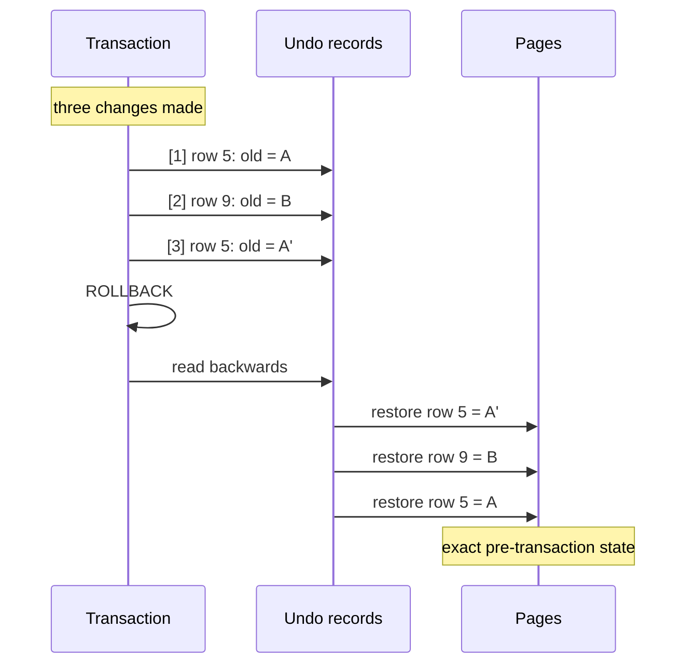
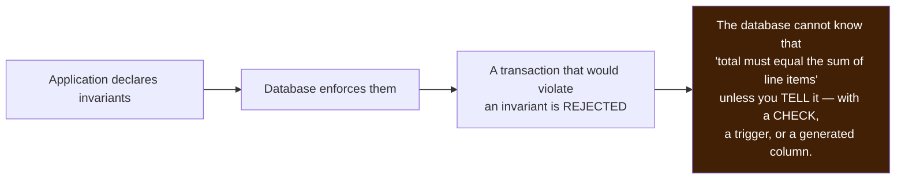
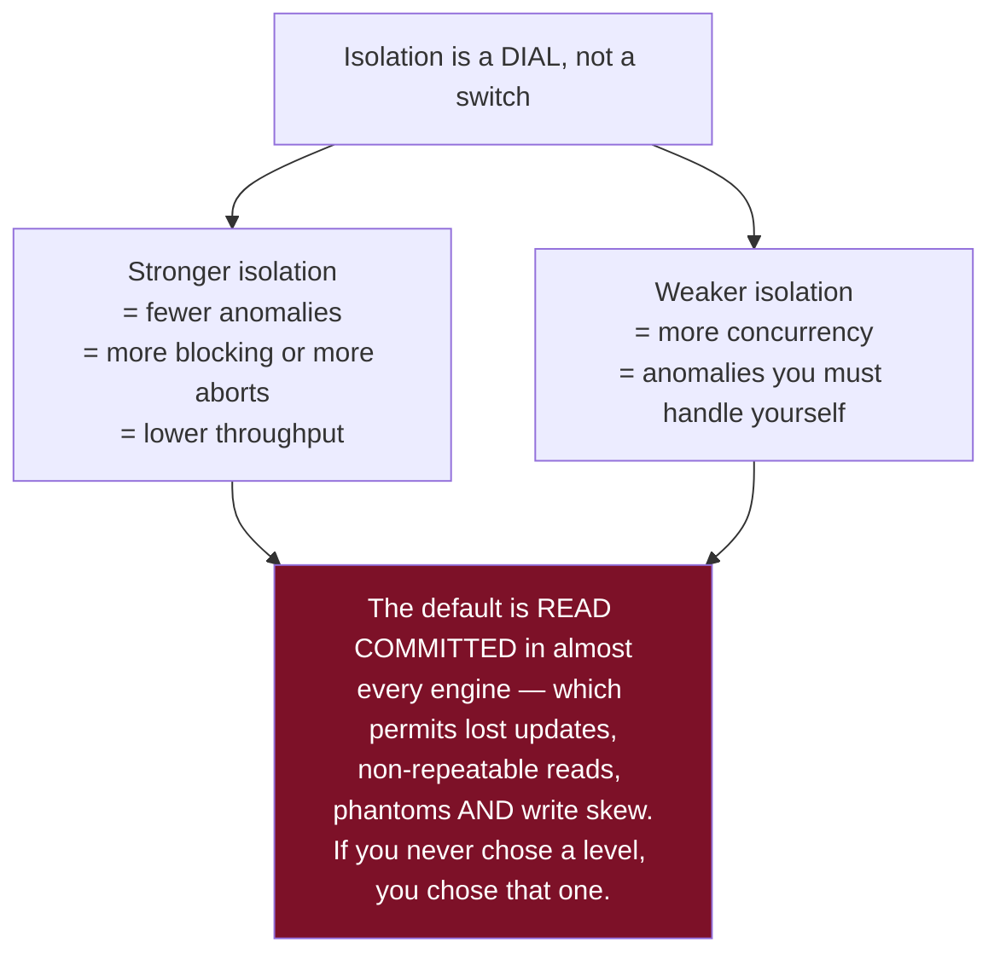
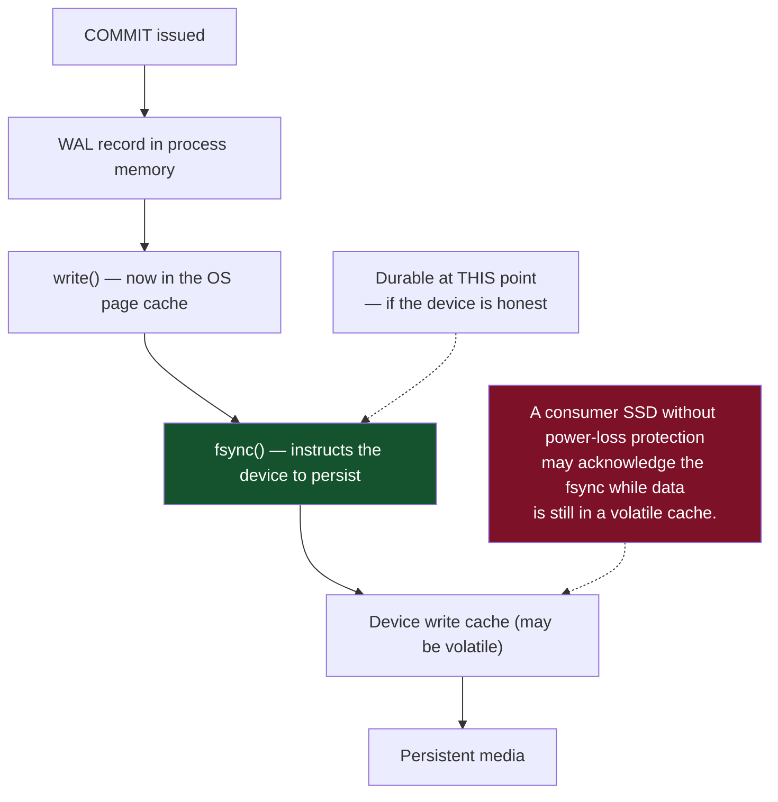
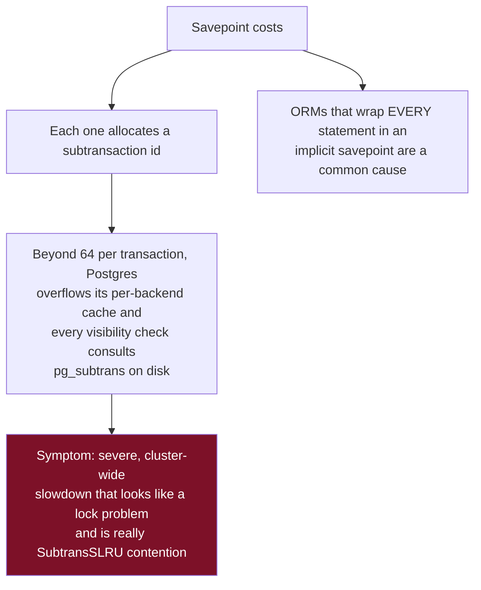
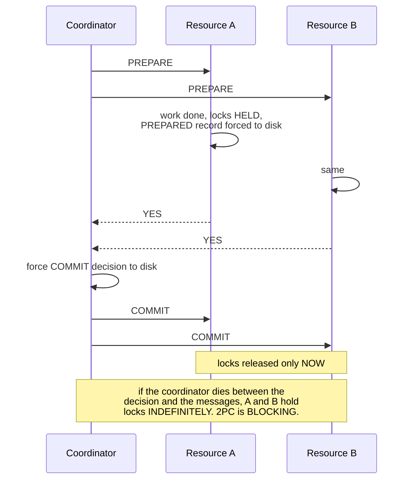
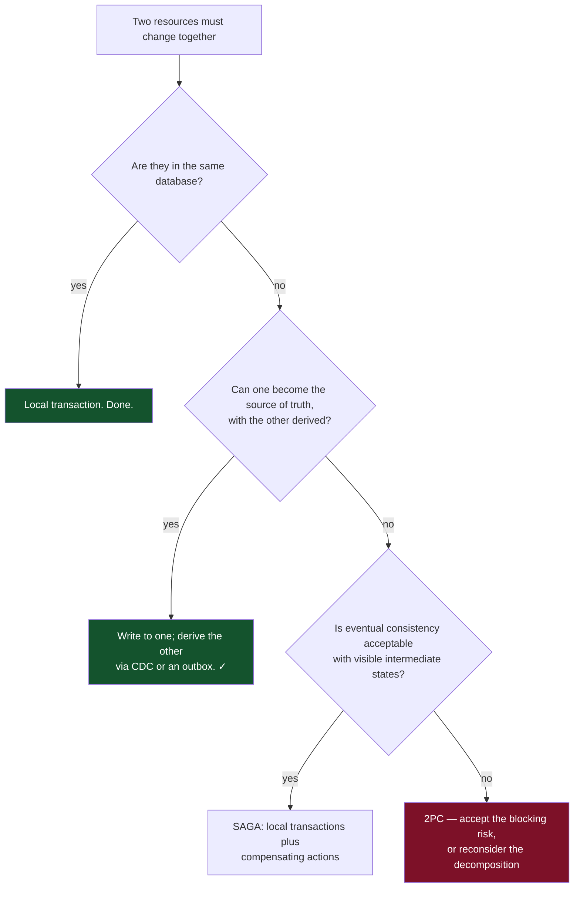
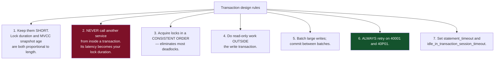

# 04 — Transactions and ACID

*Each letter mechanically, savepoints, distributed transactions, and transaction design.*

[← back to the handbook](../README.md)

---

## 1. Atomicity

### 1.1 Undo, redo and the two rules

Atomicity requires the ability to **undo**; durability requires the ability to
**redo**. Two rules govern when pages may be written:



Steal + no-force is chosen because it gives the best runtime behaviour: the buffer
manager can evict whatever it likes, and commit costs one sequential log write
rather than scattered page writes. The price is that recovery must do real work.

### 1.2 What rollback actually does



In an MVCC engine, rollback is often cheaper than this suggests: PostgreSQL simply
marks the transaction aborted in the commit log, and every version it created becomes
invisible instantly. The physical cleanup is deferred to vacuum. **This is why
`ROLLBACK` is O(1) in Postgres and O(changes) in InnoDB**, which must walk its undo
log — and it is why a rolled-back bulk update still leaves bloat behind in Postgres.

---

## 2. Consistency

The odd letter out. Atomicity, isolation and durability are properties the database
provides. **Consistency is a property the application defines and the database
enforces** — via constraints, foreign keys, types, triggers and checks.



The practical implication is the one stated throughout this handbook: **an invariant
enforced only in application code is not enforced.** There is always a second code
path — a migration, an admin console, a background job, a bulk import, a bug fix
applied by hand at 2 am.

---

## 3. Isolation

Covered mechanically in [05](05-isolation-levels-and-anomalies.md) and
[06](06-locking-and-concurrency-control.md). The essential framing here:



---

## 4. Durability

### 4.1 The layers



### 4.2 Durability settings and what they cost

| Setting | Behaviour | Loses on crash |
|---|---|---|
| `synchronous_commit = on` (PG) | fsync WAL before acking | Nothing |
| `synchronous_commit = off` (PG) | Ack immediately, fsync within `wal_writer_delay` | Up to ~3× the delay of recent commits. **The database stays consistent** — only the most recent transactions vanish |
| `fsync = off` (PG) | Never fsync | **Everything, and the database may be corrupt.** Only for throwaway instances |
| `innodb_flush_log_at_trx_commit = 1` | fsync per commit | Nothing (the default, ACID-compliant) |
| `= 2` | Write to OS cache per commit, fsync once per second | Up to 1 s, **only on OS/machine crash** — a mysqld crash alone loses nothing |
| `= 0` | Write and fsync once per second | Up to 1 s on any crash |

`synchronous_commit = off` is a legitimate, well-understood trade for workloads where
losing a few hundred milliseconds of recent commits is acceptable — analytics
ingestion, telemetry, session updates. It can multiply write throughput. It must be a
documented decision, ideally applied per-transaction:

```sql
BEGIN;
SET LOCAL synchronous_commit = off;   -- this transaction only
INSERT INTO page_views ...;
COMMIT;
```

### 4.3 Durability beyond one machine


Each layer defends against a different adversary. Local fsync does nothing about a
dropped server; a replica does nothing about `DELETE FROM orders` — it replicates it
faithfully in milliseconds.

---

## 5. Savepoints and subtransactions

```sql
BEGIN;
  INSERT INTO orders (...) RETURNING id INTO v_order;

  SAVEPOINT items;
  BEGIN
    INSERT INTO order_items (...);
  EXCEPTION WHEN unique_violation THEN
    ROLLBACK TO SAVEPOINT items;
    UPDATE order_items SET qty = qty + 1 WHERE ...;
  END;
COMMIT;
```



Use savepoints deliberately, not by default. The common ORM pattern of "retry the
statement" via implicit savepoints is fine at low volume and pathological at high
volume.

---

## 6. Distributed transactions

### 6.1 Two-phase commit, and its cost



In PostgreSQL, prepared transactions (`PREPARE TRANSACTION`) are disabled by default
(`max_prepared_transactions = 0`) for exactly this reason: an orphaned prepared
transaction holds locks and pins the vacuum horizon **forever**, silently bloating the
database until someone finds it in `pg_prepared_xacts`. If you enable them, you must
monitor for orphans.

### 6.2 When you actually need it, and when you do not



### 6.3 The transactional outbox

The standard answer to "write to the database and publish an event atomically":

```sql
BEGIN;
  INSERT INTO orders (id, customer_id, total) VALUES (...);
  INSERT INTO outbox (aggregate_id, event_type, payload)
  VALUES (..., 'OrderPlaced', jsonb_build_object(...));
COMMIT;
-- a relay (or CDC on the outbox table) publishes afterwards, at least once
```

One commit, so either both rows exist or neither does. The relay is at-least-once by
construction, which is fine — consumers must be idempotent anyway.

---

## 7. Transaction design

### 7.1 Rules



### 7.2 The retry wrapper every application needs

```python
import random, time
import psycopg

RETRYABLE = {"40001", "40P01"}   # serialization_failure, deadlock_detected

def run_in_transaction(conn, fn, max_attempts=5):
    for attempt in range(max_attempts):
        try:
            with conn.transaction():
                return fn(conn)
        except psycopg.errors.Error as e:
            if e.sqlstate not in RETRYABLE or attempt == max_attempts - 1:
                raise
            # exponential backoff with full jitter
            time.sleep(random.uniform(0, min(1.0, 0.02 * (2 ** attempt))))
```

Two details that matter: **full jitter** (not a fixed backoff), because retrying
transactions collide with each other exactly as retrying HTTP clients do; and a
**bounded attempt count**, because an unbounded retry loop under sustained contention
becomes a self-inflicted denial of service.

### 7.3 Timeouts to set

```sql
-- per session or per role
SET statement_timeout = '30s';                          -- kill runaway queries
SET lock_timeout = '5s';                                -- do not queue forever
SET idle_in_transaction_session_timeout = '60s';        -- kill forgotten BEGINs
```

`idle_in_transaction_session_timeout` is the one that prevents the single most common
cause of runaway bloat: a connection that opened a transaction and then went off to
do something else — or crashed without closing.

---

## 8. Checklist

```
□ Transaction boundaries are explicit and as short as possible
□ No network calls to other services inside a transaction
□ Locks acquired in a consistent order (e.g. ascending primary key)
□ Retry-on-40001/40P01 wrapper exists and is used everywhere
□ statement_timeout, lock_timeout and idle_in_transaction_session_timeout set
□ Durability setting is a documented decision, not a default nobody examined
□ Savepoints used sparingly; the ORM is not creating one per statement
□ max_prepared_transactions is 0 unless XA is genuinely needed and monitored
□ Outbox pattern used for "write plus publish an event"
□ Longest-running-transaction metric is monitored and alerted
```

---

[← previous: Query planning](03-query-planning-and-optimization.md) · [back to the handbook](../README.md) · [next: Isolation levels and anomalies →](05-isolation-levels-and-anomalies.md)
