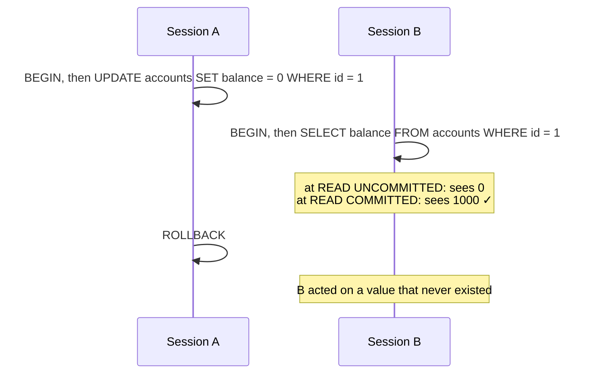
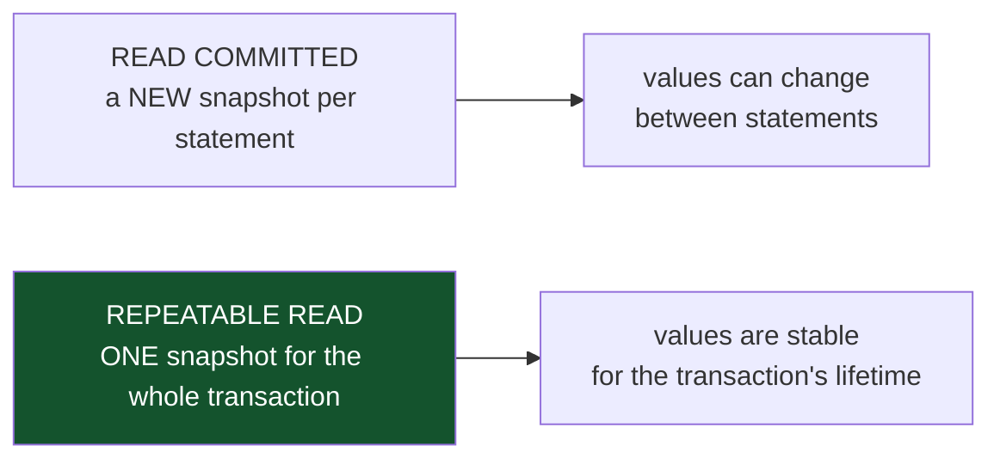
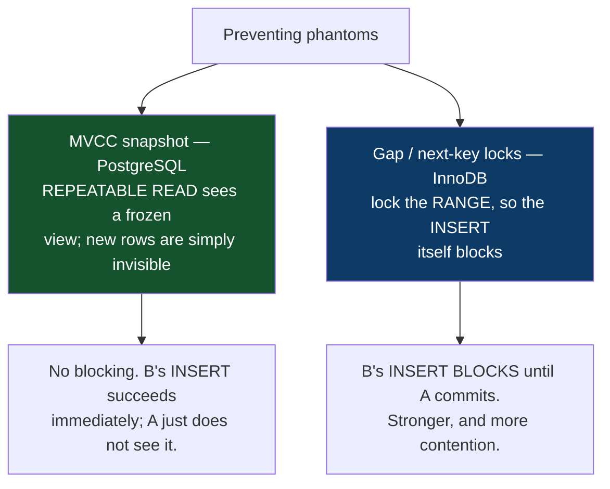
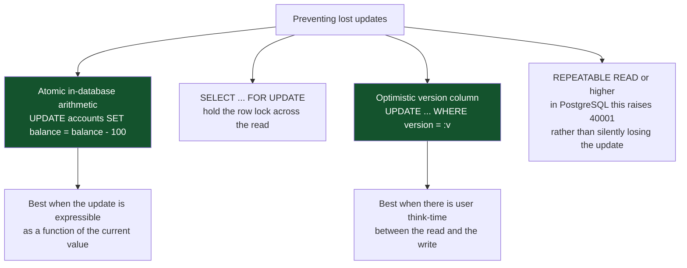
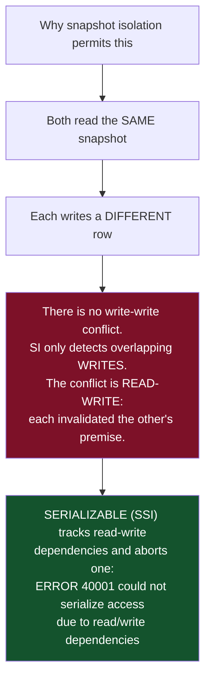
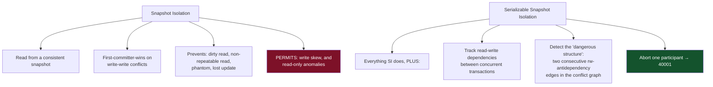
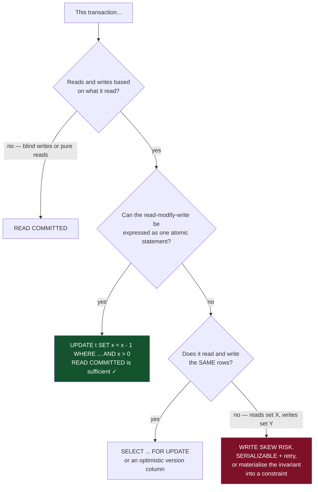

# 05 — Isolation Levels and Anomalies

*Every anomaly with a reproduction you can run, snapshot isolation vs SSI, and per-engine behaviour.*

[← back to the handbook](../README.md)

---

## 1. Setup

Every reproduction below uses this table. Open two `psql` sessions side by side and
run the statements in the order shown.

```sql
CREATE TABLE accounts (
  id      int PRIMARY KEY,
  owner   text NOT NULL,
  balance numeric(19,4) NOT NULL,
  on_call boolean NOT NULL DEFAULT false
);
INSERT INTO accounts VALUES
  (1, 'alice', 1000, true),
  (2, 'bob',   1000, true);
```

---

## 2. Dirty read

**Reading data another transaction has written but not committed.**



**PostgreSQL cannot produce this.** `READ UNCOMMITTED` is accepted as syntax and
behaves as `READ COMMITTED` — MVCC makes dirty reads impossible by construction,
since a reader only ever sees committed versions. MySQL/InnoDB *does* honour
`READ UNCOMMITTED` and will show you uncommitted data.

---

## 3. Non-repeatable read

**The same row, read twice, returns different values.**

```sql
-- Session A                                    -- Session B
BEGIN ISOLATION LEVEL READ COMMITTED;
SELECT balance FROM accounts WHERE id = 1;
-- 1000
                                                BEGIN;
                                                UPDATE accounts SET balance = 500 WHERE id = 1;
                                                COMMIT;
SELECT balance FROM accounts WHERE id = 1;
-- 500   ⚠ changed inside one transaction
COMMIT;
```

At `REPEATABLE READ` the second `SELECT` still returns 1000, because the snapshot was
fixed at the transaction's first statement.



**Why this matters practically:** any multi-statement report, reconciliation, or
consistency check run at `READ COMMITTED` can produce internally contradictory output
— a total that does not match its own line items, because they were read at different
instants.

---

## 4. Phantom read

**The same query returns a different set of rows.**

```sql
-- Session A                                    -- Session B
BEGIN ISOLATION LEVEL READ COMMITTED;
SELECT count(*) FROM accounts WHERE balance > 500;
-- 2
                                                INSERT INTO accounts
                                                  VALUES (3, 'carol', 900, false);
                                                COMMIT;
SELECT count(*) FROM accounts WHERE balance > 500;
-- 3   ⚠ a phantom
COMMIT;
```

The distinction from a non-repeatable read: this is about **rows appearing or
disappearing from a predicate's result**, not about a known row's values changing.
Locking the two rows A read would not have prevented it — there is nothing to lock
for a row that does not yet exist. Preventing phantoms requires either a snapshot
(MVCC) or **predicate/gap locking**.



> This is why the SQL standard's table saying "REPEATABLE READ permits phantoms" is
> misleading for real engines: PostgreSQL's `REPEATABLE READ` prevents them via
> snapshots, and InnoDB's prevents them via gap locks. Neither matches the standard's
> description.

---

## 5. Lost update

**Two read-modify-write cycles interleave; one is silently discarded.**

```sql
-- Session A                                    -- Session B
BEGIN;
SELECT balance FROM accounts WHERE id = 1;      BEGIN;
-- 1000                                         SELECT balance FROM accounts WHERE id = 1;
                                                -- 1000
UPDATE accounts SET balance = 1000 - 100
  WHERE id = 1;                                 -- (blocks on the row lock)
COMMIT;   -- balance = 900
                                                UPDATE accounts SET balance = 1000 - 200
                                                  WHERE id = 1;   -- unblocks, writes 800
                                                COMMIT;
-- Final: 800. Should be 700. NO ERROR RAISED.
```

The insidious part is that both transactions succeeded and neither received any
warning. The `-100` simply vanished.



Note the fourth option's behaviour: at `REPEATABLE READ`, PostgreSQL detects that
session B's target row was modified by a transaction that committed after B's
snapshot, and **aborts B with `40001`** rather than allowing the lost update. The
update is not lost — it becomes an error your retry logic must handle.

---

## 6. Write skew

**The anomaly snapshot isolation does not prevent, and the reason `SERIALIZABLE`
exists.**

```sql
-- invariant: at least one doctor must remain on call
-- both alice and bob are currently on_call = true

-- Session A                                    -- Session B
BEGIN ISOLATION LEVEL REPEATABLE READ;          BEGIN ISOLATION LEVEL REPEATABLE READ;
SELECT count(*) FROM accounts
  WHERE on_call;   -- 2                         SELECT count(*) FROM accounts
                                                  WHERE on_call;   -- 2
-- "2 > 1, safe to go off call"                 -- "2 > 1, safe to go off call"
UPDATE accounts SET on_call = false
  WHERE id = 1;                                 UPDATE accounts SET on_call = false
                                                  WHERE id = 2;
COMMIT;                                         COMMIT;
-- Both succeed. ZERO doctors on call.
```



**Real instances of write skew** are not academic:

| Domain | The skew |
|---|---|
| On-call rotation | Two people go off call simultaneously |
| Meeting rooms | Two bookings check for conflicts, both find none, both insert |
| Bank overdraft | Two withdrawals each check the *combined* balance of two accounts |
| Username claim | Two signups check availability, both find it free, both insert |
| Inventory across warehouses | Two orders each check total stock, both reserve |
| Doctor/patient assignment | Two assignments each check a capacity limit |

The username case has a much better fix than `SERIALIZABLE`: a `UNIQUE` constraint.
**Where a materialised constraint can express the invariant, use it** — it is
cheaper, always correct, and needs no retry logic. `SERIALIZABLE` is for invariants
that span rows in ways a constraint cannot express.

---

## 7. Snapshot isolation vs serialisable



### 7.1 The cost of SSI

| Property | Effect |
|---|---|
| No extra locking | Readers still do not block writers |
| Predicate locks (SIREAD) | Memory proportional to rows/pages read by concurrent transactions |
| **False positives** | Some aborted transactions would in fact have been safe |
| Abort rate under contention | Rises sharply — can exceed 50% for hot rows |
| `default_transaction_isolation` | Setting this globally without retry logic **will** cause user-visible errors |

Practical guidance: use `SERIALIZABLE` for the specific transactions that carry a
cross-row invariant, keep the rest at `READ COMMITTED`, and always pair it with
retry. Setting the whole database to `SERIALIZABLE` without auditing the application
for retry handling is a reliable way to create an incident.

### 7.2 Making SSI cheaper

```sql
-- declare read-only transactions as such; SSI can then skip much of its tracking
BEGIN TRANSACTION ISOLATION LEVEL SERIALIZABLE READ ONLY DEFERRABLE;
-- DEFERRABLE waits for a safe snapshot, then is GUARANTEED never to abort —
-- ideal for long-running consistent reports
```

`READ ONLY DEFERRABLE` is a genuinely useful and little-known feature: it gives a
long analytical query a fully serialisable view with **zero abort risk**, at the cost
of possibly waiting a moment at the start for a suitable snapshot.

---

## 8. Engine behaviour compared

| Anomaly | PG READ COMMITTED | PG REPEATABLE READ | PG SERIALIZABLE | InnoDB REPEATABLE READ | InnoDB SERIALIZABLE |
|---|---|---|---|---|---|
| Dirty read | prevented | prevented | prevented | prevented | prevented |
| Non-repeatable read | **possible** | prevented | prevented | prevented | prevented |
| Phantom | **possible** | prevented (snapshot) | prevented | prevented (gap locks) | prevented |
| Lost update | **possible** | aborts with 40001 | prevented | **possible** on read-then-write | prevented |
| Write skew | **possible** | **possible** | prevented | **possible** | prevented |
| Blocking behaviour | writers block writers | writers block writers | non-blocking, aborts | locks, incl. gaps | reads take shared locks |

Two engine-specific notes worth carrying:

- **InnoDB's `REPEATABLE READ` uses "consistent nonlocking reads" for plain
  `SELECT`** but **locking reads for `SELECT ... FOR UPDATE`, `UPDATE` and `DELETE`,
  which see the *latest* committed data, not the snapshot.** This mixture — a
  statement reading one version and writing based on another — is the source of
  InnoDB's persistent lost-update possibility and is genuinely surprising.
- **PostgreSQL's `READ COMMITTED` re-evaluates the `WHERE` clause** when an `UPDATE`
  finds a row that was concurrently modified (`EvalPlanQual`). This can cause an
  update to match a row whose values no longer satisfy the original predicate's
  snapshot — another reason atomic in-place arithmetic is safer than read-then-write.

---

## 9. Choosing per transaction



That final branch — *reads one set of rows, writes a different set, based on what it
read* — is the precise signature of write skew. Learning to recognise it in a code
review is worth more than memorising the anomaly table.

---

## 10. Materialising conflicts

When `SERIALIZABLE` is too expensive, you can often **create a row to fight over**,
converting a read-write conflict into a write-write conflict that snapshot isolation
already handles:

```sql
-- meeting room booking: create a row per (room, time slot) up front
CREATE TABLE room_slots (
  room_id int, slot tstzrange, booking_id bigint,
  PRIMARY KEY (room_id, slot)
);

-- booking now LOCKS the specific slots it wants
BEGIN;
SELECT * FROM room_slots
 WHERE room_id = 7 AND slot && tstzrange($1, $2)
   FOR UPDATE;                       -- now there IS something to conflict on
-- check they are all free, then set booking_id
COMMIT;
```

Better still, where the engine supports it, express the invariant directly and let
the database enforce it with no application logic at all:

```sql
ALTER TABLE bookings ADD CONSTRAINT no_overlap
  EXCLUDE USING gist (room_id WITH =, during WITH &&);
```

---

[← previous: Transactions and ACID](04-transactions-and-acid.md) · [back to the handbook](../README.md) · [next: Locking and concurrency control →](06-locking-and-concurrency-control.md)
