# 06 — Locking and Concurrency Control

*Lock modes, granularity, gap locks, 2PL, MVCC internals, OCC, deadlocks and escalation.*

[← back to the handbook](../README.md)

---

## 1. What a lock is

A lock is an entry in a shared data structure saying "this resource is held in this
mode by this transaction". Two facts follow immediately:

1. **Locks cost memory and CPU** in the lock manager, which is why coarse granularity
   and escalation exist.
2. **Locks are only meaningful to participants that check them.** A lock does not
   physically prevent anything; it prevents other transactions that consult the same
   lock table.

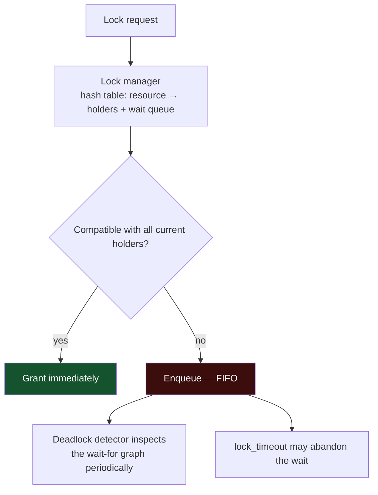

**The FIFO wait queue is why a single long transaction can stall everything**: a
request for a strong lock queues, and every subsequent request — even ones compatible
with the current holder — queues behind it to prevent starvation.

---

## 2. Lock modes

### 2.1 The compatibility matrix

| Held ↓ / Requested → | IS | IX | S | SIX | U | X |
|---|---|---|---|---|---|---|
| **IS** intent shared | ✓ | ✓ | ✓ | ✓ | ✓ | ✗ |
| **IX** intent exclusive | ✓ | ✓ | ✗ | ✗ | ✗ | ✗ |
| **S** shared | ✓ | ✗ | ✓ | ✗ | ✓ | ✗ |
| **SIX** shared + intent excl. | ✓ | ✗ | ✗ | ✗ | ✗ | ✗ |
| **U** update | ✗ | ✗ | ✓ | ✗ | ✗ | ✗ |
| **X** exclusive | ✗ | ✗ | ✗ | ✗ | ✗ | ✗ |

### 2.2 Why the update lock exists

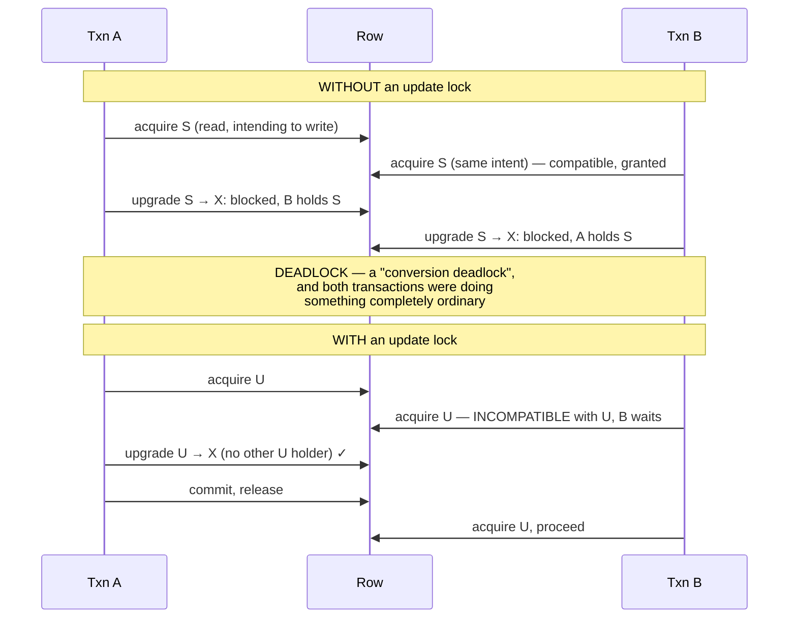

SQL Server exposes `UPDLOCK` explicitly; PostgreSQL's `FOR NO KEY UPDATE` and
InnoDB's implicit behaviour on `SELECT ... FOR UPDATE` serve the same purpose. The
lesson for application code: **never `SELECT` then `UPDATE` the same row in two
statements without a locking read** — use `SELECT ... FOR UPDATE` or a single atomic
`UPDATE`.

---

## 3. Granularity and intent

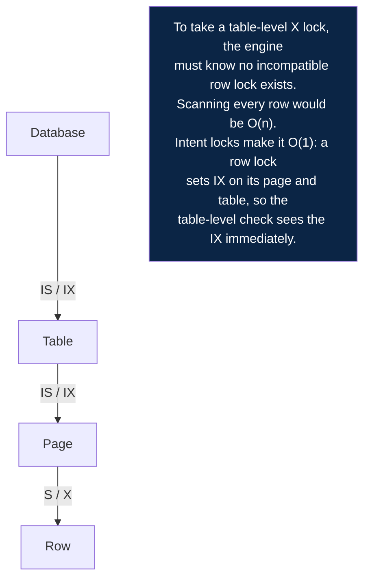

| Granularity | Concurrency | Overhead | Typical use |
|---|---|---|---|
| Row | Highest | Highest | OLTP |
| Page | Medium | Medium | Some engines under pressure |
| Table | Lowest | Lowest | DDL, bulk operations, escalation |
| Database | None | None | Restore, some maintenance |

---

## 4. Gap locks and next-key locks (InnoDB)

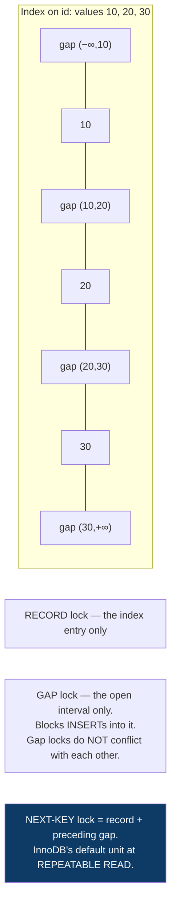

### 4.1 The surprises

```sql
-- 1. Locking a range with NO matching rows still blocks inserts into it
SELECT * FROM t WHERE id BETWEEN 100 AND 200 FOR UPDATE;   -- 0 rows returned
-- another session: INSERT INTO t (id) VALUES (150);       -- BLOCKS

-- 2. An unindexed predicate locks EVERY row scanned
UPDATE t SET x = 1 WHERE unindexed_col = 5;
-- InnoDB scans the whole table and locks every row it examines
-- ⇒ effectively a table lock, on a statement that "only updates one row"

-- 3. READ COMMITTED disables most gap locking
SET SESSION TRANSACTION ISOLATION LEVEL READ COMMITTED;
-- fewer locks, more concurrency, phantoms become possible again
```

Point 2 is worth emphasising: **in InnoDB, an index is not merely a performance
feature — it is a concurrency feature.** An `UPDATE` or `DELETE` whose `WHERE` clause
cannot use an index will lock rows it has no interest in, and the resulting
contention looks nothing like a missing-index problem in the metrics.

### 4.2 Insert intention locks

A special gap lock taken by `INSERT`. Multiple inserts into the same gap at
*different* positions do not conflict with one another — only with an explicit gap
lock held by someone else. Without this refinement, concurrent inserts into the same
region of an index would serialise entirely.

---

## 5. Two-phase locking

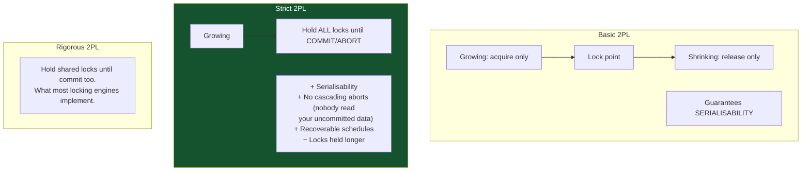

The reason strict 2PL is universal: under basic 2PL, transaction A can release a lock
after its shrinking phase begins, B reads that data, then A aborts — and B must abort
too, cascading arbitrarily far. Holding locks to commit makes that impossible.

---

## 6. MVCC internals

### 6.1 PostgreSQL

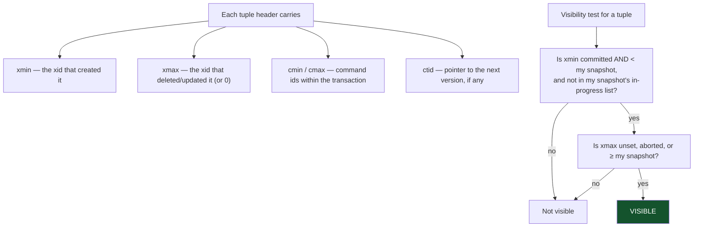

Two structures make this fast: the **commit log (clog)** records each transaction's
outcome, and the **hint bits** in the tuple header cache that outcome after the first
check, so subsequent readers avoid the clog lookup. This is why the first read after a
bulk insert can be unexpectedly slow and write I/O — it is setting hint bits, which
dirties pages.

### 6.2 InnoDB

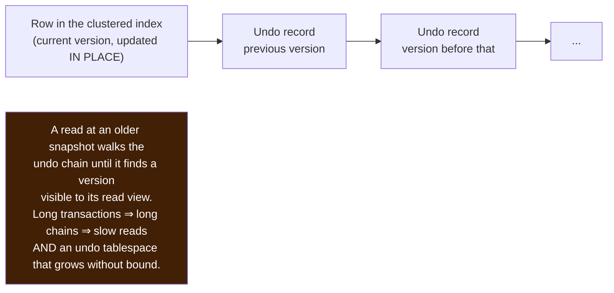

The engine-level difference has a direct operational consequence:

| | PostgreSQL | InnoDB |
|---|---|---|
| Old versions live | In the table (heap) | In the undo tablespace |
| Long transactions cause | **Table and index bloat** | **Undo growth and slow historical reads** |
| Cleanup mechanism | `VACUUM` (autovacuum) | Purge threads |
| `ROLLBACK` cost | O(1) — mark aborted | O(changes) — apply undo |
| Update of an indexed column | Non-HOT: rewrites every index entry | In-place; secondary indexes updated only if that column is indexed |

### 6.3 Vacuum in depth

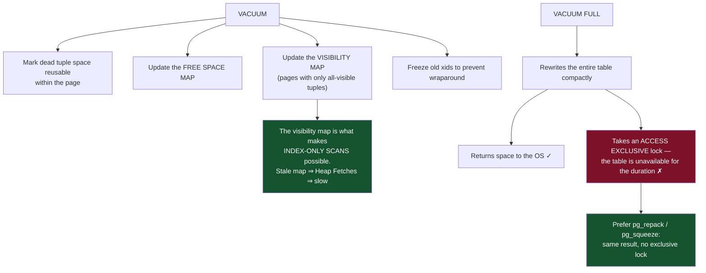

**Transaction id wraparound** is the failure mode that takes databases fully offline.
Xids are 32-bit and circular; a tuple whose xmin is more than 2 billion transactions
old would appear to be in the future. Vacuum "freezes" old tuples to prevent this.
If autovacuum cannot keep up — typically because of a long-running transaction, an
abandoned replication slot, or a prepared transaction — PostgreSQL will eventually
**refuse all new writes** to protect the data. Monitor:

```sql
SELECT datname, age(datfrozenxid) AS xid_age
FROM pg_database ORDER BY xid_age DESC;
-- alert well before autovacuum_freeze_max_age (default 200 million)
```

---

## 7. Optimistic concurrency control

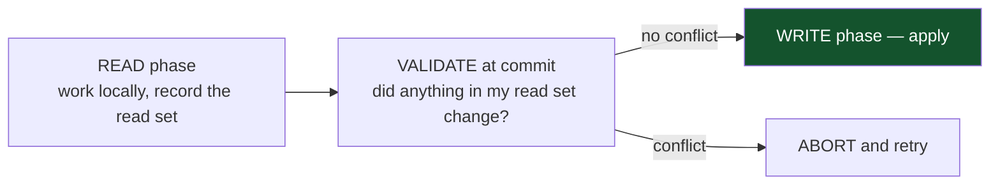

### 7.1 The application-level version column

```sql
-- schema
ALTER TABLE documents ADD COLUMN version int NOT NULL DEFAULT 1;

-- read (no lock; the user may take four minutes to think)
SELECT id, title, body, version FROM documents WHERE id = 42;

-- write, conditional
UPDATE documents
   SET title = $1, body = $2, version = version + 1
 WHERE id = 42 AND version = $3;
-- 0 rows ⇒ someone else committed first ⇒ show a conflict UI or merge
```

This is the correct pattern for anything spanning a user interaction, because it
holds **no database resources** during the think time. A `SELECT ... FOR UPDATE`
across an HTTP round trip would hold a row lock for however long the user takes.

### 7.2 Pessimistic vs optimistic

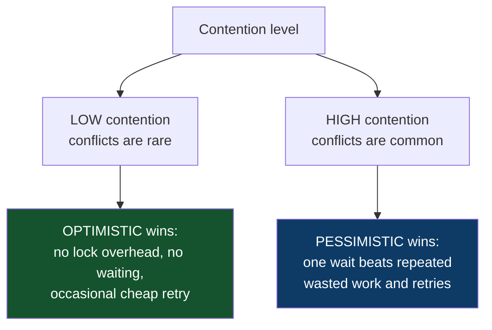

The crossover is measurable: track your conflict/abort rate. Above roughly 10–20%,
optimistic concurrency is spending more on retries than pessimistic locking would
spend on waiting.

---

## 8. Deadlocks

### 8.1 The four necessary conditions

All four must hold; breaking any one prevents deadlock.

| Condition | How databases break it |
|---|---|
| Mutual exclusion | Cannot — locks exist for a reason |
| Hold and wait | Acquire all locks up front (application discipline) |
| No preemption | **Detection + abort a victim** — this is the one engines use |
| Circular wait | **Consistent lock ordering** — this is the one applications use |

### 8.2 Diagnosing

```sql
-- PostgreSQL: enable logging of every deadlock's full detail
ALTER SYSTEM SET log_lock_waits = on;
ALTER SYSTEM SET deadlock_timeout = '1s';
-- the log then shows both statements and both lock chains
```

```sql
-- InnoDB: the most recent deadlock, in detail
SHOW ENGINE INNODB STATUS;
-- also: set innodb_print_all_deadlocks = ON to log every one
```

A deadlock report names both transactions, the exact statements, and the locks each
held and wanted. Reading it tells you the lock ordering to fix — you rarely have to
guess.

### 8.3 The canonical fix

```sql
-- ✗ deadlocks whenever two transfers cross
BEGIN;
UPDATE accounts SET balance = balance - 100 WHERE id = $from;
UPDATE accounts SET balance = balance + 100 WHERE id = $to;
COMMIT;

-- ✓ deterministic lock order: always the lower id first
BEGIN;
SELECT id FROM accounts
 WHERE id IN ($from, $to)
 ORDER BY id
   FOR UPDATE;
UPDATE accounts SET balance = balance - 100 WHERE id = $from;
UPDATE accounts SET balance = balance + 100 WHERE id = $to;
COMMIT;
```

The single `ORDER BY id ... FOR UPDATE` acquires both locks in a globally consistent
order. A circular wait can no longer form, regardless of transfer direction.

### 8.4 Other common deadlock sources

| Source | Fix |
|---|---|
| Two `UPDATE`s in different orders | Consistent ordering |
| Foreign key checks taking locks on the parent | Index the FK; consider `ON DELETE` behaviour |
| Unique index conflicts between concurrent inserts | Insert in a consistent key order; or use `ON CONFLICT` |
| Lock upgrade S → X | Use `FOR UPDATE` on the initial read |
| Gap locks from range operations | `READ COMMITTED` where phantoms are acceptable; index the predicate |
| Batch operations touching overlapping sets | Order batches by key; keep batches small |

---

## 9. Lock escalation

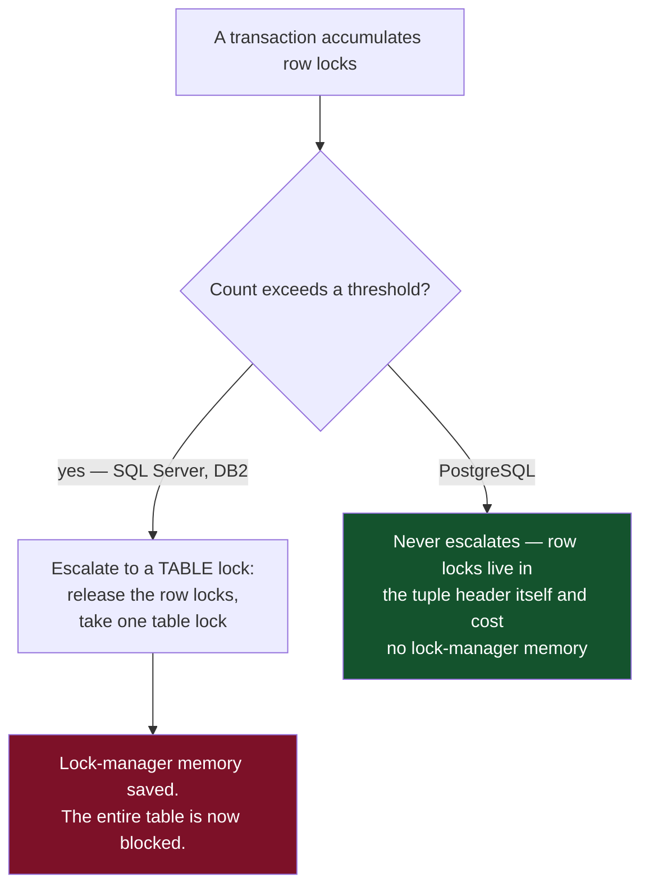

Where escalation exists, the remedy is to batch:

```sql
-- ✗ locks millions of rows, escalates, blocks the table
DELETE FROM events WHERE created_at < '2025-01-01';

-- ✓ bounded lock count per transaction
WHILE (1 = 1) BEGIN
  DELETE TOP (5000) FROM events WHERE created_at < '2025-01-01';
  IF @@ROWCOUNT = 0 BREAK;
  COMMIT; BEGIN TRANSACTION;
END
```

Batching is good practice on every engine anyway — it bounds WAL volume, keeps
replicas from lagging, and makes the operation interruptible and resumable.

---

## 10. Checklist

```
□ Every read-then-write on the same row uses FOR UPDATE or a single atomic UPDATE
□ Lock acquisition order is consistent (ascending primary key) across the codebase
□ Every UPDATE/DELETE predicate is indexed — especially on InnoDB
□ Transactions are short; no external calls inside them
□ lock_timeout set so a request abandons rather than queueing indefinitely
□ Deadlock logging enabled; deadlock rate monitored
□ Retry-on-deadlock wrapper in place
□ Long-running transactions monitored (bloat and wraparound risk)
□ Autovacuum tuned for high-update tables; xid age alerted on
□ Bulk DELETE/UPDATE batched with commits between batches
□ Optimistic version columns used where user think-time is involved
□ Advisory locks released explicitly; never left held on a pooled connection
```

---

[← previous: Isolation levels and anomalies](05-isolation-levels-and-anomalies.md) · [back to the handbook](../README.md) · [next: WAL, durability and recovery →](07-wal-durability-and-recovery.md)
