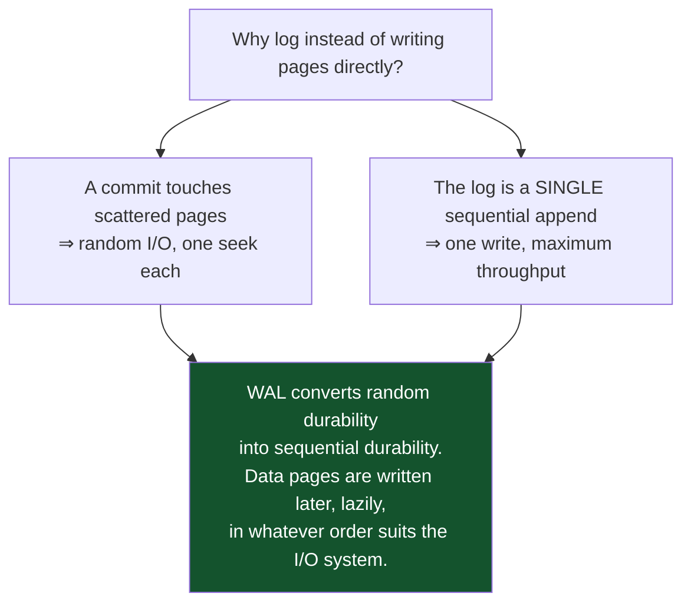
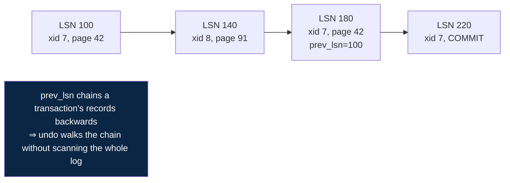
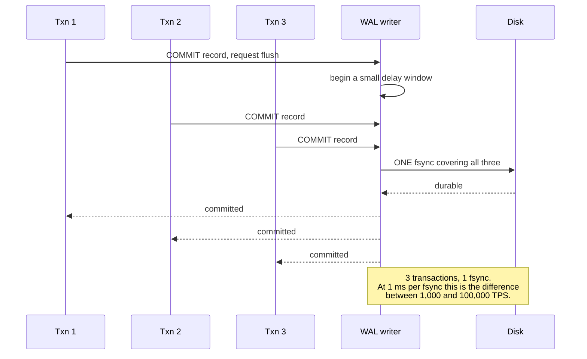
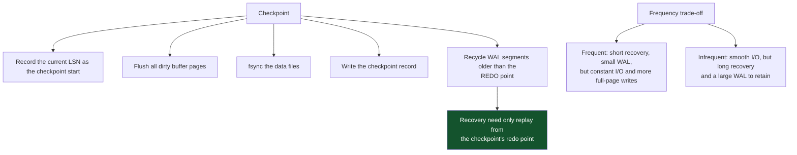
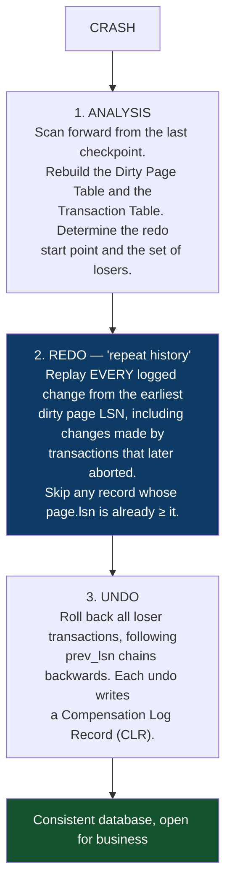
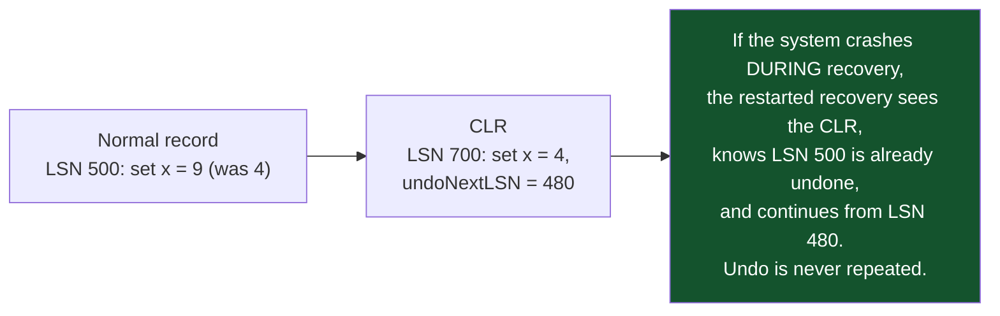
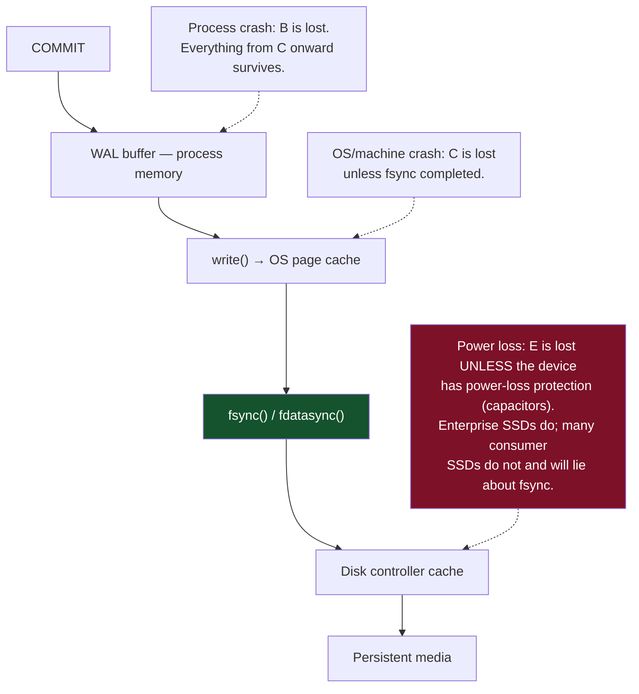
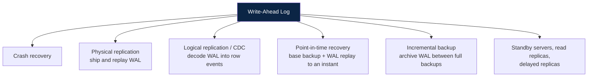
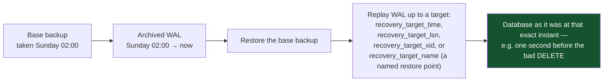

# 07 — WAL, Durability and Recovery

*Log records, checkpoints, ARIES in detail, the fsync stack, and what the WAL is really for.*

[← back to the handbook](../README.md)

---

## 1. The write-ahead principle

```
WAL rule:     a log record describing a change must reach durable storage
              BEFORE the changed data page does.

Commit rule:  the COMMIT log record must be durable BEFORE the client
              is told the transaction committed.
```



---

## 2. Anatomy of a log record

```
LSN            monotonically increasing position in the log
xid            which transaction
prev_lsn       previous record of the SAME transaction (backward chain for undo)
type           INSERT / UPDATE / DELETE / COMMIT / ABORT / CHECKPOINT / CLR
page_id        which page
redo_info      how to REDO the change (physical, logical, or physiological)
undo_info      how to UNDO it  (in undo-logging engines)
```

Each page also stores the **LSN of the last log record applied to it**. This one field
makes recovery idempotent: during redo, if `page.lsn >= record.lsn`, the change is
already present and is skipped. Recovery can therefore be interrupted and restarted
any number of times.



### 2.1 Physical, logical and physiological

| Style | Records | Trade-off |
|---|---|---|
| **Physical** | Exact byte images of pages | Large, but trivially idempotent |
| **Logical** | "Insert row (x,y) into table T" | Compact; must be replayed against an identical logical state |
| **Physiological** | "On page 42, insert this tuple at slot 3" | **What real engines use** — physical to a page, logical within it |

Physiological logging is the practical compromise: page-local so it is idempotent and
order-independent across pages, but far smaller than full page images.

**Full-page writes** are the exception: after a checkpoint, the first modification to
a page logs the *entire page*. This protects against torn pages — a partial 8 KB write
during a power failure leaves a page that is neither the old nor the new version, and
no incremental record can repair it. Full-page writes are a significant fraction of
WAL volume, which is why checkpoint frequency affects WAL size so strongly.

---

## 3. Group commit



This is why database throughput frequently **improves** as concurrency rises: larger
commit groups amortise the fsync. It is also why a low-concurrency benchmark
understates a database's capacity.

---

## 4. Checkpoints



### 4.1 Spreading the I/O

```
checkpoint_timeout = 15min
checkpoint_completion_target = 0.9    # spread writes over 90% of the interval
max_wal_size = 8GB                    # raise so checkpoints are TIME-triggered,
                                      # not volume-triggered
```

A checkpoint triggered by WAL volume rather than by time is a warning sign: it means
the system is generating WAL faster than the checkpoint interval anticipated, and
those checkpoints arrive as unpredictable I/O bursts. Watch
`pg_stat_bgwriter.checkpoints_req` (requested) against `checkpoints_timed`; a healthy
system is overwhelmingly timed.

---

## 5. ARIES recovery



### 5.1 Why redo the work of aborted transactions

It seems wasteful, and it is the design's central insight. Repeating history exactly
restores the **precise pre-crash state**, which means undo then operates on a state it
fully understands. The alternative — trying to selectively redo only committed work —
requires reasoning about interleaved changes to the same page and is far more complex
and error-prone.

### 5.2 Compensation log records



CLRs are **redo-only** — they are never themselves undone. This is what makes ARIES
recovery restartable, which matters because recovery of a large database can take long
enough for a second failure to occur.

---

## 6. The durability stack, honestly



Test your hardware's honesty rather than assuming it — tools such as `diskchecker.pl`
and `fio` with `--fsync=1` exist for exactly this. A storage device that acknowledges
fsync before data is durable will produce "impossible" corruption after a power event,
and no amount of database configuration will prevent it.

### 6.1 Configuration and what each setting really costs

| Setting | Effect | Loses |
|---|---|---|
| `synchronous_commit = on` | fsync WAL before ack | Nothing |
| `= remote_write` | Replica received it (not yet fsynced) | Both nodes failing simultaneously |
| `= remote_apply` | Replica has applied it — read-your-writes on replicas | Slowest |
| `= local` | Local fsync only, no replica wait | Committed data if the primary is lost |
| `= off` | No fsync wait at all | Up to ~3×`wal_writer_delay` of recent commits. **Still crash-consistent** |
| `fsync = off` | Never fsync | **Everything; possible corruption.** Throwaway instances only |
| `full_page_writes = off` | Skip torn-page protection | Corruption on power loss unless the filesystem/storage provides atomic 8 KB writes |

The distinction between `synchronous_commit = off` and `fsync = off` is the one people
conflate. The first loses *recent transactions* and leaves a consistent database; the
second can leave a *corrupt* one. The first is a legitimate tuning choice; the second
essentially never is.

---

## 7. What else the WAL powers



### 7.1 WAL retention hazards

Three things hold WAL and can fill a disk:

| Holder | Symptom | Guard |
|---|---|---|
| **Replication slot** with a dead consumer | WAL grows without bound → disk full → database down | `max_slot_wal_keep_size` |
| `wal_keep_size` set too high | Constant large WAL directory | Size it deliberately |
| Failing `archive_command` | WAL cannot be recycled | Alert on `pg_stat_archiver.last_failed_time` |

**A dead logical replication slot is one of the few configuration mistakes that takes
a healthy primary database completely offline.** Setting `max_slot_wal_keep_size`
converts that outage into a broken slot — a much better failure.

```sql
-- monitor slot lag
SELECT slot_name, active,
       pg_size_pretty(pg_wal_lsn_diff(pg_current_wal_lsn(), restart_lsn)) AS retained
FROM pg_replication_slots
ORDER BY pg_wal_lsn_diff(pg_current_wal_lsn(), restart_lsn) DESC;
```

---

## 8. Point-in-time recovery



```sql
-- create a named restore point before something risky
SELECT pg_create_restore_point('before_v42_migration');
```

Practical notes: restore into a **new** instance rather than over the damaged one, so
you retain the ability to try a different target; use `recovery_target_action = pause`
so you can inspect the state before promoting; and remember that PITR restores the
*whole cluster*, so recovering one accidentally-dropped table means restoring
elsewhere and copying the table across.

---

## 9. Checklist

```
□ synchronous_commit setting is a deliberate, documented decision
□ fsync = on (unless the instance is genuinely disposable)
□ full_page_writes = on unless the storage guarantees atomic page writes
□ Storage hardware verified to honour fsync
□ checkpoint_completion_target = 0.9; checkpoints are timed, not WAL-triggered
□ max_wal_size sized so requested checkpoints are rare
□ WAL archiving configured, and archive failures alerted on
□ max_slot_wal_keep_size set so a dead slot cannot fill the disk
□ Replication slot lag monitored
□ PITR tested end to end — restore, replay to a target, verify with real queries
□ Recovery time measured against the stated RTO
```

---

[← previous: Locking and concurrency control](06-locking-and-concurrency-control.md) · [back to the handbook](../README.md) · [next: Replication →](08-replication.md)
