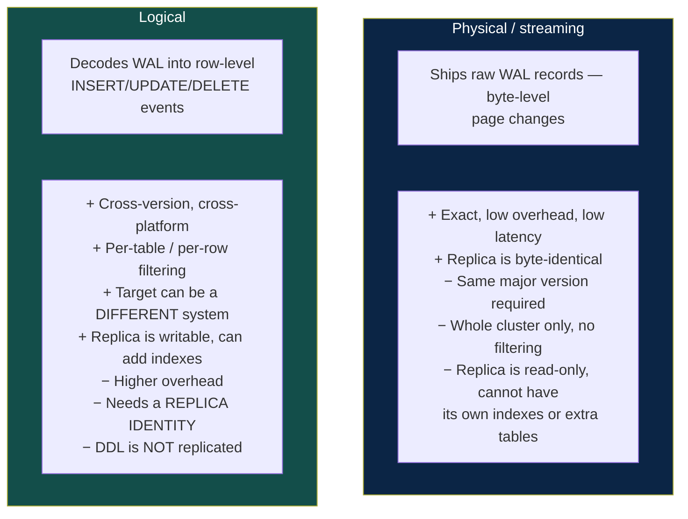
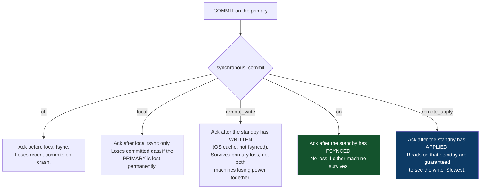
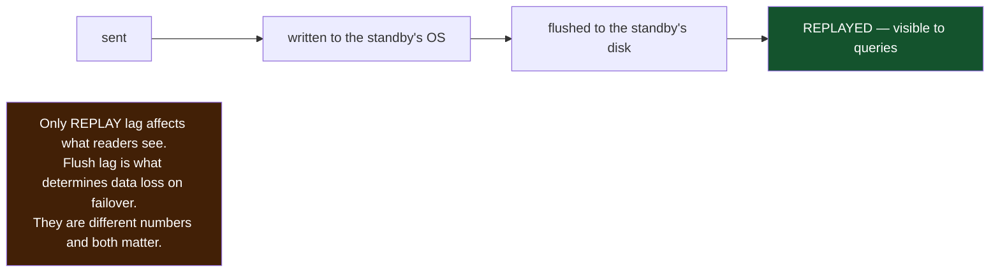
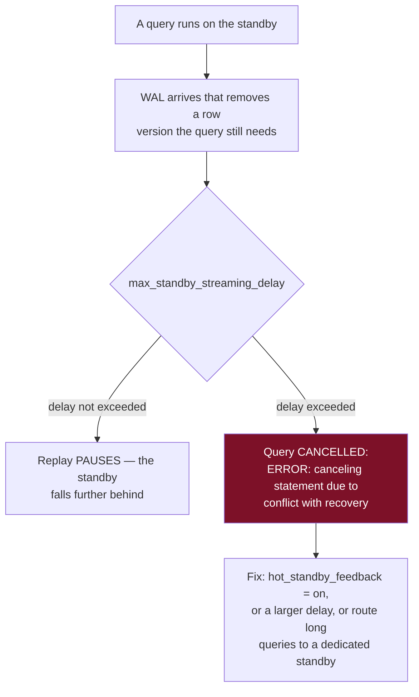
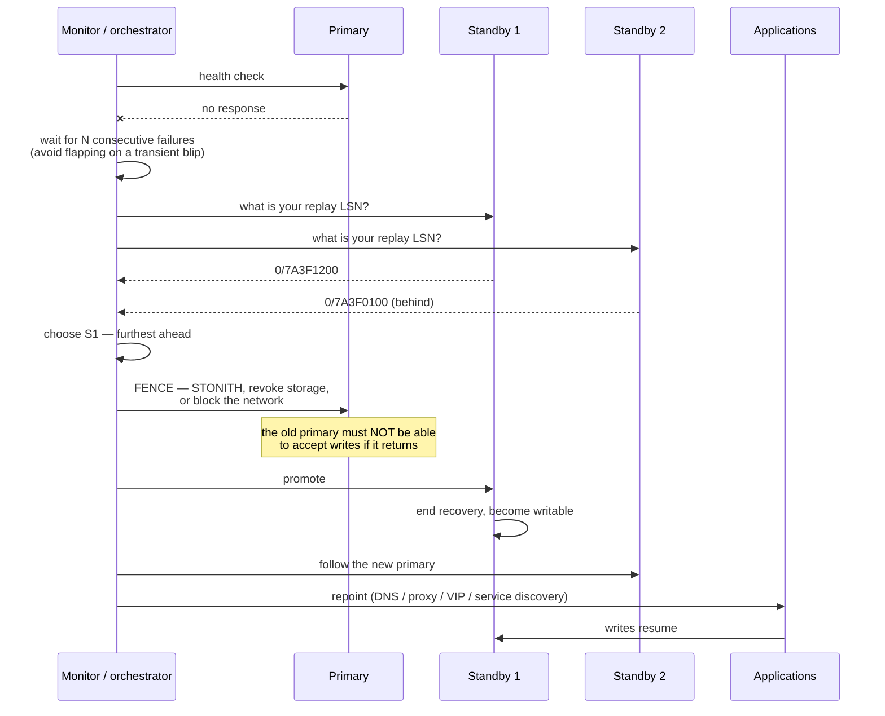
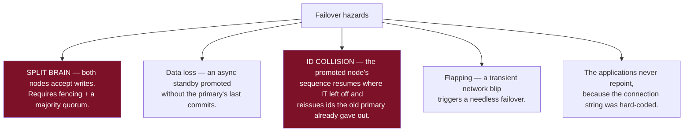
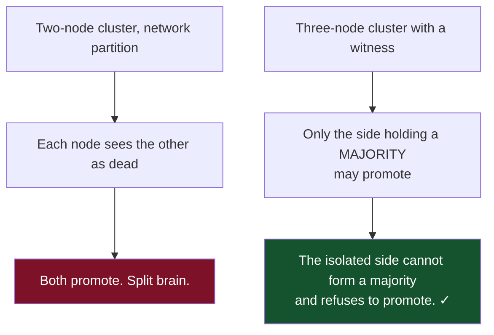
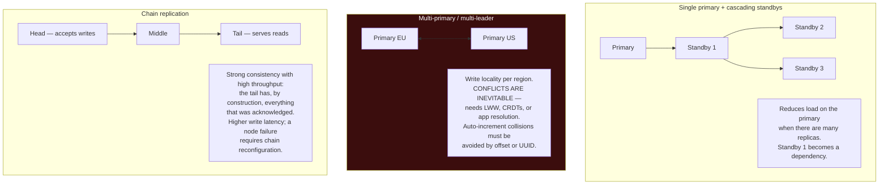
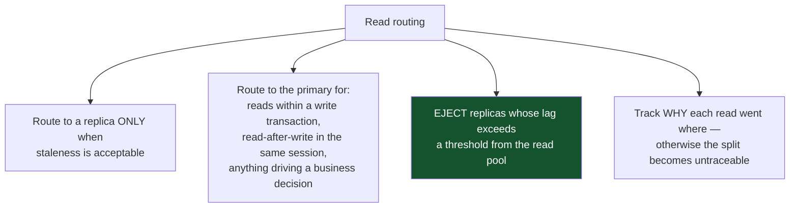

# 08 — Replication

*Physical vs logical, synchronicity, lag, failover, split brain, and topologies.*

[← back to the handbook](../README.md)

---

## 1. Physical vs logical



| Use case | Choose |
|---|---|
| High-availability standby | Physical |
| Read replicas serving identical queries | Physical |
| Major-version upgrade with minimal downtime | **Logical** |
| Feeding a search index, warehouse, or cache invalidator | **Logical (CDC)** |
| Replicating a subset of tables to another team | **Logical** |
| Consolidating several databases into one | **Logical** |

### 1.1 Replica identity — the logical replication gotcha

For `UPDATE` and `DELETE`, logical replication must identify *which row* changed on
the subscriber. By default it uses the primary key.

```sql
-- a table with no primary key cannot be logically replicated for UPDATE/DELETE
ALTER TABLE events REPLICA IDENTITY FULL;   -- ships the ENTIRE old row as the key
-- correct, but expensive: doubles the WAL volume for that table
-- and makes the subscriber do a full-row comparison per change
```

**Every table you intend to replicate logically needs a primary key.** Discovering
this after a migration has started is a common and avoidable delay.

---

## 2. Synchronicity in depth



### 2.1 Quorum-based synchronous replication

```sql
-- ✗ names one standby: if s1 is down or slow, ALL writes stall
synchronous_standby_names = 's1'

-- ✓ any one of three: a single sick standby cannot stop writes
synchronous_standby_names = 'ANY 1 (s1, s2, s3)'

-- stronger: any two of three
synchronous_standby_names = 'ANY 2 (s1, s2, s3)'
```

The `ANY k (...)` form is the configuration that gives durability without turning a
standby's problem into a primary outage. Naming a specific standby means that
standby's availability is now the primary's availability.

### 2.2 `remote_apply` and read-your-writes

`remote_apply` is the only setting that makes a read on the standby *guaranteed* to
see the write that just returned. It costs an extra round trip plus apply time on
every commit, so it is normally applied per-transaction rather than globally:

```sql
BEGIN;
SET LOCAL synchronous_commit = remote_apply;
UPDATE profiles SET bio = $1 WHERE user_id = $2;
COMMIT;   -- when this returns, the standby has applied it
```

---

## 3. Replication lag

### 3.1 Measuring it correctly

```sql
-- on the primary: lag per standby, in bytes, at each stage
SELECT application_name, state, sync_state,
       pg_size_pretty(pg_wal_lsn_diff(sent_lsn,   write_lsn)) AS write_lag,
       pg_size_pretty(pg_wal_lsn_diff(sent_lsn,   flush_lsn)) AS flush_lag,
       pg_size_pretty(pg_wal_lsn_diff(sent_lsn,   replay_lsn)) AS replay_lag,
       write_lag AS write_time, flush_lag AS flush_time, replay_lag AS replay_time
FROM pg_stat_replication;

-- on the standby: how stale is my data, in seconds?
SELECT CASE WHEN pg_last_wal_receive_lsn() = pg_last_wal_replay_lsn()
            THEN 0
            ELSE extract(epoch FROM now() - pg_last_xact_replay_timestamp())
       END AS lag_seconds;
```



### 3.2 Causes and fixes

| Cause | Fix |
|---|---|
| **Single-threaded apply** vs parallel writes on the primary | `max_parallel_apply_workers` (logical); for physical, reduce write burstiness |
| **A long query on the standby** blocking replay | `hot_standby_feedback = on` (costs bloat on the primary) or `max_standby_streaming_delay` |
| One enormous transaction | Batch large writes into chunks on the primary |
| Weaker standby hardware | Match the primary's I/O capability |
| Network saturation | Enable WAL compression; check bandwidth |
| Standby doing heavy analytics | Dedicate a standby to it, and accept its lag |

The **`hot_standby_feedback` trade-off** is worth understanding: with it on, the
standby tells the primary which old row versions it still needs, so the primary
delays vacuuming them and long standby queries are never cancelled. The cost is bloat
on the *primary* driven by query behaviour on the *standby* — a coupling that
surprises people during an incident.

### 3.3 Query conflicts on hot standbys



---

## 4. Failover



### 4.1 The failure modes



**F3 is the quiet one.** After promotion, `nextval()` on the new primary continues
from the last value *it* replicated. Any ids the old primary issued but did not
replicate get handed out a second time — to different rows. Those duplicates then
propagate into caches, search indexes, analytics and third-party systems, and the
corruption is discovered weeks later. It is the strongest practical argument for
UUIDv7 or Snowflake identifiers in any system that will ever fail over.

### 4.2 Preventing split brain



Fencing mechanisms, strongest first: **STONITH** (power off the old node), storage
fencing (revoke its access to the volume), network fencing (drop its traffic at the
switch or security group), and — weakest — a cooperative shutdown, which does nothing
if the node is unreachable rather than misbehaving.

---

## 5. Topologies



### 5.1 Multi-primary conflict resolution

| Strategy | Behaviour | Risk |
|---|---|---|
| **Last-write-wins** | Higher timestamp survives | **Silent data loss**; clock skew decides business outcomes |
| First-write-wins | Earlier timestamp survives | Same, inverted |
| Site priority | A designated region always wins | Predictable, arbitrary |
| Merge function | Application-defined | Correct, most work |
| **Avoid conflicts entirely** | Partition writes so each row has exactly one writing region | **Best answer where the domain allows** |

The last row is the one to reach for first. If EU users' rows are only ever written in
EU and US users' rows only in US, there is no conflict to resolve — you have
multi-primary write locality with single-primary semantics per row.

---

## 6. Using replicas correctly



### 6.1 The LSN token pattern

```sql
-- after writing on the primary
SELECT pg_current_wal_lsn();     -- e.g. 0/7A3F1200 → return to the client/session

-- before reading on a replica
SELECT pg_last_wal_replay_lsn() >= '0/7A3F1200'::pg_lsn;
-- true  → this replica is current enough, serve the read
-- false → wait briefly, try another replica, or fall back to the primary
```

This gives precise read-your-writes with full replica parallelism — far better than
"send everything to the primary for 5 seconds", which sacrifices most of the benefit
of having replicas at all.

---

## 7. Checklist

```
□ Replication mode chosen deliberately: physical for HA, logical for CDC/upgrades
□ Every logically-replicated table has a primary key
□ synchronous_standby_names uses ANY k (...) — never a single named standby
□ Replay lag AND flush lag both monitored, in bytes and seconds
□ Replicas beyond a lag threshold are ejected from the read pool
□ hot_standby_feedback decision made consciously (standby cancellations vs primary bloat)
□ Failover is automated, fenced, and requires a majority
□ Failover TESTED on a schedule, not just documented
□ External ids are UUIDv7/Snowflake, not bare sequences, if failover is possible
□ Applications repoint automatically (proxy, service discovery, not a hard-coded host)
□ Read routing rules are explicit and observable
□ Replication slots have max_slot_wal_keep_size set
```

---

[← previous: WAL, durability and recovery](07-wal-durability-and-recovery.md) · [back to the handbook](../README.md) · [next: Partitioning and sharding →](09-partitioning-and-sharding.md)
