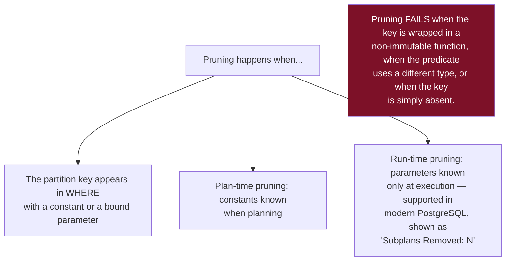
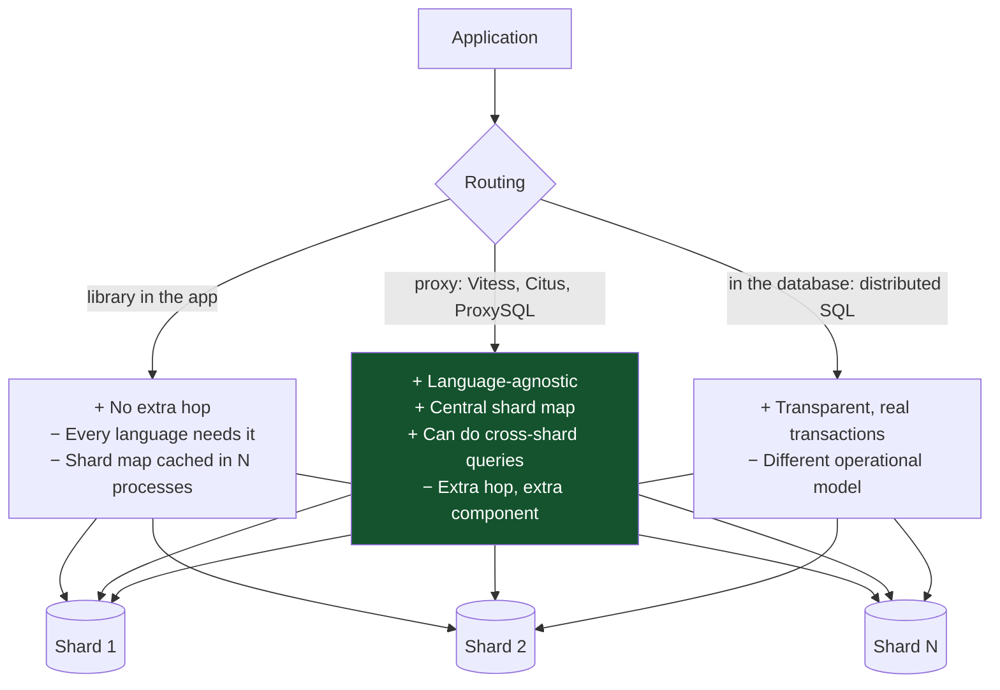
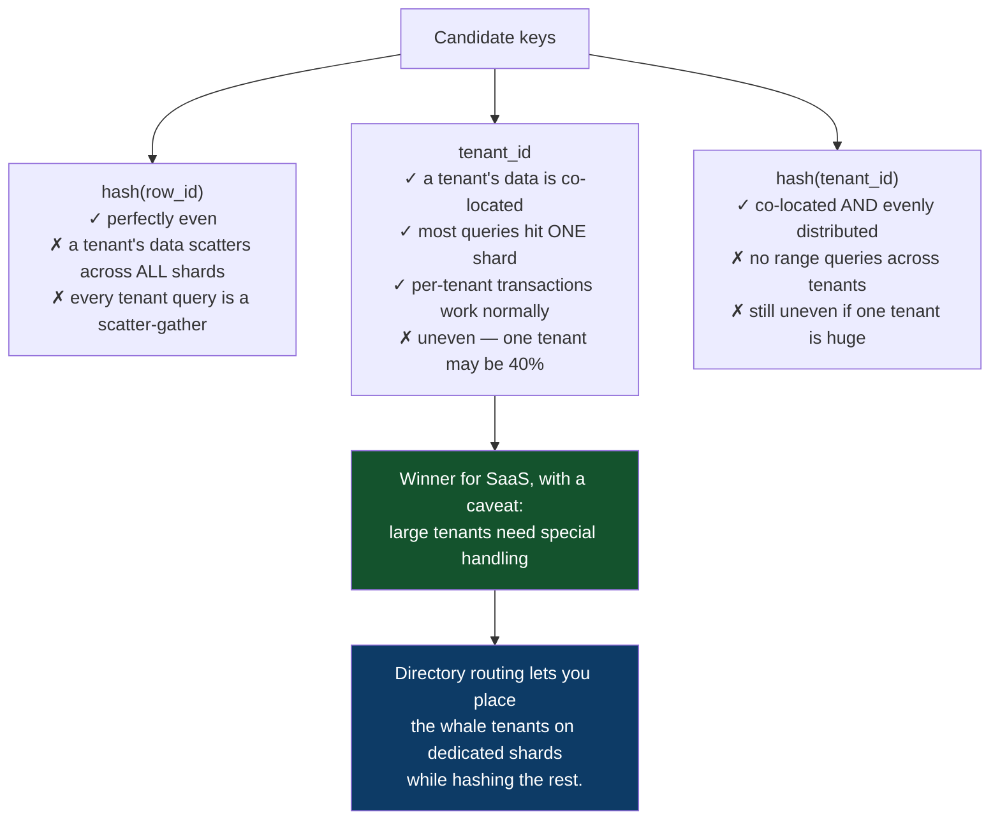
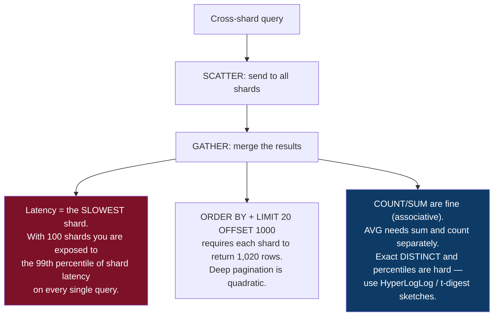
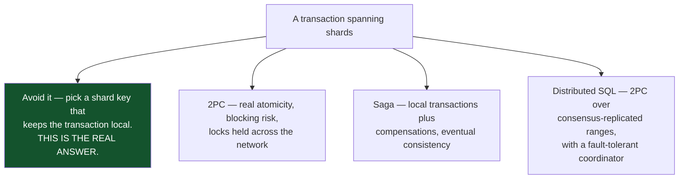
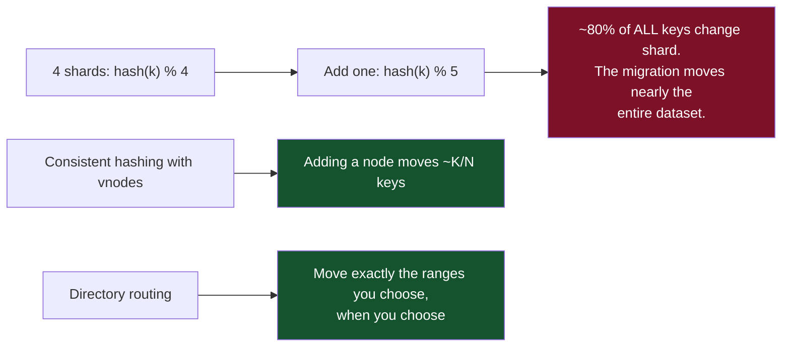
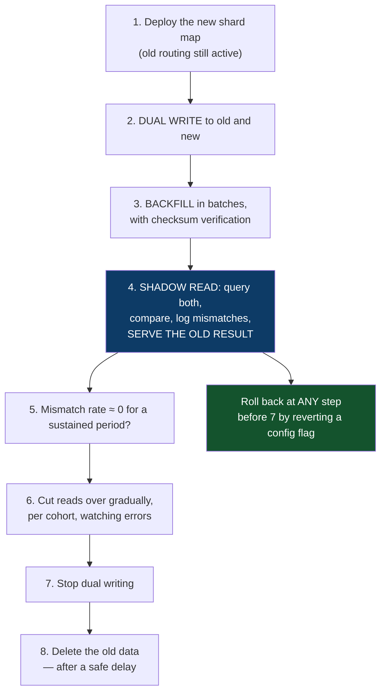
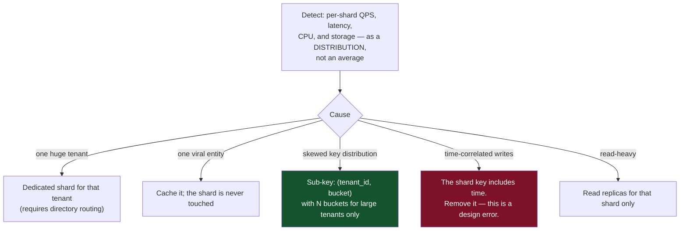

# 09 — Partitioning and Sharding

*Pruning, local vs global indexes, shard keys, cross-shard work, and resharding without downtime.*

[← back to the handbook](../README.md)

---

## 1. The distinction

| | Partitioning | Sharding |
|---|---|---|
| Scope | One database instance | Many independent instances |
| Transparent to the app? | **Yes** | No — routing is the app's problem |
| Cross-piece transactions | Normal | Distributed, or forbidden |
| Cross-piece joins | Normal | Application-level or forbidden |
| Global uniqueness | Only including the partition key | Requires UUIDs or a separate service |
| Scales | Storage, maintenance, query pruning | **Writes, connections, CPU, memory** |
| Reversible | Easily | Not really |

> **Partition first. Shard only when a single machine genuinely cannot hold the write
> volume or the working set** — and note that a modern server with 128 cores, 2 TB of
> RAM and NVMe storage is an enormous amount of database.

---

## 2. Partitioning in practice

### 2.1 A worked example

```sql
CREATE TABLE events (
    id          bigserial,
    tenant_id   bigint      NOT NULL,
    occurred_at timestamptz NOT NULL,
    kind        text        NOT NULL,
    payload     jsonb       NOT NULL,
    PRIMARY KEY (id, occurred_at)     -- the partition key MUST be in the PK
) PARTITION BY RANGE (occurred_at);

CREATE TABLE events_2026_08 PARTITION OF events
    FOR VALUES FROM ('2026-08-01') TO ('2026-09-01');
CREATE TABLE events_2026_09 PARTITION OF events
    FOR VALUES FROM ('2026-09-01') TO ('2026-10-01');
CREATE TABLE events_default PARTITION OF events DEFAULT;   -- catches surprises

CREATE INDEX ON events (tenant_id, occurred_at DESC);   -- created on every partition
```

The `PRIMARY KEY (id, occurred_at)` requirement is the first thing that surprises
people: PostgreSQL uses local indexes, so a unique constraint must include the
partition key to be enforceable. This ripples into foreign keys and application code.

### 2.2 Verifying pruning

```sql
EXPLAIN (COSTS OFF)
SELECT * FROM events
WHERE occurred_at >= '2026-08-15' AND occurred_at < '2026-08-16';

--  Append
--    ->  Seq Scan on events_2026_08 events_1     ← ONE partition. Pruning worked.
```



**A partitioned table whose queries do not prune is strictly worse than an
unpartitioned one** — the planner examines every partition, planning time grows, and
you gained nothing. Verify with `EXPLAIN` against your real query mix before
committing.

### 2.3 Automating partition lifecycle

```sql
-- create next month's partition ahead of time (run monthly from a scheduler)
CREATE TABLE IF NOT EXISTS events_2026_10 PARTITION OF events
    FOR VALUES FROM ('2026-10-01') TO ('2026-11-01');

-- retention: detach first (fast, weak lock), then drop
ALTER TABLE events DETACH PARTITION events_2025_08 CONCURRENTLY;
DROP TABLE events_2025_08;
```

Detaching before dropping keeps the lock window tiny and lets you archive the
partition first. Compare with `DELETE FROM events WHERE occurred_at < '2025-09-01'`,
which on a large table takes hours, generates gigabytes of WAL, bloats the table, and
lags every replica.

### 2.4 Costs

| Cost | Detail |
|---|---|
| Planning time | Grows with partition count; keep it in the low hundreds, not thousands |
| Cross-partition queries | Append over every partition — often slower than an unpartitioned index scan |
| Unique constraints | Must include the partition key |
| Foreign keys **to** a partitioned table | Supported in recent versions; check yours |
| Operational burden | Creating and dropping partitions must be automated, or it will be forgotten |

---

## 3. Sharding

### 3.1 Architecture



### 3.2 Choosing the key — worked

Consider a multi-tenant SaaS.



This is the general shape of the answer: **co-locate what is queried together, then
handle the outliers explicitly.** A uniform hash gives perfect balance and terrible
query locality; a natural key gives perfect locality and imperfect balance. Imperfect
balance is far easier to fix.

### 3.3 Cross-shard operations



**Reference tables** are the standard mitigation for cross-shard joins: replicate
small, slowly-changing lookup tables (countries, currencies, product categories,
feature flags) to **every** shard, so joins against them stay local. Citus calls these
"reference tables"; the pattern predates it by decades.

### 3.4 Cross-shard transactions



If your shard key forces frequent cross-shard transactions, the key is wrong. That is
worth re-examining before building machinery to work around it.

---

## 4. Resharding

### 4.1 Why modulo routing is a trap



The pragmatic alternative if you are stuck with modulo: **pre-shard into far more
logical shards than physical servers** — say 1,024 logical shards mapped onto 8
servers. Growing means reassigning logical shards to new servers, which moves data but
never changes any key's logical shard. This is what Vitess, Citus and most large
in-house systems do.

### 4.2 The migration



Step 4 is the one that gets skipped and the one that finds the bugs. Shadow reads
prove correctness against **real production traffic** while nothing depends on the new
path. The cost is doubled read load for the duration, which is almost always worth
paying.

### 4.3 Verifying a backfill

```sql
-- compare row counts and a content checksum per key range, on both sides
SELECT count(*)                                       AS rows,
       md5(string_agg(md5(t.*::text), '' ORDER BY id)) AS checksum
FROM   orders t
WHERE  tenant_id BETWEEN $1 AND $2;
```

Run this on both source and destination for each range. Equal counts are necessary
but not sufficient — a checksum catches the case where the right *number* of rows
arrived with the wrong *content*, which is exactly what a subtly-wrong transformation
produces.

---

## 5. Hot shards



**Monitoring the distribution rather than the average is the operational point.** Mean
shard CPU of 40% is perfectly compatible with one shard at 98% and the rest at 30%,
and the average will look healthy right up to the moment that shard becomes an
outage. Alert on the maximum and on the spread.

---

## 6. Sharding decision record

Before sharding, write this down and get it reviewed:

```
SHARD KEY:            _______________
WHY:                  cardinality ____, expected max share of data by one value ____%
QUERIES THAT PRUNE:   ____% of query volume (measured, not guessed)
CROSS-SHARD QUERIES:  which ones, how often, how handled
CROSS-SHARD TXNS:     which ones, how handled (avoid / 2PC / saga)
GLOBAL UNIQUENESS:    how (UUIDv7 / Snowflake / a service)
ID GENERATION:        _______________
REFERENCE TABLES:     which ones are replicated to every shard
RESHARDING PLAN:      routing scheme, and how a shard is split
MIGRATION PLAN:       dual write → backfill → shadow read → cutover → cleanup
ROLLBACK:             at each step, what reverses it
OPERATIONS:           how are N shards backed up, migrated, monitored, failed over
WHAT WE TRIED FIRST:  indexes ____, pooling ____, cache ____, replicas ____,
                      partitioning ____, function split ____, bigger box ____
```

The last line is the important one. Most sharding projects that go badly were started
before the cheap options were exhausted.

---

[← previous: Replication](08-replication.md) · [back to the handbook](../README.md) · [next: Distributed databases →](10-distributed-databases.md)
