# 10 — Distributed Databases

*Distributed SQL architecture, Spanner and TrueTime, Calvin, quorums, and distributed deadlock.*

[← back to the handbook](../README.md)

---

## 1. The promise and the physics

Distributed SQL databases (Spanner, CockroachDB, TiDB, YugabyteDB) offer horizontal
scale **without** giving up SQL, secondary indexes, or transactions. The promise is
real. The physics is unchanged: a consensus round trip across regions costs 50–200 ms
and nothing can make it cheaper.

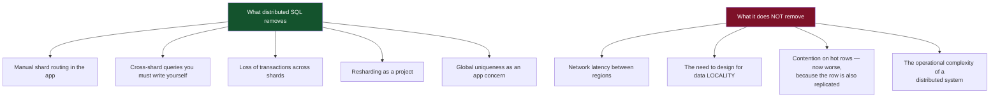

---

## 2. Architecture

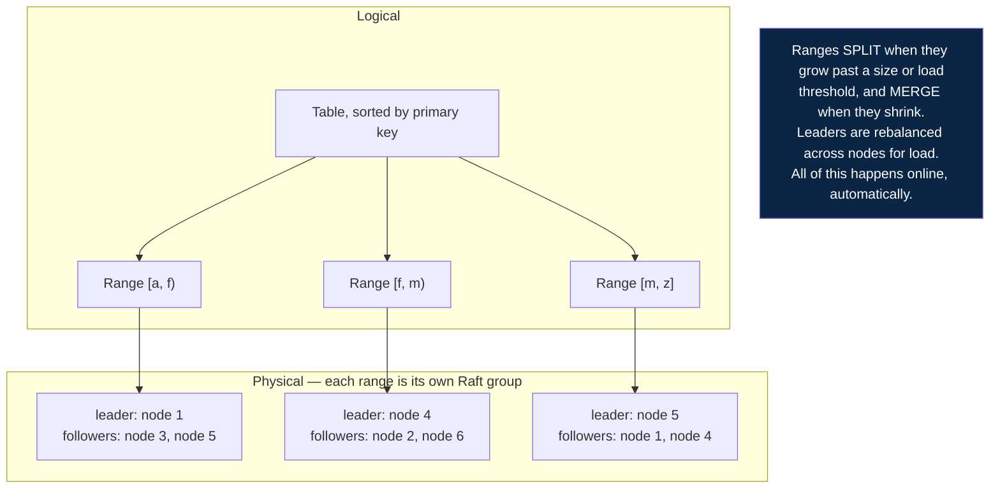

### 2.1 A single-row write

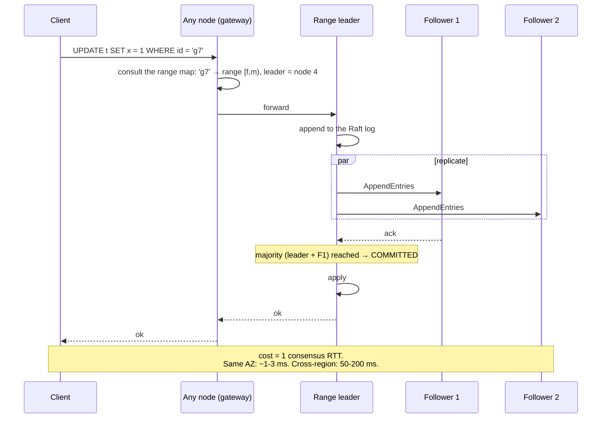

### 2.2 A multi-range transaction

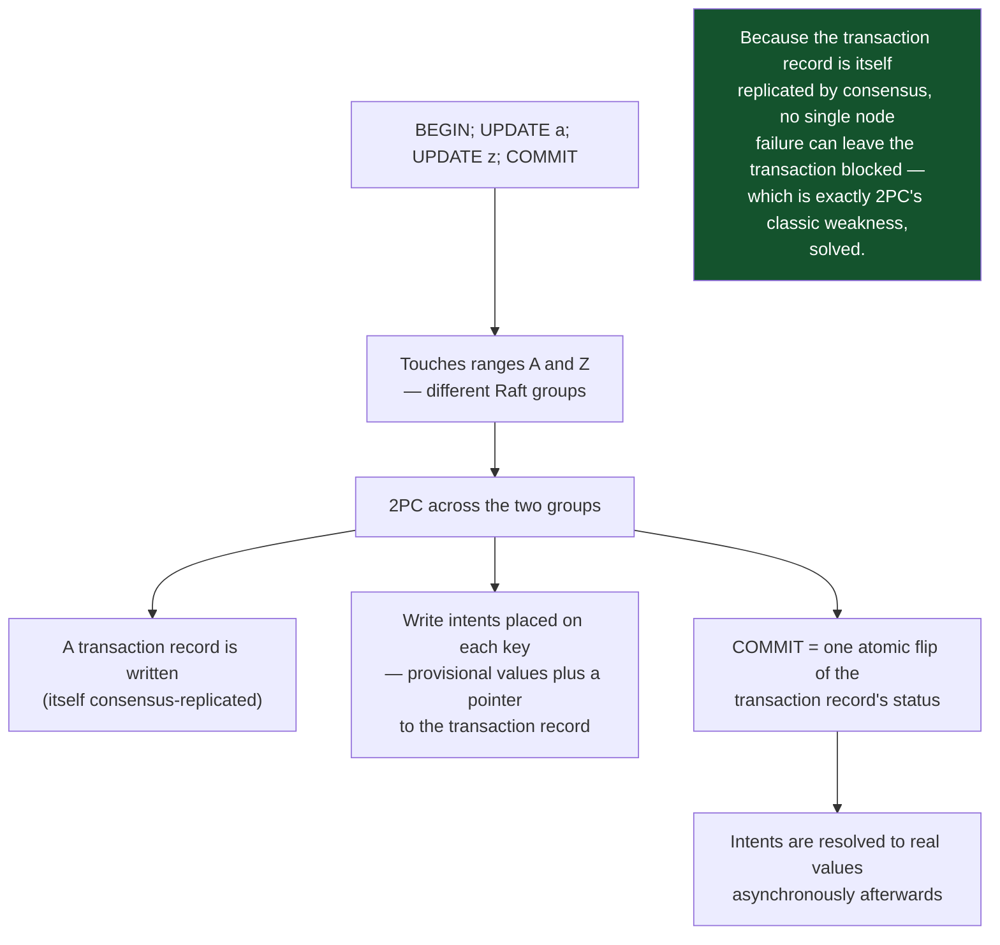

A reader encountering an unresolved write intent must find out the transaction's
status: it reads the transaction record, and if the writer has gone silent, it may
**abort the writer** and proceed. This is why an abandoned transaction in a
distributed SQL system does not block readers indefinitely the way an orphaned 2PC
participant does.

---

## 3. Time

### 3.1 The problem

To order transactions globally without coordinating every pair of them, you need
timestamps that respect causality. Machine clocks do not.

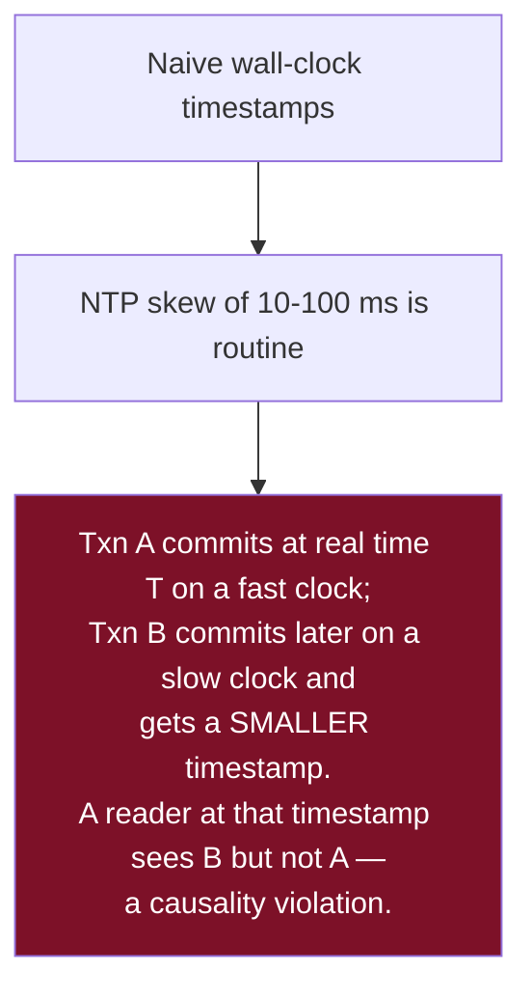

### 3.2 TrueTime (Spanner)

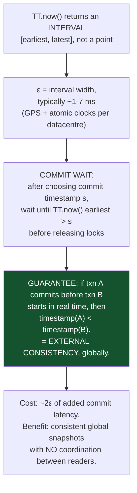

The insight worth carrying beyond Spanner: **expose uncertainty rather than hiding
it.** A clock that admits an error bound lets you wait it out; a clock that pretends
to be exact leaves you with silent anomalies.

### 3.3 Hybrid logical clocks

```
HLC = (physical_time, logical_counter)

on local event:      pt = max(local_clock, pt);  if unchanged, lc += 1 else lc = 0
on receiving msg m:  pt = max(pt, m.pt, local_clock)
                     lc = appropriate increment to stay strictly greater
```

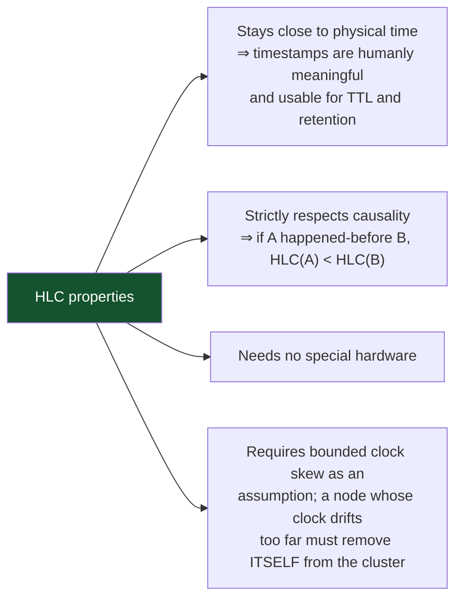

CockroachDB uses HLC with a `max_offset` setting (default 500 ms). Reads that fall
within the uncertainty interval trigger an **uncertainty restart** — the transaction
retries at a higher timestamp. This is invisible when clocks are well-synchronised and
becomes a visible performance problem when they are not, which is why NTP health is a
first-class metric on such clusters.

---

## 4. Consistency levels available

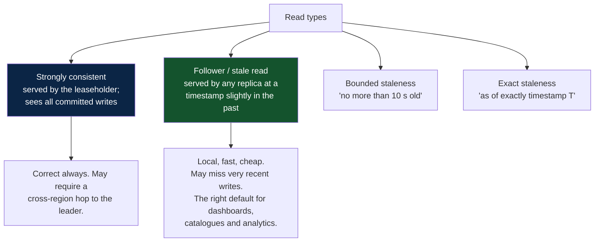

**Follower reads are the single largest performance lever** in a geo-distributed
deployment: they turn a 150 ms cross-region read into a 2 ms local one. The
application must be able to tolerate a few seconds of staleness for that query, which
most read paths can.

---

## 5. Locality is the design problem

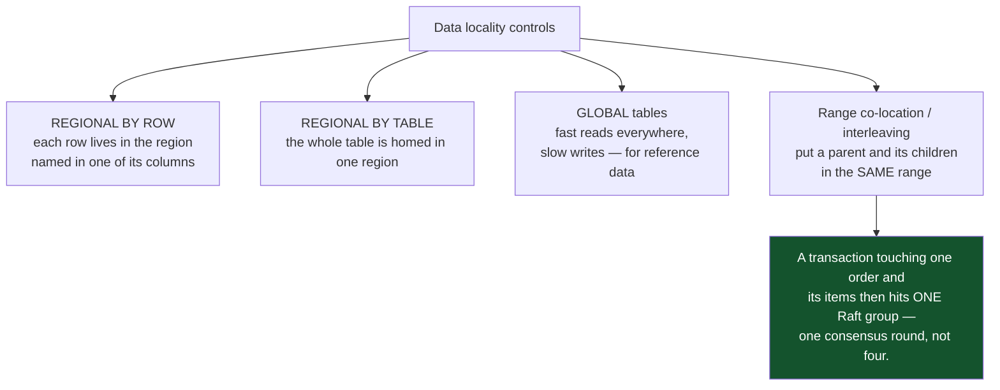

A schema designed without locality in mind will be correct and slow. The specific
anti-pattern: a globally-replicated table on the write path of every transaction,
turning every write into a multi-region consensus round.

---

## 6. Calvin — the other approach

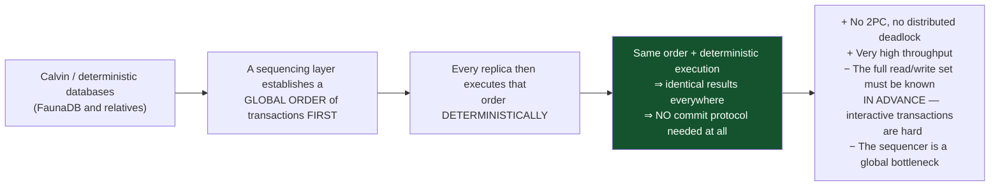

The trade is stark and clarifying: Calvin removes the entire commit-protocol problem
by requiring transactions to be declared up front. Systems that need interactive,
multi-round-trip transactions (which is most application code) cannot use it directly.

---

## 7. Distributed deadlock

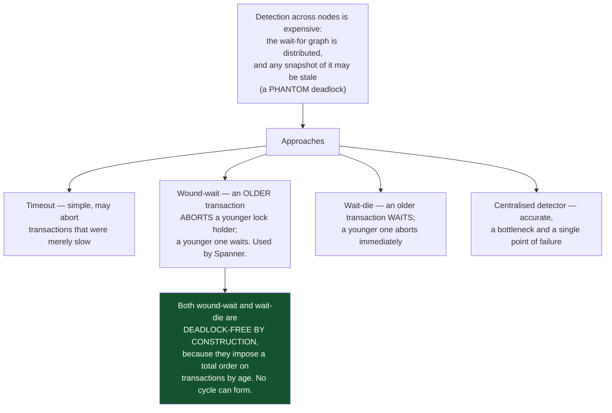

Both schemes guarantee that older transactions eventually complete — a transaction
that gets aborted keeps its original timestamp on retry, so it grows older and
eventually wins. That property is what prevents starvation.

---

## 8. Choosing

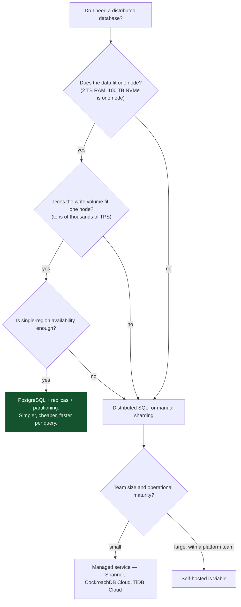

| Choose distributed SQL when | Stay single-node when |
|---|---|
| Data genuinely exceeds one machine | It fits — and it probably fits |
| You need multi-region writes with transactions | Single region is acceptable |
| You need zero-downtime elastic scaling | Scheduled maintenance windows are acceptable |
| You would otherwise build sharding yourself | You have not yet exhausted indexes, pooling, caching, replicas, partitioning |
| Survival of a whole region is a requirement | An RTO measured in minutes is acceptable |

> **The honest default in 2026:** a well-tuned single PostgreSQL primary with replicas
> and partitioning serves the overwhelming majority of applications, at lower latency
> per query and a fraction of the operational cost. Reach for distributed SQL when you
> have a measured reason, not an anticipated one.

---

[← previous: Partitioning and sharding](09-partitioning-and-sharding.md) · [back to the handbook](../README.md) · [next: NoSQL and polyglot persistence →](11-nosql-and-polyglot-persistence.md)
