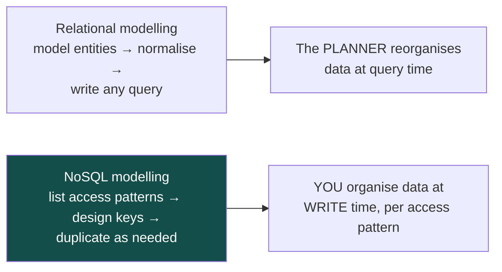
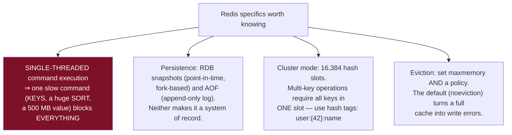
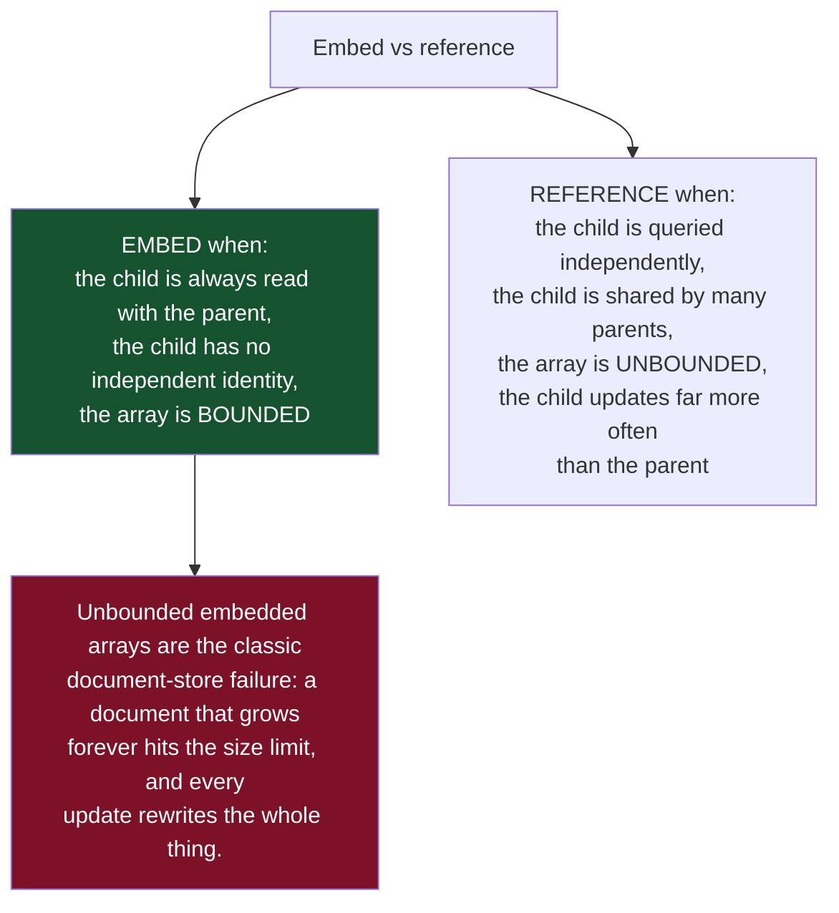
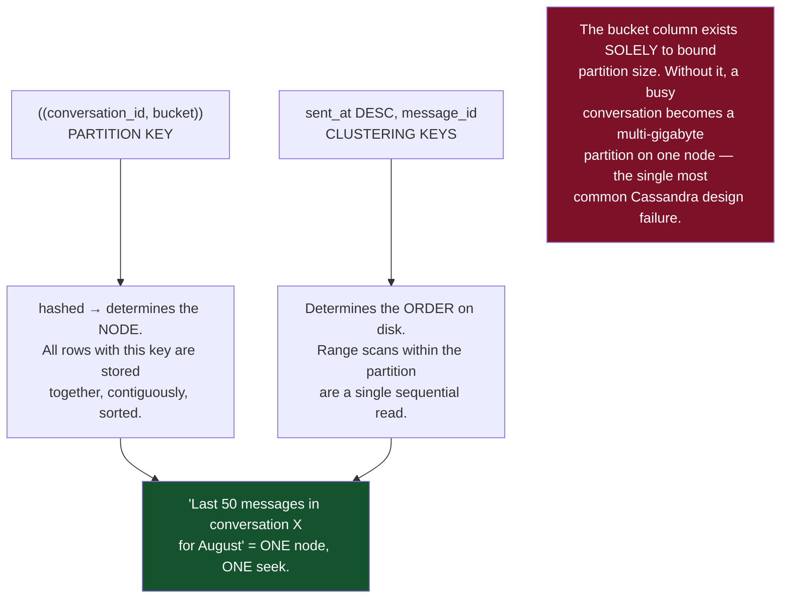
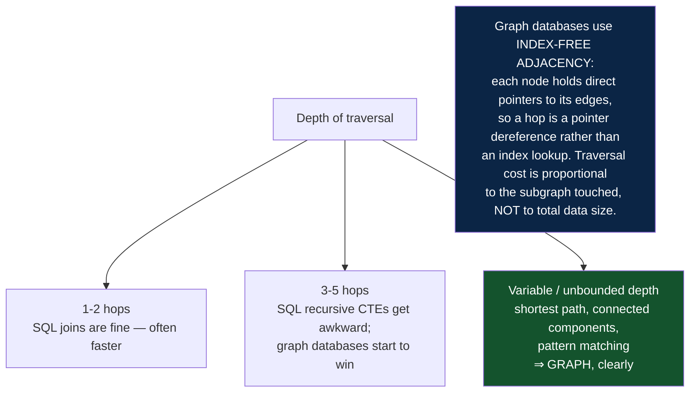
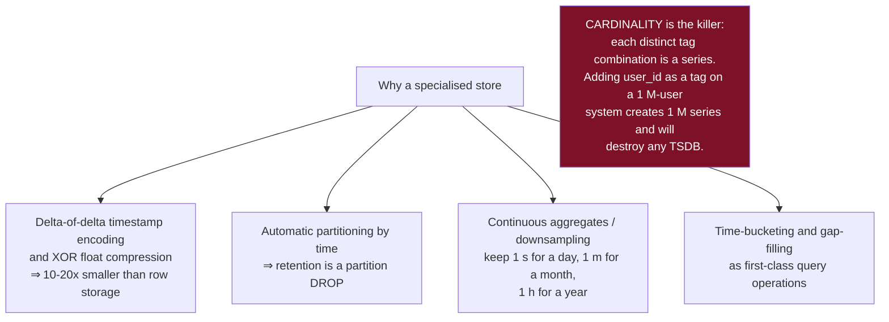
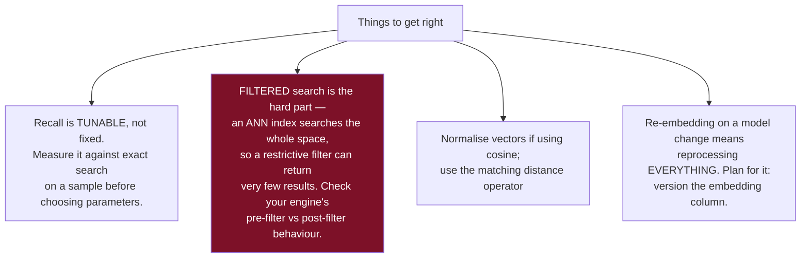
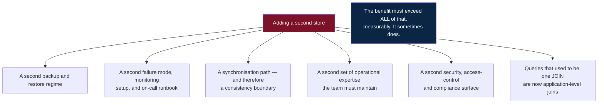
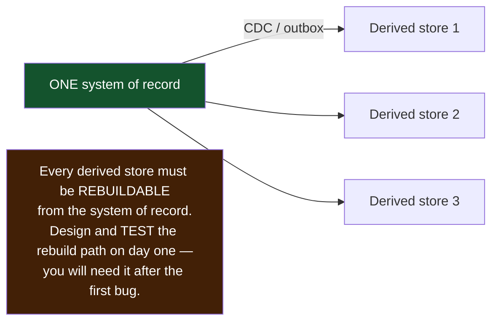

# 11 — NoSQL and Polyglot Persistence

*Each family's data model and access patterns, and when it genuinely beats relational.*

[← back to the handbook](../README.md)

---

## 1. The one idea that transfers



There is no planner to rescue a query the schema was not designed for. In a
wide-column or key-value store, "can I run this query?" is answered by the key
structure, not by an optimiser — so the access-pattern list *is* the schema design.

---

## 2. Key-value

**Model:** opaque value addressed by key. **Operations:** `GET`, `SET`, `DEL`,
sometimes atomic numeric and structural operations.

| Use | Why |
|---|---|
| Session storage | Pure key lookup, TTL, tolerable loss |
| Rate limiting counters | Atomic `INCR`, expiry |
| Feature flags and configuration | Small, hot, read-constantly |
| Distributed locks | Atomic `SET NX PX` — **with fencing tokens** |
| Caching | The canonical use |
| Job queues | Redis lists/streams, or `SKIP LOCKED` in Postgres |
| Leaderboards | Sorted sets |



---

## 3. Document

**Model:** nested JSON-like documents; each may have a different shape.

```json
{
  "_id": "ord_8821",
  "customer": { "id": "c_42", "name": "Ahmed", "tier": "gold" },
  "items": [
    { "sku": "W-1", "name": "Widget", "qty": 2, "price": 10.00 },
    { "sku": "G-9", "name": "Gadget", "qty": 1, "price": 25.00 }
  ],
  "total": 45.00,
  "placed_at": "2026-08-20T10:14:00Z"
}
```



> **Postgres `JSONB` covers most document use cases**, with GIN indexing, real
> constraints on the structured columns, and full SQL alongside. The genuine reasons
> to prefer a dedicated document store are its horizontal scaling model and its
> ecosystem — not the data model itself.

---

## 4. Wide-column

**Model:** `partition key → sorted rows within the partition`. The most
misunderstood family, and the most instructive.

```sql
CREATE TABLE messages_by_conversation (
    conversation_id uuid,
    bucket          text,        -- e.g. '2026-08' — bounds the partition size
    sent_at         timestamp,
    message_id      timeuuid,
    sender_id       uuid,
    body            text,
    PRIMARY KEY ((conversation_id, bucket), sent_at, message_id)
) WITH CLUSTERING ORDER BY (sent_at DESC);
```



### 4.1 Query-driven duplication

```
Access patterns:
  AP1  messages in a conversation, newest first  → messages_by_conversation
  AP2  messages sent by a user                   → messages_by_sender
  AP3  messages mentioning a user                → messages_by_mention

Three tables. The same message written three times.
Storage is cheap; a scatter-gather across every node is not.
```

Writing the same fact three times means **three places to update or delete**, which is
why wide-column stores suit append-mostly, immutable-ish data (events, messages,
metrics, logs) far better than mutable entity state.

### 4.2 Tunable consistency

```
W + R > RF  ⇒  a read overlaps a write ⇒ strong consistency

RF=3, W=QUORUM(2), R=QUORUM(2)  → 2+2 > 3 ✓  strong, tolerates one node down
RF=3, W=ONE,       R=ONE        → 1+1 < 3 ✗  eventual, fastest
RF=3, W=ALL,       R=ONE        → strong, but any node down blocks writes
```

Lightweight transactions (`IF NOT EXISTS`) use Paxos and are roughly an order of
magnitude slower than a normal write. They exist for the rare cases that need
linearisability — and reaching for them frequently is a sign the workload wanted a
different database.

---

## 5. Graph

**Model:** nodes and edges, both with properties. **Operation:** traversal.

```cypher
// friends-of-friends who work at the same company, excluding direct friends
MATCH (me:Person {id: $id})-[:FRIEND]->(f)-[:FRIEND]->(fof)
WHERE NOT (me)-[:FRIEND]->(fof) AND me <> fof
MATCH (fof)-[:WORKS_AT]->(c)<-[:WORKS_AT]-(me)
RETURN fof, count(*) AS mutual ORDER BY mutual DESC LIMIT 10
```



---

## 6. Time-series

**Model:** `(metric, tags, timestamp) → value`. Append-heavy, rarely updated,
queried by time range with aggregation, usually with a retention policy.



TimescaleDB is worth singling out because it is a PostgreSQL extension: you get
hypertables, compression and continuous aggregates while keeping SQL, joins,
transactions and your existing tooling. For most teams that is a better trade than
adding a wholly separate system.

---

## 7. Vector

**Model:** high-dimensional embeddings with approximate nearest-neighbour search.

```sql
-- pgvector
CREATE TABLE documents (
  id        bigserial PRIMARY KEY,
  content   text,
  tenant_id bigint NOT NULL,
  embedding vector(1536)
);
CREATE INDEX ON documents USING hnsw (embedding vector_cosine_ops);

SELECT id, content, 1 - (embedding <=> $1) AS similarity
FROM documents
WHERE tenant_id = $2                     -- filter first, then search
ORDER BY embedding <=> $1
LIMIT 10;
```



---

## 8. Polyglot persistence — the honest accounting



### 8.1 When it genuinely pays

| Store added | Justified when |
|---|---|
| **Redis** | Cache hit ratio or counter contention is a measured bottleneck |
| **Elasticsearch** | Relevance ranking, faceting and typo tolerance are product requirements — not just `LIKE` |
| **ClickHouse / warehouse** | Analytical queries are degrading OLTP latency |
| **Cassandra / Scylla** | Sustained write volume exceeds what a partitioned relational cluster can absorb |
| **Neo4j** | Traversals are routinely deeper than 3 hops and central to the product |
| **A vector store** | pgvector's scaling limits are actually reached, with measurements |

### 8.2 The synchronisation rule



Dual-writing from the application to two stores is the anti-pattern: there is no
ordering of two independent writes that survives a crash between them. Use the outbox
pattern or log-based CDC so there is exactly one commit and everything else is derived
from it.

---

## 9. Decision summary

| Requirement | Store |
|---|---|
| Transactions, joins, ad-hoc queries | Relational |
| Point lookups at extreme throughput | Key-value |
| Varying document shapes queried by field | Document (or Postgres JSONB) |
| Huge sustained writes, ordered reads per entity | Wide-column |
| Traversals deeper than 3 hops | Graph |
| Timestamped measurements with aggregation | Time-series (or TimescaleDB) |
| Semantic similarity search | Vector (or pgvector) |
| Full-text relevance ranking | Search engine (or Postgres FTS) |
| Analytical scans over billions of rows | Columnar warehouse |
| Large immutable files | Object storage |

**Default to PostgreSQL**, which covers a surprising number of these adequately, and
add a specialist store when a measurement — not an intuition — says you must.

---

[← previous: Distributed databases](10-distributed-databases.md) · [back to the handbook](../README.md) · [next: OLAP, warehousing and CDC →](12-olap-warehousing-and-cdc.md)
