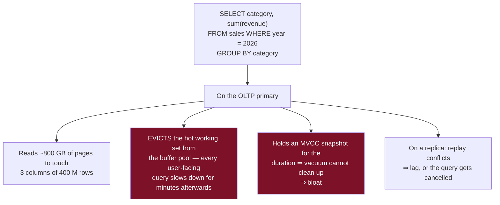
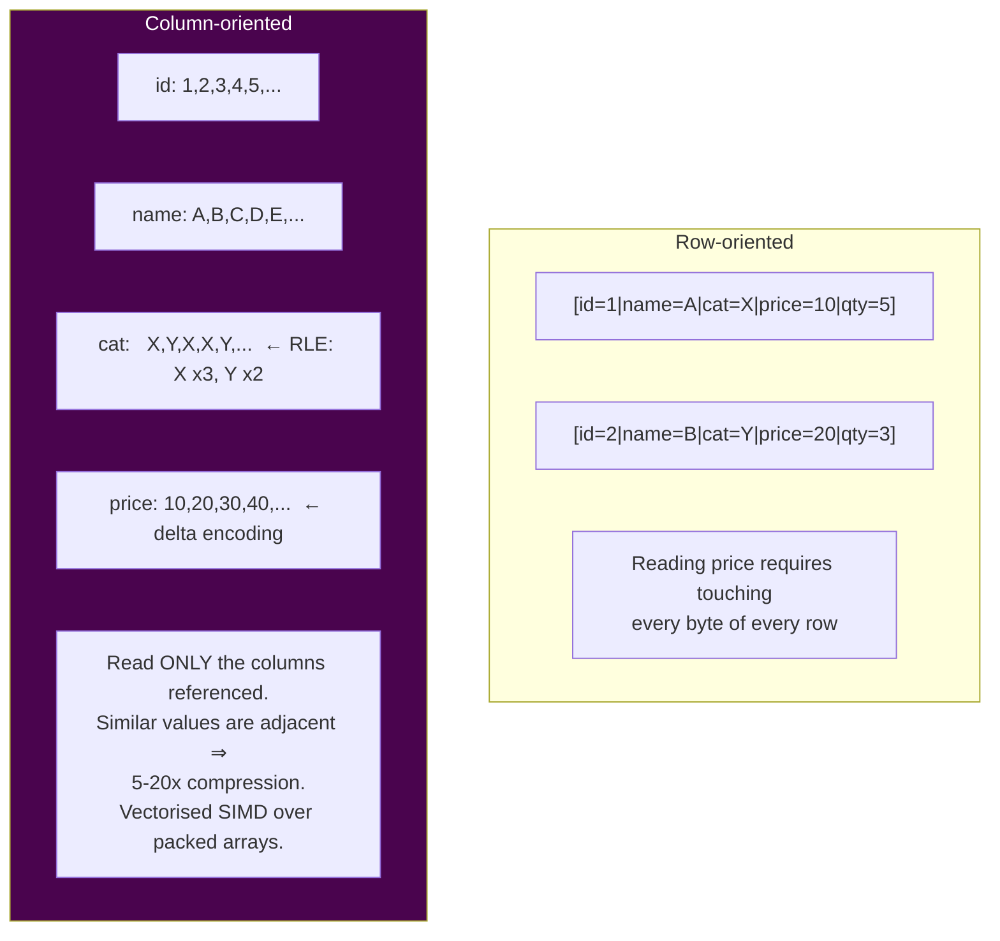
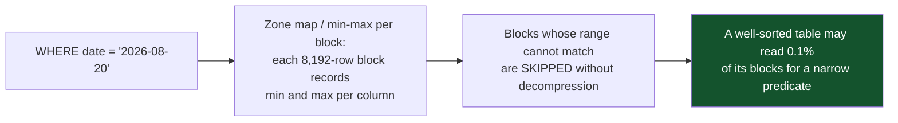
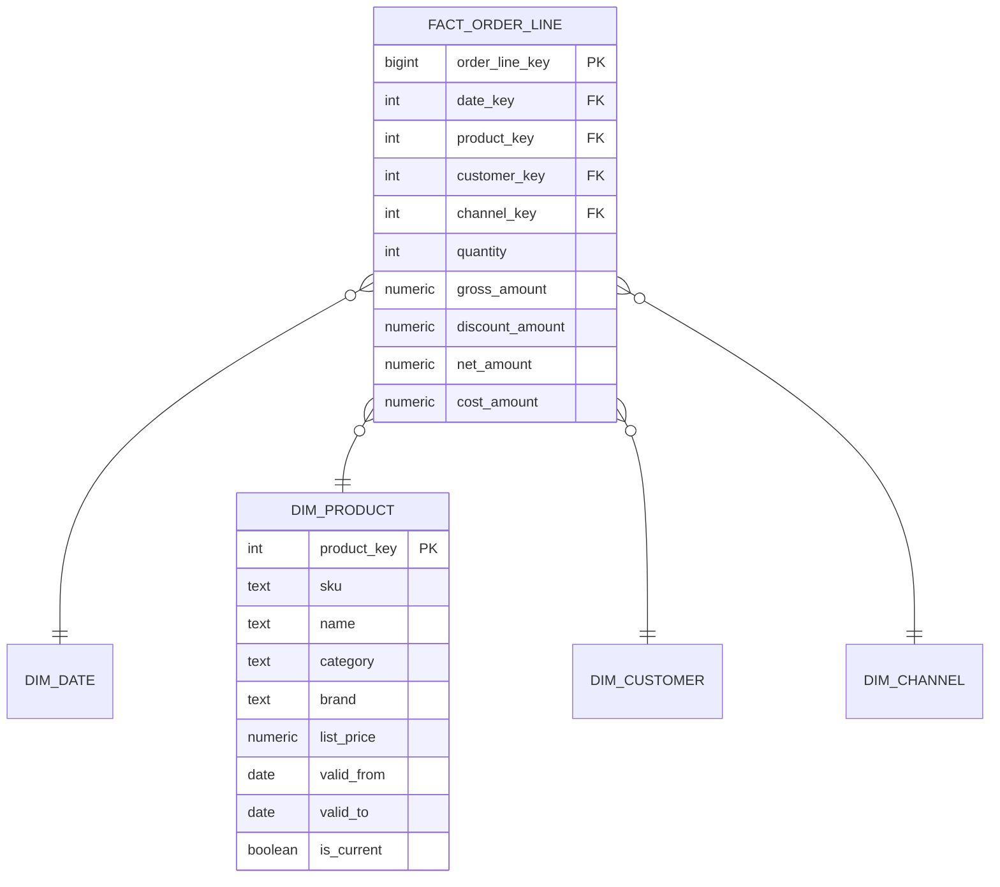
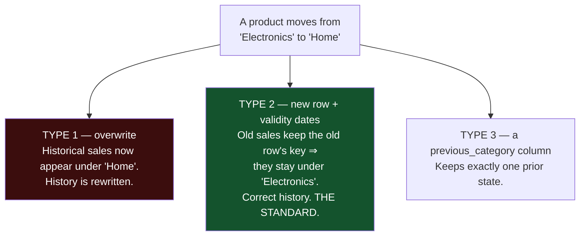
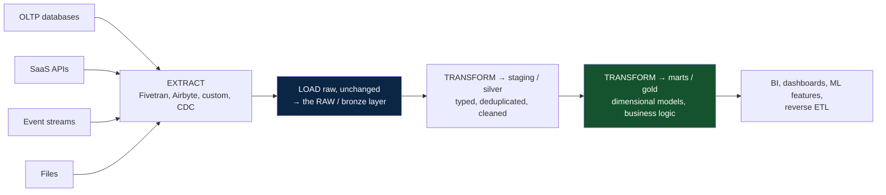
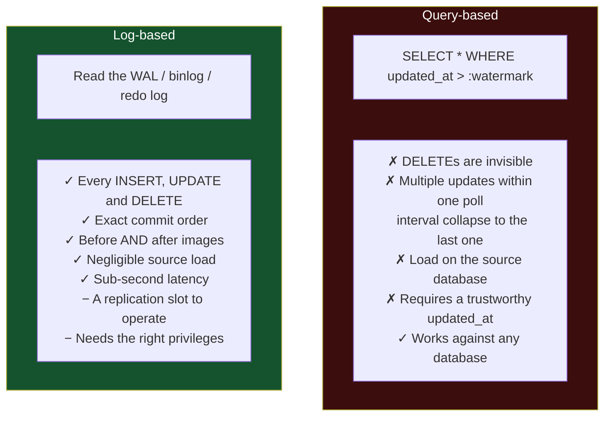
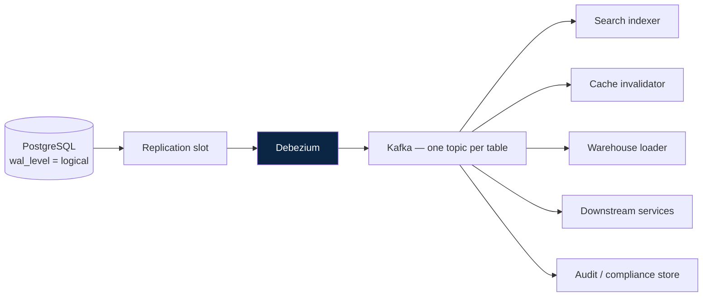
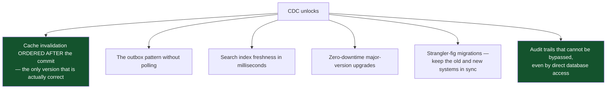
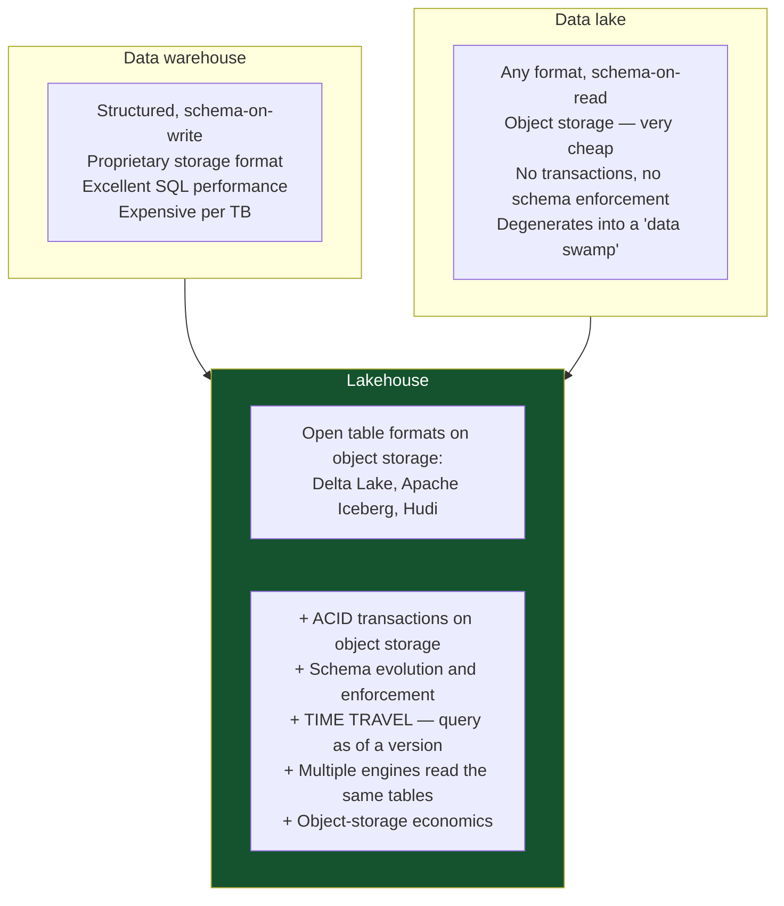

# 12 — OLAP, Warehousing and CDC

*Columnar storage, dimensional modelling, ELT pipelines, change data capture, and the lakehouse.*

[← back to the handbook](../README.md)

---

## 1. Why analytics needs a different system



The buffer-pool eviction is the effect people underestimate. One large analytical scan
does not merely take a long time — it degrades **every other query** for as long as it
takes the cache to refill.

---

## 2. Columnar storage



### 2.1 The encodings

| Encoding | Applies to | Effect |
|---|---|---|
| **Run-length (RLE)** | Sorted or low-cardinality columns | `X,X,X,X,Y,Y` → `(X,4),(Y,2)` |
| **Dictionary** | Repeated strings | Store integers, plus one dictionary |
| **Delta** | Sorted numerics, timestamps | Store differences, which are small |
| **Delta-of-delta** | Regular time intervals | Near-zero bytes for evenly-spaced series |
| **Bit-packing** | Small integer ranges | 3 bits instead of 32 |
| **Frame of reference** | Clustered numerics | Store an offset from a block minimum |

**Sort order determines compression.** A column store sorted by `(date, category)`
compresses those columns dramatically better than an unsorted one. Choosing the sort
key is the columnar equivalent of choosing a clustered index, and it is the highest-
impact schema decision in a warehouse.

### 2.2 Predicate pushdown and zone maps



This is the same idea as BRIN in PostgreSQL, applied natively.

---

## 3. Dimensional modelling



### 3.1 Grain — decide it first

The **grain** is what one row of the fact table represents. Getting it wrong is the
most expensive warehouse mistake, because everything downstream assumes it.

```
"One row per order line item"   ✓ atomic, flexible, aggregates to anything
"One row per order"             ✗ loses per-product detail permanently
"One row per customer per day"  ✗ already an aggregate; cannot drill down
```

**Model at the most atomic grain available.** Aggregates can always be derived;
detail that was never stored cannot be recovered.

### 3.2 Fact table types

| Type | Contains | Example |
|---|---|---|
| **Transaction** | One row per event | Each sale, each click |
| **Periodic snapshot** | State at regular intervals | Daily account balance |
| **Accumulating snapshot** | One row per process, updated as it progresses | An order with columns for placed/paid/shipped/delivered dates |
| **Factless** | Only keys — the event itself is the fact | Attendance, promotion eligibility |

### 3.3 Slowly changing dimensions



Type 2 requires a **surrogate dimension key** distinct from the natural key: the fact
row references `product_key = 8891` (a specific version), not `sku = 'W-1'`. That
indirection is precisely what preserves history.

---

## 4. ELT pipelines



### 4.1 Why the raw layer is non-negotiable

Keeping the untransformed extract means a transformation bug is fixed by re-running
SQL, not by re-extracting from a source system that may have changed, rate-limited
you, or discarded the data. It is cheap (object storage) and it is the difference
between a two-hour fix and a two-week one.

### 4.2 Incremental models

```sql
-- dbt-style incremental model
{{ config(materialized='incremental', unique_key='order_line_key') }}

SELECT ...
FROM {{ ref('stg_order_lines') }}

  -- overlap the window: late-arriving data is real
  WHERE updated_at > (SELECT max(updated_at) - interval '3 days' FROM {{ this }})

```

Two details that separate a working incremental model from a subtly wrong one: a
**lookback window** (source systems backdate records, and a strict `>` watermark
misses them permanently) and a **unique key** so the reprocessed overlap merges rather
than duplicates.

### 4.3 Testing the pipeline

| Test | Catches |
|---|---|
| Uniqueness on the primary key | Fan-out from a bad join — the most common transformation bug |
| Not-null on required columns | Upstream schema drift |
| Referential integrity to dimensions | Orphaned facts, missing dimension rows |
| Accepted values on enumerations | New source values nobody told you about |
| **Row count within an expected band** | A silently-failed extract |
| **Freshness** | A pipeline that stopped running |
| Reconciliation totals against the source | Systematic transformation errors |

The last three catch the failures that matter most, because they are the ones that
produce a dashboard that is *wrong* rather than *broken* — and a wrong dashboard is
trusted.

---

## 5. Change data capture

### 5.1 Log-based vs query-based



### 5.2 A CDC pipeline



### 5.3 The operational realities

| Concern | Detail |
|---|---|
| **Slot lag → disk full** | A stopped consumer accumulates WAL until the primary's disk fills and the **database goes down**. Set `max_slot_wal_keep_size` |
| **Snapshot then stream** | Initial load must be consistent with the stream's start LSN; Debezium handles this, hand-rolled connectors often do not |
| **Schema changes** | DDL is not replicated logically. Consumers must tolerate new and dropped columns — use a schema registry with compatibility rules |
| **Replica identity** | `UPDATE`/`DELETE` need a primary key, or `REPLICA IDENTITY FULL` (which doubles WAL volume) |
| **At-least-once** | Duplicates will occur. Downstream must be idempotent, keyed by primary key plus LSN |
| **Ordering** | Guaranteed per key if the key is the Kafka partition key. Not guaranteed across keys |
| **Backfill vs stream** | Reprocessing history means replaying from the topic's start, or re-snapshotting — design which one you rely on |

### 5.4 CDC beyond analytics



C6 is worth emphasising: an audit derived from the WAL captures **every** change,
including ones made by a console session, a migration script, or an attacker with
database credentials. An application-level audit log captures only what the
application did.

---

## 6. Lakehouse



The mechanism behind the ACID claim is a **metadata log**: the table format keeps a
transaction log of which data files constitute the table at each version. A write adds
new files and atomically appends a new log entry; readers see a consistent file list.
This gives snapshot isolation and time travel over immutable object-storage files
without any coordination server.

---

## 7. Checklist

```
□ Analytics does NOT run on the OLTP primary
□ Fact table grain decided explicitly, at the most atomic level available
□ Dimensions use surrogate keys; SCD type chosen per dimension
□ Sort/cluster key chosen for the actual query patterns (drives compression too)
□ Raw layer retained unchanged; transformations are re-runnable
□ Incremental models have a lookback window and a unique key
□ Pipeline tests: uniqueness, not-null, referential integrity, row-count band, freshness
□ CDC uses log-based capture, not polling
□ Every logically-replicated table has a primary key
□ max_slot_wal_keep_size set; slot lag alerted on
□ Consumers are idempotent and tolerate schema evolution
□ The rebuild path for every derived store is documented and TESTED
```

---

[← previous: NoSQL and polyglot persistence](11-nosql-and-polyglot-persistence.md) · [back to the handbook](../README.md) · [next: Migrations and operations →](13-migrations-and-operations.md)
