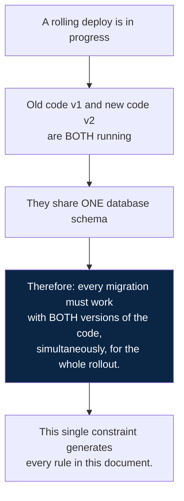
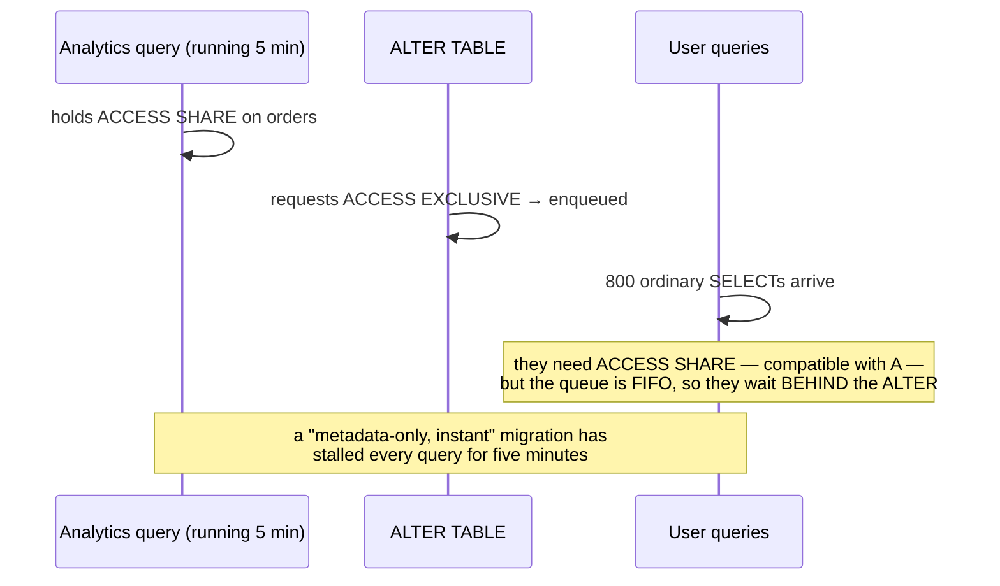
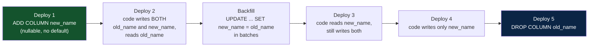
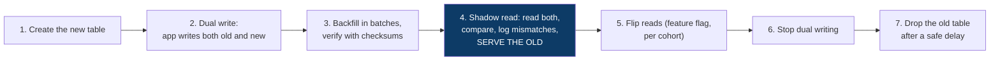
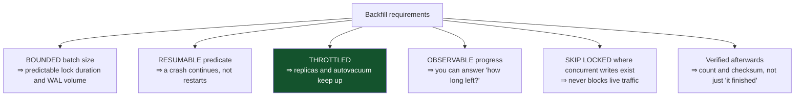
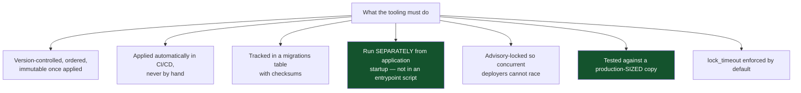
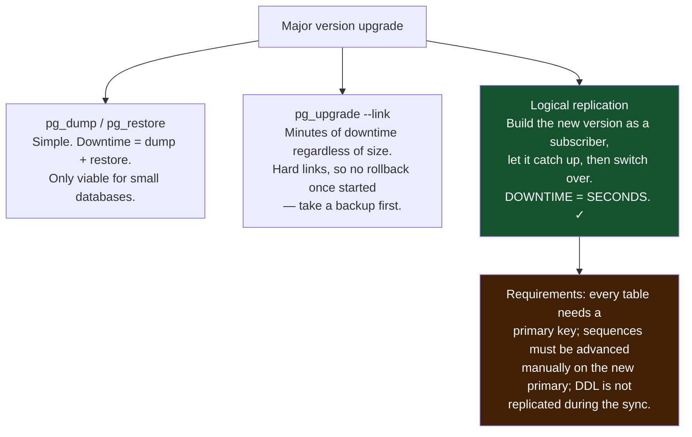

# 13 — Migrations and Operations

*Expand/contract, online DDL, backfills, and zero-downtime playbooks for the changes that hurt.*

[← back to the handbook](../README.md)

---

## 1. The governing constraint



The corollary people miss: it also applies to **rollback**. If you deploy v2 and must
revert to v1, the schema is still whatever v2's migration made it. A migration that
v1 cannot tolerate makes rollback impossible — which is exactly when you need it.

---

## 2. Safe and unsafe operations

| Operation | PostgreSQL | MySQL 8 | Notes |
|---|---|---|---|
| `ADD COLUMN` nullable, no default | Instant | Instant | Catalogue only |
| `ADD COLUMN` with a constant default | Instant (11+) | Instant (8.0.12+) | Older versions rewrite the table |
| `ADD COLUMN` with a **volatile** default | **Full rewrite** | Full rewrite | e.g. `DEFAULT gen_random_uuid()` |
| `ADD COLUMN NOT NULL` no default | Fails if rows exist | Fails | Add nullable → backfill → set NOT NULL |
| `DROP COLUMN` | Instant | Instant | Space reclaimed later |
| `RENAME COLUMN` | Instant, but **breaks v1** | Same | Use expand/contract |
| `ALTER TYPE` int→bigint | **Full rewrite + ACCESS EXCLUSIVE** | Rewrite | New column + backfill instead |
| `ALTER TYPE` varchar(50)→varchar(100) | Instant | Instant | Widening only |
| `SET NOT NULL` | Full scan (or instant with a valid CHECK, PG 12+) | Scan | Add `CHECK ... NOT VALID`, validate, then `SET NOT NULL` |
| `CREATE INDEX` | **Blocks writes** | Online by default | Use `CONCURRENTLY` |
| `DROP INDEX` | Brief exclusive lock | Fast | `DROP INDEX CONCURRENTLY` available |
| `ADD FOREIGN KEY` | Scans both tables | Scans | `NOT VALID` then `VALIDATE` |
| `ADD CHECK` | Full scan | Scan | `NOT VALID` then `VALIDATE` |
| `ADD PRIMARY KEY` | Blocks | Blocks | Build a unique index concurrently, then attach |

### 2.1 The two-step constraint pattern

```sql
-- step 1: instant — applies to new and modified rows only, takes a weak lock
ALTER TABLE orders
  ADD CONSTRAINT total_non_negative CHECK (total_amount >= 0) NOT VALID;

-- step 2: separate transaction — scans existing rows under a SHARE UPDATE EXCLUSIVE
-- lock, which does NOT block reads or writes
ALTER TABLE orders VALIDATE CONSTRAINT total_non_negative;
```

This pattern applies to `CHECK` and `FOREIGN KEY` constraints, and it turns a
table-locking operation into two safe ones. It is the single most useful migration
technique in PostgreSQL and is widely unknown.

---

## 3. The lock queue



### 3.1 The defence

```sql
-- always, for any DDL
SET lock_timeout = '3s';
SET statement_timeout = '30s';

ALTER TABLE orders ADD COLUMN note text;
-- on timeout: back off and retry. Retrying an instant DDL costs nothing;
-- blocking the application costs an incident.
```

Wrap DDL in a retry loop with backoff, and pair it with an operational rule: **no
long-running queries against the primary during a deploy window**. Many teams enforce
this by routing analytics to a replica permanently, which is the right answer anyway.

---

## 4. Playbooks

### 4.1 Renaming a column



Five deploys for a rename. It looks excessive until the first time a one-step rename
takes production down for the duration of a rollout.

### 4.2 int → bigint on a large table

The classic emergency: a `SERIAL` primary key approaching 2,147,483,647.

```sql
-- 1. add the new column (instant)
ALTER TABLE events ADD COLUMN id_new bigint;

-- 2. keep it in sync for new rows
CREATE FUNCTION events_sync_id() RETURNS trigger AS $$
BEGIN NEW.id_new := NEW.id; RETURN NEW; END;
$$ LANGUAGE plpgsql;

CREATE TRIGGER events_sync_id_trg
BEFORE INSERT OR UPDATE ON events
FOR EACH ROW EXECUTE FUNCTION events_sync_id();

-- 3. backfill in batches (hours; entirely online)
--    UPDATE events SET id_new = id WHERE id_new IS NULL AND id BETWEEN ...

-- 4. build the replacement index without blocking
CREATE UNIQUE INDEX CONCURRENTLY events_pkey_new ON events (id_new);

-- 5. the swap — one short transaction
BEGIN;
SET LOCAL lock_timeout = '3s';
ALTER TABLE events DROP CONSTRAINT events_pkey;
ALTER TABLE events ALTER COLUMN id_new SET NOT NULL;
ALTER TABLE events ADD CONSTRAINT events_pkey PRIMARY KEY USING INDEX events_pkey_new;
ALTER TABLE events DROP COLUMN id;
ALTER TABLE events RENAME COLUMN id_new TO id;
ALTER SEQUENCE events_id_seq AS bigint;
COMMIT;
```

Everything expensive happens online; only step 5 takes a strong lock, and it takes it
for milliseconds. Foreign keys referencing this table need the same treatment on their
referencing columns, planned together.

### 4.3 Adding an index to a hot table

```sql
CREATE INDEX CONCURRENTLY idx_orders_tenant_placed
    ON orders (tenant_id, placed_at DESC);

-- CONCURRENTLY: two table scans, no write blocking, cannot run inside a transaction.
-- If it fails it leaves an INVALID index behind — you must find and drop it:
SELECT indexrelid::regclass FROM pg_index WHERE NOT indisvalid;
DROP INDEX CONCURRENTLY idx_orders_tenant_placed;   -- then retry
```

Checking for invalid indexes after every concurrent build should be part of the
migration tooling, not a thing someone remembers to do.

### 4.4 Splitting a table



Every step is behind a flag, so rollback at any point before step 6 is a config change
rather than a deploy.

---

## 5. Backfills

```sql
-- resumable, bounded, throttled
DO $$
DECLARE n int;
BEGIN
  LOOP
    UPDATE orders SET status_v2 = status
     WHERE id IN (SELECT id FROM orders
                   WHERE status_v2 IS NULL
                   ORDER BY id LIMIT 5000
                   FOR UPDATE SKIP LOCKED);
    GET DIAGNOSTICS n = ROW_COUNT;
    EXIT WHEN n = 0;
    COMMIT;
    PERFORM pg_sleep(0.05);
  END LOOP;
END $$;
```



**Watch replication lag while a backfill runs.** A backfill that outpaces the
replicas' apply rate silently degrades every read served from a replica, and the
metric that reveals it is lag, not anything on the primary.

---

## 6. Migration tooling requirements



T4 deserves emphasis: running migrations from an application container's startup means
N replicas race to run them, a failed migration crash-loops the app, and there is no
clean place to intervene. Run migrations as a distinct, gated pipeline step.

T6 is the one that catches the real problems. A migration that takes 40 ms against
1,000 rows may take 40 minutes against 400 million, and staging will not tell you.

---

## 7. Routine operations

### 7.1 Vacuum tuning

```sql
-- global: the shipped defaults are conservative for modern hardware
ALTER SYSTEM SET autovacuum_max_workers = 6;
ALTER SYSTEM SET autovacuum_vacuum_cost_limit = 2000;   -- default 200
ALTER SYSTEM SET autovacuum_naptime = '15s';

-- per table: high-churn tables need much lower thresholds
ALTER TABLE sessions SET (
  autovacuum_vacuum_scale_factor  = 0.02,   -- default 0.2 = 20% of the table
  autovacuum_analyze_scale_factor = 0.01,
  autovacuum_vacuum_cost_delay    = 0
);
```

The default `scale_factor` of 0.2 means a 500 M-row table waits for 100 M dead tuples
before autovacuum triggers. On large, high-churn tables that is far too late — the
table has already bloated and the eventual vacuum is enormous.

### 7.2 Bloat monitoring

```sql
SELECT schemaname, relname,
       n_live_tup, n_dead_tup,
       round(100.0 * n_dead_tup / nullif(n_live_tup + n_dead_tup, 0), 1) AS dead_pct,
       last_autovacuum, last_autoanalyze
FROM pg_stat_user_tables
WHERE n_dead_tup > 10000
ORDER BY dead_pct DESC NULLS LAST;
```

Remedies in order of disruption: tune autovacuum (none), `pg_repack` (brief lock),
`VACUUM FULL` (table unavailable — last resort), rebuild indexes with `REINDEX
CONCURRENTLY`.

### 7.3 A routine schedule

| Frequency | Task |
|---|---|
| Continuous | Autovacuum, autoanalyze, WAL archiving, replication |
| Daily | Backup verification, bloat check, slow query review, disk growth |
| Weekly | Unused/redundant index review, connection pool sizing, lag trends |
| Monthly | **Restore test into a fresh environment**, failover drill |
| Quarterly | Capacity forecast, configuration review, version upgrade planning |
| Annually | Full DR exercise, security and access review |

The monthly restore test is the one that is always skipped and always turns out to
have been the important one.

---

## 8. Upgrades



The "advance the sequences manually" step is the one that goes wrong and produces
duplicate key errors immediately after cutover. Script it, and verify before switching
traffic.

---

## 9. Checklist

```
□ Every migration is compatible with the currently-deployed code AND its predecessor
□ Rollback path exists at every step
□ lock_timeout set on all DDL, with retry
□ Indexes built CONCURRENTLY; invalid indexes checked for afterwards
□ Constraints added NOT VALID then validated separately
□ Backfills batched, resumable, throttled, verified
□ Replication lag watched during backfills and migrations
□ Migrations run as a distinct pipeline step, advisory-locked, never at app startup
□ Tested against a production-sized dataset
□ Autovacuum tuned per table for high-churn tables
□ Restore tested monthly; failover drilled
□ Major-version upgrade path chosen and rehearsed before it is needed
```

---

[← previous: OLAP, warehousing and CDC](12-olap-warehousing-and-cdc.md) · [back to the handbook](../README.md) · [next: Performance playbook →](14-performance-playbook.md)
