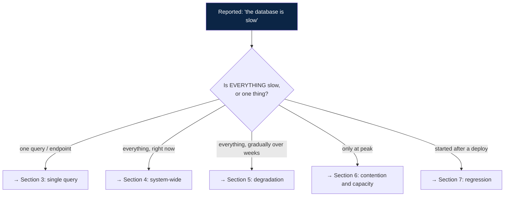
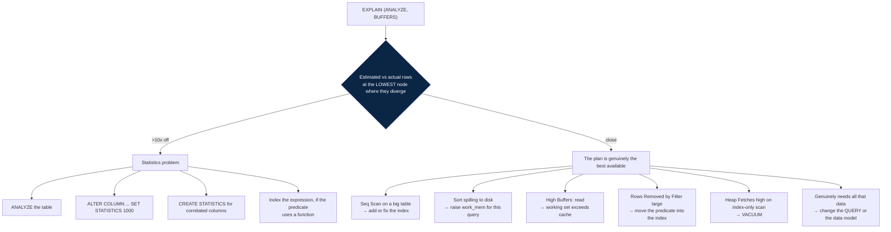
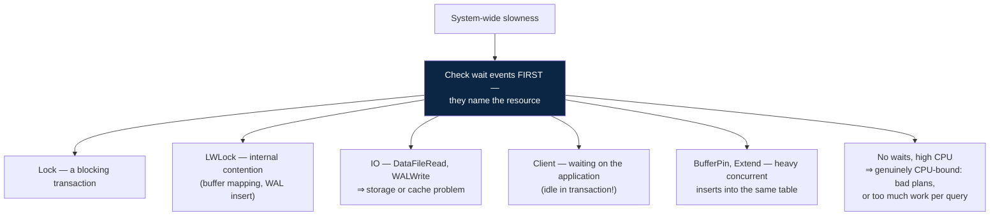
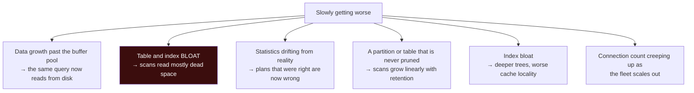
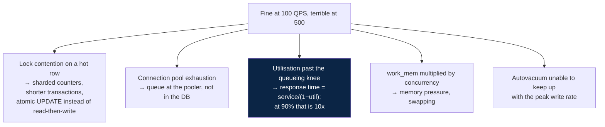
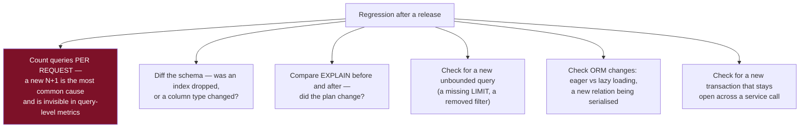

# 14 — Performance Playbook

*A diagnostic procedure from symptom to fix, with the queries to run at each step.*

[← back to the handbook](../README.md)

---

## 1. Triage



Answering that first question correctly saves most of the time. "Everything is slow"
and "one query is slow" have almost disjoint causes, and starting down the wrong
branch wastes the hour when it matters most.

---

## 2. The measurements to take first

```sql
-- 1. What is running right now?
SELECT pid, now() - query_start AS runtime, state, wait_event_type, wait_event,
       left(query, 100) AS query
FROM pg_stat_activity
WHERE state <> 'idle'
ORDER BY query_start;

-- 2. Is anything blocked?
SELECT blocked.pid AS blocked_pid,
       left(blocked.query, 60) AS blocked_query,
       blocking.pid AS blocking_pid,
       left(blocking.query, 60) AS blocking_query,
       now() - blocking.xact_start AS blocking_txn_age
FROM pg_stat_activity blocked
JOIN pg_stat_activity blocking
  ON blocking.pid = ANY(pg_blocking_pids(blocked.pid));

-- 3. What consumes the most time overall?
SELECT calls,
       round(total_exec_time::numeric)          AS total_ms,
       round(mean_exec_time::numeric, 2)        AS mean_ms,
       round(stddev_exec_time::numeric, 2)      AS stddev_ms,
       rows,
       round(100.0 * shared_blks_hit /
             nullif(shared_blks_hit + shared_blks_read, 0), 1) AS hit_pct,
       left(query, 90) AS query
FROM pg_stat_statements
ORDER BY total_exec_time DESC
LIMIT 20;

-- 4. Cache hit ratio (target > 0.99 for OLTP)
SELECT round(sum(heap_blks_hit) * 100.0 /
             nullif(sum(heap_blks_hit + heap_blks_read), 0), 2) AS cache_hit_pct
FROM pg_statio_user_tables;

-- 5. Connections
SELECT state, count(*) FROM pg_stat_activity GROUP BY state;
```

> **Order by `total_exec_time`, not `mean_exec_time`.** A 3 ms query called 200,000
> times per minute consumes ten times the resources of a 4-second report run hourly,
> and it is invisible if you sort by average duration.

---

## 3. One query is slow



### 3.1 Checking whether an index would help — without creating it

```sql
-- HypoPG: create a hypothetical index and see if the planner would use it
CREATE EXTENSION IF NOT EXISTS hypopg;
SELECT * FROM hypopg_create_index('CREATE INDEX ON orders (tenant_id, placed_at DESC)');
EXPLAIN SELECT ... ;    -- the planner now considers the hypothetical index
SELECT hypopg_reset();
```

This avoids the cost and risk of building a large index on a production table just to
discover the planner will not use it.

### 3.2 Common rewrites

| Slow pattern | Fast pattern |
|---|---|
| `WHERE lower(email) = $1` | `lower(email)` expression index, or store normalised |
| `WHERE date_trunc('day', ts) = $1` | `WHERE ts >= $1 AND ts < $1 + interval '1 day'` |
| `OFFSET 100000 LIMIT 20` | Keyset: `WHERE (ts, id) < ($1, $2) LIMIT 20` |
| `SELECT count(*)` for existence | `SELECT EXISTS (SELECT 1 ...)` |
| `NOT IN (subquery)` | `NOT EXISTS (...)` — also NULL-safe |
| `col = ANY(huge_array)` | `JOIN unnest($1) AS t(id) USING (id)` |
| `OR` across different columns | `UNION` of two indexed queries |
| Window function for top-N-per-group | `CROSS JOIN LATERAL (... ORDER BY ... LIMIT n)` |
| `ORDER BY random() LIMIT 1` | `TABLESAMPLE`, or a random offset with a known count |
| N+1 queries in the app | One query with `= ANY($1)`, or a join |

---

## 4. Everything is slow, right now



```sql
-- what is everything waiting on?
SELECT wait_event_type, wait_event, count(*)
FROM pg_stat_activity
WHERE state <> 'idle'
GROUP BY 1, 2
ORDER BY count DESC;
```

### 4.1 The usual acute causes

| Finding | Cause | Immediate action |
|---|---|---|
| One old transaction blocking many | A stuck or forgotten transaction | Identify it, `pg_cancel_backend()`, then `pg_terminate_backend()` |
| Many `idle in transaction` | The application opened transactions and went away | Set `idle_in_transaction_session_timeout`; fix the code path |
| Connections at max | Pool misconfiguration or a leak | Add a pooler; cap per-pod pool size |
| Heavy `DataFileRead` waits | Working set exceeds RAM | Reduce data touched, add RAM, better indexes |
| Checkpoint in progress | I/O burst | Raise `max_wal_size`, `checkpoint_completion_target = 0.9` |
| A migration or backfill running | Self-inflicted | Pause it |
| Autovacuum on a huge table | Overdue cleanup | Let it finish — cancelling makes it worse |

```sql
-- emergency: terminate the oldest blocking transaction
SELECT pg_terminate_backend(pid)
FROM pg_stat_activity
WHERE state = 'idle in transaction'
  AND now() - state_change > interval '10 minutes';
```

---

## 5. Gradual degradation over weeks



```sql
-- table growth over time (with pg_stat_statements or a metrics history)
SELECT relname,
       pg_size_pretty(pg_total_relation_size(relid)) AS total,
       pg_size_pretty(pg_relation_size(relid))       AS heap,
       pg_size_pretty(pg_indexes_size(relid))        AS indexes,
       n_live_tup, n_dead_tup
FROM pg_stat_user_tables
ORDER BY pg_total_relation_size(relid) DESC
LIMIT 20;
```

If `indexes` approaches or exceeds `heap`, you probably have redundant indexes, index
bloat, or both. `REINDEX CONCURRENTLY` addresses bloat; the unused-index query in
[docs/02](02-storage-engines-and-indexes.md) addresses the rest.

---

## 6. Slow only at peak



The queueing relationship is worth internalising: at 70% utilisation response time is
~3.3× the service time; at 90% it is 10×; at 95% it is 20×. **A database that looks
comfortable at 70% will fall off a cliff at 90%,** and the transition is fast. Target
utilisation, not "does it currently cope".

---

## 7. Slow since the deploy



Instrument **queries per request** as a standard metric. It catches N+1 regressions
the moment they ship, whereas per-query latency looks perfectly healthy — each of the
1,001 queries is fast.

---

## 8. Bulk operation performance

| Task | Approach |
|---|---|
| Load millions of rows | `COPY` (10–100× faster than `INSERT`); drop non-essential indexes first, rebuild after |
| Insert with many indexes | Drop → load → `CREATE INDEX` (parallel, and denser indexes) |
| Update a whole table | Batches of ~5,000 with commits and a short sleep |
| Delete most of a table | `CREATE TABLE new AS SELECT ... WHERE keep`, then swap; or partition and `DROP` |
| Delete by time | **Partition by time and `DROP PARTITION`** — milliseconds instead of hours |
| Many small inserts from the app | Multi-row `INSERT`, or a prepared batch; one round trip per batch |
| Upsert | `INSERT ... ON CONFLICT DO UPDATE` — one statement, one lock acquisition |

```sql
-- fast bulk load
BEGIN;
SET LOCAL synchronous_commit = off;      -- acceptable for a restartable load
ALTER TABLE staging SET UNLOGGED;        -- skip WAL entirely for a temp/staging table
COPY staging FROM STDIN WITH (FORMAT csv);
ALTER TABLE staging SET LOGGED;
COMMIT;
ANALYZE staging;                          -- statistics before anything queries it
```

The final `ANALYZE` is skipped constantly and matters: a freshly-loaded table has no
statistics, so the planner assumes a default row count and produces terrible plans for
the first queries against it.

---

## 9. Configuration quick reference

| Setting | Starting point | Why |
|---|---|---|
| `shared_buffers` | 25% of RAM | The OS cache supplements it |
| `effective_cache_size` | 60% of RAM | Planner hint only; costs nothing; changes plans |
| `work_mem` | 4–16 MB global; raise per-session | Per node, per connection — multiplies fast |
| `maintenance_work_mem` | 1–2 GB | Speeds up index builds and vacuum substantially |
| `random_page_cost` | **1.1 on SSD** | The default of 4.0 discourages index scans |
| `effective_io_concurrency` | 200 on NVMe | Enables prefetching for bitmap scans |
| `max_connections` | 100–200, with a pooler | More is worse |
| `checkpoint_completion_target` | 0.9 | Spread checkpoint I/O |
| `max_wal_size` | 4–16 GB | Make checkpoints time-triggered |
| `autovacuum_vacuum_cost_limit` | 2000 | The default of 200 is far too conservative |
| `default_statistics_target` | 100; raise for skewed columns | Better selectivity estimates |

`random_page_cost` and `effective_cache_size` are the two that most frequently produce
a large improvement for no risk, and both are left at their defaults on the majority
of installations.

---

## 10. The playbook, condensed

```
1. MEASURE      pg_stat_statements by total_exec_time; pg_stat_activity for now
2. CLASSIFY     one query / everything / gradual / peak-only / post-deploy
3. EXPLAIN      (ANALYZE, BUFFERS) — find the LOWEST node where estimate ≠ actual
4. ATTRIBUTE    statistics problem, missing index, memory, locks, or genuine work
5. FIX ONE      thing at a time
6. RE-MEASURE   same query, same params, warm and cold
7. CHECK        did writes get slower? did another plan change?
8. RECORD       what you changed and why — the next person is you in six months
```

---

[← previous: Migrations and operations](13-migrations-and-operations.md) · [back to the handbook](../README.md) · [next: Security, backup and observability →](15-security-backup-and-observability.md)
