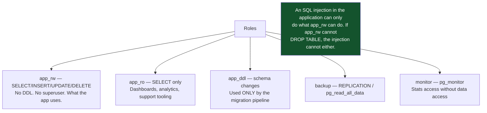
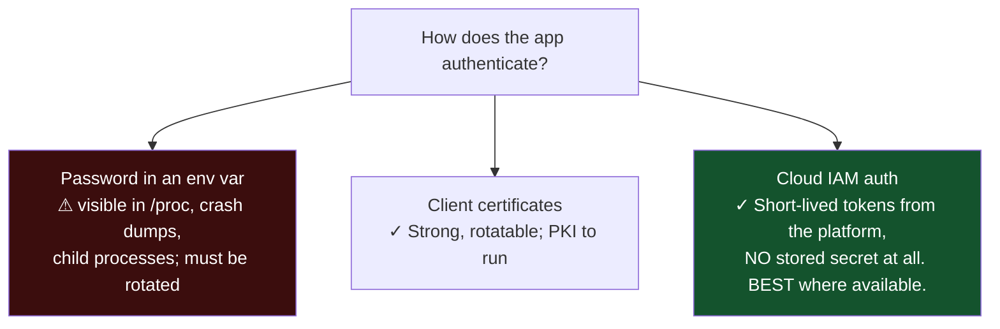
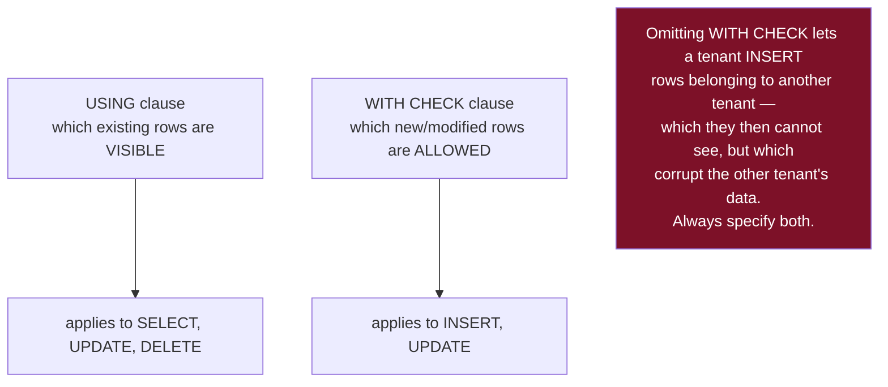
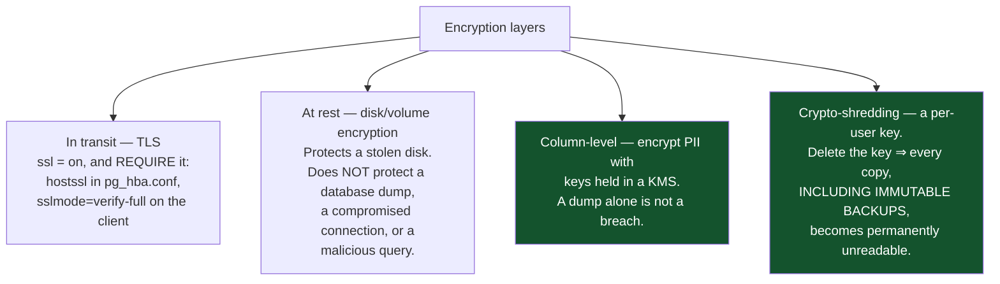
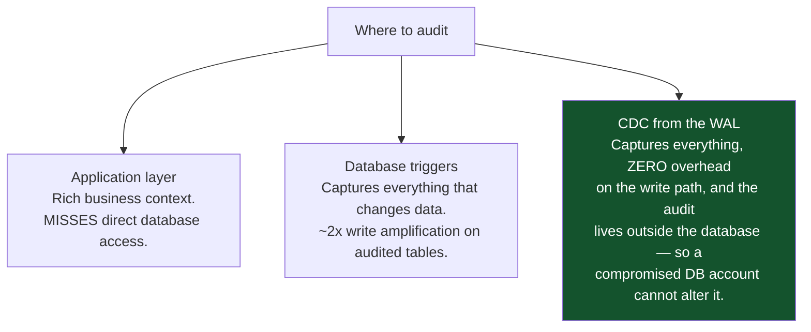
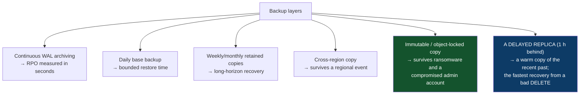

# 15 — Security, Backup and Observability

*Least privilege, row-level security, encryption, PITR, restore testing, and the metrics that matter.*

[← back to the handbook](../README.md)

---

## 1. Access control

### 1.1 Role separation



```sql
-- revoke the permissive defaults first
REVOKE ALL ON SCHEMA public FROM PUBLIC;
REVOKE ALL ON DATABASE appdb FROM PUBLIC;

CREATE ROLE app_rw LOGIN PASSWORD :'pw';
GRANT CONNECT ON DATABASE appdb TO app_rw;
GRANT USAGE ON SCHEMA public TO app_rw;
GRANT SELECT, INSERT, UPDATE, DELETE ON ALL TABLES IN SCHEMA public TO app_rw;
GRANT USAGE ON ALL SEQUENCES IN SCHEMA public TO app_rw;

-- future tables created by app_ddl get the same grants automatically
ALTER DEFAULT PRIVILEGES FOR ROLE app_ddl IN SCHEMA public
  GRANT SELECT, INSERT, UPDATE, DELETE ON TABLES TO app_rw;
```

The `ALTER DEFAULT PRIVILEGES` line is the one people forget, and its absence produces
the recurring "the new table works in staging but the app can't read it in
production" incident.

### 1.2 Authentication without passwords



---

## 2. Row-level security

```sql
ALTER TABLE invoices ENABLE ROW LEVEL SECURITY;
ALTER TABLE invoices FORCE ROW LEVEL SECURITY;   -- applies to the table OWNER too

CREATE POLICY tenant_read ON invoices FOR SELECT
  USING (tenant_id = current_setting('app.tenant_id', true)::uuid);

CREATE POLICY tenant_write ON invoices FOR ALL
  USING      (tenant_id = current_setting('app.tenant_id', true)::uuid)
  WITH CHECK (tenant_id = current_setting('app.tenant_id', true)::uuid);
```



### 2.1 The pooling interaction

```sql
-- ✓ correct with a TRANSACTION-mode pooler
BEGIN;
SET LOCAL app.tenant_id = '7f3a-...';
SELECT * FROM invoices;
COMMIT;

-- ✗ DANGEROUS with a transaction-mode pooler:
SET app.tenant_id = '7f3a-...';   -- session-scoped
-- the connection returns to the pool STILL CARRYING this tenant context.
-- the next borrower inherits it.
```

This is a real, exploitable cross-tenant data leak and it is entirely silent. Use
`SET LOCAL` inside an explicit transaction, always, and add a test that asserts the
setting is cleared after a connection is returned.

### 2.2 Performance

RLS predicates are appended to every query's `WHERE` clause, so the tenant column
**must be indexed and must be the leading column** of the indexes that serve tenant
queries. A policy on an unindexed column turns every query into a full scan.

---

## 3. Encryption



Column encryption has a real cost: encrypted columns cannot be indexed for range
queries or sorted meaningfully, and equality search requires deterministic encryption
(which leaks equality patterns). Encrypt what genuinely needs it — identifiers,
health data, financial details — rather than everything.

**Crypto-shredding is the only practical answer to "delete this user from a backup
taken in March"**, because you cannot edit an immutable backup. Designing for it means
a per-user data encryption key from day one; retrofitting it means re-encrypting
everything.

---

## 4. Auditing

```sql
-- trigger-based audit: captures changes from ANY source, including a console session
CREATE TABLE audit_log (
  id          bigserial PRIMARY KEY,
  table_name  text        NOT NULL,
  operation   char(1)     NOT NULL,
  row_id      text        NOT NULL,
  changed_at  timestamptz NOT NULL DEFAULT now(),
  changed_by  text        NOT NULL DEFAULT current_user,
  app_user    text,                   -- from current_setting('app.user_id', true)
  old_row     jsonb,
  new_row     jsonb
);
```



For regulated data, **audit reads as well as writes** — "who viewed this record" is the
question compliance actually asks, and it is not answerable from a change log.

---

## 5. Backup

### 5.1 Strategy



The delayed replica is under-used and cheap: `recovery_min_apply_delay = '1h'` gives
you a running database as it was an hour ago. When someone runs a destructive
statement, you have an hour to notice and read the correct data out of it — far faster
than restoring a backup.

### 5.2 Point-in-time recovery

```bash
# restore into a NEW instance, never over the damaged one
pg_basebackup -D /restore -h backup-host -X stream

# recovery target
cat >> /restore/postgresql.conf <<'EOF'
restore_command = 'cp /wal_archive/%f %p'
recovery_target_time = '2026-08-20 14:22:00+00'
recovery_target_action = 'pause'   # inspect before promoting
EOF
touch /restore/recovery.signal
```

Restoring to a new instance preserves the option of trying a different target time,
which you will need if the first guess lands after the damage.

### 5.3 The rule that matters

> **An untested backup is a hypothesis.** Schedule a restore test — monthly is
> reasonable — into a fresh environment, and *verify with real queries* that the data
> is correct and complete. Then measure how long it took, and compare that to your
> stated RTO.

The failure modes found by restore testing and by nothing else:

| Failure | Discovered how |
|---|---|
| Backup job silently failing for weeks | The restore has no recent data |
| A tablespace or table excluded | Tables missing after restore |
| The decryption key is stored only in the environment being restored | Cannot decrypt |
| WAL archive gaps | Recovery stops before the target |
| Restore takes 11 hours; the RTO is 1 | Timing the test |
| Restore requires an undocumented manual step | Somebody has to work it out at 3 am |

---

## 6. Observability

### 6.1 The alerting set

| Metric | Threshold | Severity |
|---|---|---|
| **Transaction id age** | > 1 billion | **Critical — writes will stop** |
| **Replication slot retained WAL** | > a few GB | **Critical — disk will fill** |
| Disk free | < 20%, or < 14 days projected | Critical |
| Replication lag (replay) | > SLO | High |
| Connections in use | > 80% of max | High |
| Longest transaction | > 5 minutes | High |
| Cache hit ratio | < 0.95 | Medium |
| Deadlocks per minute | Any sustained rate | Medium |
| Blocked sessions | Any > 10 s | Medium |
| Dead tuple ratio | > 25% | Medium |
| Failed archive command | Any | High |
| Backup age | > 26 hours | High |
| Restore test age | > 35 days | Medium |

The top two cause **complete outages** rather than degradation, and both are silent
until the moment they are not. They belong at the top of any database alerting
configuration.

### 6.2 The queries behind them

```sql
-- transaction id age (wraparound risk)
SELECT datname, age(datfrozenxid) AS xid_age,
       round(100.0 * age(datfrozenxid) / 2000000000, 1) AS pct_to_wraparound
FROM pg_database ORDER BY xid_age DESC;

-- replication slots retaining WAL
SELECT slot_name, slot_type, active,
       pg_size_pretty(pg_wal_lsn_diff(pg_current_wal_lsn(), restart_lsn)) AS retained
FROM pg_replication_slots
ORDER BY pg_wal_lsn_diff(pg_current_wal_lsn(), restart_lsn) DESC;

-- replication lag, per standby
SELECT application_name, state, sync_state,
       pg_size_pretty(pg_wal_lsn_diff(pg_current_wal_lsn(), replay_lsn)) AS replay_lag
FROM pg_stat_replication;

-- WAL archiving health
SELECT archived_count, last_archived_time,
       failed_count,  last_failed_time, last_failed_wal
FROM pg_stat_archiver;

-- longest running transaction
SELECT pid, usename, state, now() - xact_start AS age, left(query, 80)
FROM pg_stat_activity
WHERE xact_start IS NOT NULL
ORDER BY xact_start LIMIT 5;
```

### 6.3 Logging configuration

```
log_min_duration_statement = 1000      # log queries over 1 s
log_lock_waits = on                    # log waits exceeding deadlock_timeout
log_checkpoints = on                   # correlate latency spikes with checkpoints
log_autovacuum_min_duration = 0        # every autovacuum, with its cost
log_temp_files = 0                     # every spill to disk — reveals work_mem issues
log_connections = on
log_disconnections = on
log_line_prefix = '%m [%p] %q%u@%d app=%a '
```

`log_temp_files = 0` is the most informative and least known of these: every logged
temporary file is a sort or hash that exceeded `work_mem` and spilled to disk, which
is often a large and easily-fixed latency contributor.

---

## 7. Checklist

```
□ PUBLIC privileges revoked; roles separated (rw / ro / ddl / backup / monitor)
□ ALTER DEFAULT PRIVILEGES configured so new tables inherit grants
□ TLS required, verified (verify-full), not merely available
□ RLS enabled with FORCE, and both USING and WITH CHECK specified
□ SET LOCAL used for tenant context; a test asserts it does not leak across the pool
□ Tenant column indexed as the leading column
□ PII encrypted at the column level with KMS-held keys
□ Per-user keys for crypto-shredding if erasure must reach backups
□ Audit trail exists and cannot be bypassed by direct database access
□ Continuous WAL archiving; archive failures alerted on
□ Cross-region and immutable backup copies
□ Delayed replica for fast logical-error recovery
□ RESTORE TESTED MONTHLY, timed against the RTO, verified with real queries
□ Transaction id age and replication slot lag alerted on — these cause outages
□ log_min_duration_statement, log_lock_waits, log_temp_files enabled
```

---

[← previous: Performance playbook](14-performance-playbook.md) · [back to the handbook](../README.md) · [next: Interview questions →](16-interview-questions.md)
