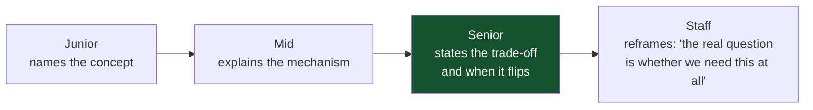

# 16 — Interview Questions

*Sixty questions with answers, graded junior → staff. Answer them aloud before reading the answer.*

[← back to the handbook](../README.md)

---

## How to use this

The answers are written the way a strong candidate would actually speak: a direct
claim, the mechanism behind it, and the trade-off. Where a question has a "junior
answer" and a "senior answer", both are given — the difference between them is
usually the entire point of asking.

---

## Part 1 — Modelling (1–8)

**1. What is normalisation and why does it matter?**
Structuring a schema so each fact is stored exactly once. It matters because
duplicated facts eventually disagree and there is no principled way to decide which
copy is right. 3NF removes update, insert and delete anomalies. Target 3NF for OLTP;
warehouses deliberately denormalise because dimensions are read constantly and
updated rarely.

**2. When would you denormalise?**
When a *measured* read cost justifies it and I have ruled out a covering index or a
materialised view first. The safe cases are historical facts (`price_at_purchase` is
a different fact from `current_price`, not redundancy), engine-maintained values
(generated columns, materialised views), and read models in a separate store where
duplication is the point.

**3. Surrogate or natural primary key?**
Surrogate, plus a `UNIQUE` constraint on the natural key. Natural keys change —
people change email addresses — and a changing primary key means cascading updates
across every referencing table. Natural keys are also wide, which matters enormously
in InnoDB where the primary key is copied into every secondary index.

**4. `BIGINT` or `UUID` for a primary key?**
`BIGINT` if a single sequence is acceptable — it is narrow and sequential.
**UUIDv7** if I need distributed generation or want to avoid leaking volume. Never
UUIDv4 on a high-write table: random keys scatter inserts across the whole B-tree,
splitting pages at ~50% fill, so the index roughly doubles in size and the working
set becomes the entire index instead of the right-hand edge.

**5. Why is `FLOAT` wrong for money?**
Binary floating point cannot represent 0.1 exactly, so errors accumulate with every
arithmetic operation. Use `NUMERIC(19,4)` or store integer minor units. This is not
theoretical — ledgers on `FLOAT` develop drift proportional to transaction volume and
are unauditable.

**6. How would you model a hierarchy?**
Adjacency list (`parent_id`) with recursive CTEs is the default — simple writes, and
modern SQL handles the reads. If subtree queries are frequent and deep, a closure
table gives O(1) subtree reads at the cost of O(depth) rows per node. Nested sets are
rarely worth it because any insert rewrites half the table.

**7. What is `NULL` and what surprises people about it?**
It means *unknown*, and it propagates through three-valued logic. `NULL = NULL` is
`NULL`, not true. `WHERE x NOT IN (1, NULL)` is never true, so the query silently
returns zero rows — use `NOT EXISTS`. Aggregates ignore NULLs, so `COUNT(col)` and
`COUNT(*)` differ.

**8. What is a covering index?**
An index containing every column a query needs, so the query is answered without
touching the table — an index-only scan. In PostgreSQL, use `INCLUDE` for columns
needed only in the output; they ride in the leaf without widening the internal pages
the tree navigates through.

---

## Part 2 — Indexes and queries (9–20)

**9. How does a B+Tree index work?**
A balanced tree where all values live in the leaves, which are linked so a range scan
walks sideways without revisiting the tree. Internal pages hold only separator keys,
giving a fan-out of a few hundred per page, so even a billion-row table is three or
four levels deep. That is why indexed lookup latency barely changes with table size.

**10. Why might the planner ignore my index?**
Six common reasons: a function wraps the column; an implicit type cast; a leading
wildcard in `LIKE`; low selectivity (a sequential scan is genuinely cheaper above
roughly 5–20% of rows); stale statistics; or the table is small enough that it does
not matter. The fourth is not a bug — the planner is right and the query is asking
for most of the table.

**11. Explain composite index column order.**
The index is sorted by the first column, then the second within equal values of the
first, and so on, so it serves any **leftmost prefix**. Order equality columns first,
then one range column, then columns used for sorting. A range column stops the index
being usable for anything after it, which is why only one is useful.

**12. What does `EXPLAIN ANALYZE` tell you that `EXPLAIN` does not?**
It actually executes the query and reports real row counts and timings. The gap
between estimated and actual rows is the diagnosis — find the lowest node where they
diverge, because errors propagate upward. Also watch `loops=`: actual time is *per
loop*, so `0.03 ms × 1.2 M loops` is 36 seconds, not 0.03.

**13. Nested loop, hash join, merge join — when is each right?**
Nested loop when the outer side is small and the inner side is indexed. Hash join for
large equality joins with no useful index. Merge join when both inputs are already
sorted on the key, or for inequality joins. The most common bad plan in production is
a nested loop chosen because the outer cardinality was underestimated — fix the
estimate, not the join type.

**14. What is the N+1 problem?**
Fetching a list, then issuing one query per item. 1,001 round trips instead of two.
At 1 ms of network latency each, that is a second of pure latency. Fix with a join,
`WHERE id = ANY($1)`, or a batching data loader. Detect it by instrumenting **queries
per request** — per-query latency looks perfectly healthy because each query is fast.

**15. Why is `OFFSET` pagination slow, and what is the alternative?**
The engine must locate and discard every skipped row, so cost grows linearly with
depth; and concurrent inserts shift the window, producing duplicated and skipped
items. Keyset pagination — `WHERE (created_at, id) < ($1, $2) ORDER BY ... LIMIT n` —
is an index seek, constant cost at any depth, and stable under concurrent writes. The
trade is that you cannot jump to an arbitrary page.

**16. What is a partial index and when would you use one?**
An index with a `WHERE` clause, covering only matching rows. If 95% of rows are
soft-deleted and every query filters `deleted_at IS NULL`, a partial index is a
twentieth of the size, fits in cache, and is faster to maintain.

**17. What is BRIN and when does it beat B-tree?**
BRIN stores min/max per block range. On a time-ordered append-only table it is
kilobytes where a B-tree would be gigabytes, and it prunes ranges nearly as well. It
only works when physical order correlates with the indexed column — check
`pg_stats.correlation`.

**18. What does an index cost?**
Every write pays: an insert costs a tree descent per index; an update of an indexed
column costs a delete plus an insert in that index and, if the row moves, in every
index. Plus disk, plus buffer-pool competition, plus planning time. A table with
twelve indexes can be an order of magnitude slower to write than one with two.

**19. How do you find missing indexes?**
`pg_stat_user_tables` ordered by `seq_tup_read` finds tables being scanned heavily.
Foreign keys without indexes are a specific, very common, very expensive omission —
every parent delete scans the child table. And `pg_stat_statements` ranked by
`total_exec_time` tells you which queries are worth the effort.

**20. Write a query to find unused indexes.**
`pg_stat_user_indexes` where `idx_scan` is near zero, excluding unique and primary
indexes. The caveat matters: those counters reset on restart and are per-instance, so
check across replicas and over a full business cycle — an index used only by the
monthly report looks unused for 29 days.

---

## Part 3 — Transactions and isolation (21–34)

**21. What does ACID stand for, and which letter is the odd one out?**
Atomicity, Consistency, Isolation, Durability. **Consistency is the odd one out** —
the other three are properties the database provides, while consistency is the
application's invariants that the database enforces via constraints. It is also not
the C in CAP, which means linearisability.

**22. How is atomicity implemented?**
Undo logging. Before each change, the old value is recorded; rollback replays the
undo log backwards. Combined with redo logging in the WAL, this supports the
steal/no-force buffer policy — dirty pages may be written before commit, and clean
pages need not be written at commit.

**23. What is a dirty read, and can PostgreSQL produce one?**
Reading uncommitted data. **PostgreSQL cannot** — it accepts `READ UNCOMMITTED` as
syntax but treats it as `READ COMMITTED`, because MVCC readers only ever see
committed versions. InnoDB does honour it.

**24. Non-repeatable read versus phantom read?**
Non-repeatable: the same *row* returns different values on re-read. Phantom: the same
*query* returns a different *set of rows*. The distinction matters because locking
the rows you read prevents the first but not the second — there is nothing to lock
for a row that does not yet exist.

**25. What is a lost update and how do you prevent it?**
Two read-modify-write cycles interleave and one is silently discarded, with no error.
Prevent it with an atomic in-database update (`SET n = n - 1 WHERE n > 0`),
`SELECT ... FOR UPDATE`, an optimistic version column, or `REPEATABLE READ` — which
in PostgreSQL raises `40001` rather than losing the update.

**26. What is write skew? Give a real example.**
Two transactions each read a set of rows, check an invariant, and write to
*different* rows. Neither conflicts, and together they break the invariant. Classic
example: two doctors both check that two people are on call, both conclude it is safe
to go off call, and both do. Snapshot isolation permits it because it only detects
write-write conflicts.

**27. Why doesn't snapshot isolation prevent write skew?**
Because the conflict is read-write, not write-write. Each transaction invalidated the
other's *premise*, but neither wrote to a row the other wrote. SSI catches this by
tracking read-write dependencies and aborting when it sees the dangerous structure.

**28. What is the default isolation level, and what does it permit?**
`READ COMMITTED` in PostgreSQL, MySQL is `REPEATABLE READ`, most others `READ
COMMITTED`. It prevents dirty reads and permits everything else: non-repeatable
reads, phantoms, lost updates and write skew. If you never chose a level, you chose
that one.

**29. When would you use `SERIALIZABLE`?**
For a transaction carrying an invariant across rows that a constraint cannot express
— the on-call example, or a booking check across a set. Not globally: abort rates
rise sharply under contention, and **every** application using it needs a retry
wrapper on `40001`. Where a `UNIQUE` or `EXCLUDE` constraint can express the
invariant, use that instead — it is cheaper and always correct.

**30. Explain MVCC.**
Writers create new row versions instead of overwriting; each transaction reads the
versions visible at its snapshot. Readers never block writers and writers never block
readers. The cost is garbage collection — old versions must be reclaimed, and they
cannot be reclaimed while any transaction might still need them.

**31. Why does one long transaction bloat the whole database?**
Its snapshot pins the oldest version that must be retained. Vacuum cannot remove any
version newer than that snapshot, anywhere in the database — so a forgotten `BEGIN`
in a psql session bloats tables it never touched. Monitor the age of the oldest
running transaction; it is one of the most important database metrics.

**32. What is transaction id wraparound?**
Transaction ids are 32-bit and circular, so a tuple older than about 2 billion
transactions would appear to be in the future. Vacuum freezes old tuples to prevent
this. If autovacuum cannot keep up — usually because of a long transaction or an
abandoned replication slot — **PostgreSQL refuses all writes** to protect the data.
Alert on `age(datfrozenxid)`.

**33. What is a deadlock and how do you prevent it?**
A cycle in the wait-for graph. The engine detects it and aborts a victim. Prevent it
with **consistent lock ordering** — always lock rows in ascending primary key order —
short transactions, and indexed predicates so an update does not lock rows it has no
interest in. And always retry on the deadlock error; deadlocks are normal, not
exceptional.

**34. Optimistic or pessimistic concurrency control?**
Optimistic when conflicts are rare and especially when user think-time sits between
the read and the write — a version column holds no database resources across an HTTP
round trip. Pessimistic when contention is high, because one wait beats repeated
wasted work. The crossover is measurable: above roughly a 10–20% conflict rate,
switch to locking.

---

## Part 4 — Locks and WAL (35–42)

**35. What lock modes exist and why does an `UPDATE` lock exist?**
Shared, exclusive, update, and the intent variants. The update lock prevents the
conversion deadlock: two transactions each take a shared lock intending to upgrade to
exclusive, and neither can, because the other holds shared. An update lock is
compatible with shared but not with another update, so only one transaction can be in
the about-to-write state.

**36. What are intent locks for?**
To make coarse-grained lock acquisition O(1). To take a table-level exclusive lock,
the engine must know no conflicting row lock exists; scanning every row would be
O(n). A row lock also sets an intent lock on the page and table, so the table-level
check sees it immediately.

**37. What is a gap lock?**
A lock on the interval between index values, preventing inserts into that range. It
is how InnoDB prevents phantoms at `REPEATABLE READ`. Two consequences surprise
people: a `SELECT ... FOR UPDATE` on a range with no matches still blocks inserts
into it, and an unindexed predicate causes InnoDB to lock every row it scans —
effectively a table lock.

**38. What is write-ahead logging and why does it exist?**
Log the intent before changing anything. The rule is that a log record must be durable
before the corresponding data page. It exists because a commit touches scattered
pages — random I/O — while the log is a single sequential append. WAL converts random
durability into sequential durability.

**39. What is group commit?**
Batching several transactions' commit records into one fsync. At 1 ms per fsync, this
is the difference between roughly 1,000 and 100,000 transactions per second. It is
also why throughput often *improves* with more concurrent clients — larger groups
amortise the fsync.

**40. Explain ARIES recovery.**
Three phases: analysis rebuilds the dirty page table and the set of in-flight
transactions from the last checkpoint; redo replays **all** logged changes, including
those of transactions that later aborted, restoring the exact pre-crash state; undo
rolls back the uncommitted ones, writing compensation log records. Repeating history
including aborted work is what makes recovery restartable — crash during recovery and
you simply start again.

**41. What is a checkpoint and what is the trade-off?**
Flushing dirty pages so WAL before that point can be recycled. Frequent checkpoints
mean fast recovery and small WAL but constant I/O spikes and more full-page writes;
infrequent means smooth I/O but long recovery. Spread the writes with
`checkpoint_completion_target = 0.9` so they trickle rather than burst.

**42. What else does the WAL power besides recovery?**
Physical replication, logical replication and CDC, point-in-time recovery,
incremental backup, and warm standbys — all the same subsystem. It is also why a dead
replication slot is dangerous: it retains WAL until its consumer confirms, and an
abandoned slot will fill the disk and take the primary down. Set
`max_slot_wal_keep_size`.

---

## Part 5 — Scale (43–54)

**43. Partitioning versus sharding?**
Partitioning splits one table within one database — transparent to the application,
transactions unchanged, easily reversed. Sharding splits data across independent
servers — routing becomes the application's problem, cross-shard transactions and
joins are lost, and it is effectively irreversible. Partition first.

**44. What does partitioning actually buy you?**
Partition pruning, much smaller per-partition indexes, parallel maintenance, tiered
storage — and above all, **retention by `DROP PARTITION`**. Deleting a month of data
from an unpartitioned table takes hours, bloats it, floods the WAL and lags every
replica; dropping a partition is a catalogue update.

**45. What breaks when you shard?**
Cross-shard joins, cross-shard transactions, global uniqueness and auto-increment,
global `ORDER BY ... LIMIT` (which becomes scatter-gather with quadratic deep
pagination), global aggregates, and simple schema migrations. Each has a workaround;
together they are why sharding is a last resort.

**46. How do you choose a shard key?**
High cardinality, even distribution, present in most queries, immutable, and it
should co-locate data that is used together. For SaaS that is usually `tenant_id`,
with directory routing so the whale tenants can get dedicated shards. Never shard on
time alone — all writes land on today's shard.

**47. How do you reshard without downtime?**
Dual write to old and new, backfill in verified batches, **shadow read** — query both,
compare, log mismatches, serve the old result — then cut reads over per cohort, stop
dual writing, and drop the old data after a delay. The shadow-read step is the one
teams skip and the one that finds the bugs.

**48. Synchronous or asynchronous replication?**
Semi-synchronous with a quorum — `ANY 1 (s1, s2, s3)` — is the right default. Async
loses committed writes on primary failure; fully synchronous makes one sick replica a
write outage; naming a single synchronous standby makes that standby's availability
your primary's availability.

**49. Why is my replica lagging?**
Most often single-threaded apply against parallel writes on the primary. Also: a long
query on the standby conflicting with replay, weaker replica hardware, one enormous
transaction arriving as a unit, or network saturation. Measure both replay lag (what
readers see) and flush lag (what determines data loss on failover) — they are
different numbers.

**50. What is split brain and how do you prevent it?**
Two nodes both accepting writes after a partition. Prevent it with a majority quorum
— an odd number of voters or a witness outside both sites — plus fencing, so the old
primary cannot accept writes if it returns. Two-node clusters cannot do this safely:
each side sees one failure and cannot tell which is isolated.

**51. What is the read-your-writes problem and how do you fix it?**
A user writes to the primary, the load balancer sends their next read to a lagging
replica, and their own change is missing. Fix by routing reads to the primary briefly
after a write, or — better — by carrying the write's LSN and requiring the replica to
have caught up to it. The LSN approach keeps replica parallelism.

**52. Why do 30 connections often outperform 300?**
Beyond roughly twice the core count, more connections increase context switching and
lock-manager contention without adding throughput, while each one consumes memory and
a process. Queueing at a pooler is cheap; queueing inside the database is expensive.
Size the pool at about `(2 × cores) + spindles`.

**53. What does transaction-mode pooling break?**
Anything session-scoped: `SET` (use `SET LOCAL`), session-level advisory locks,
`LISTEN`/`NOTIFY`, temporary tables, and naive server-side prepared statements. The
dangerous one is session-scoped tenant context for row-level security — it leaks to
the next borrower of that connection, which is a silent cross-tenant data leak.

**54. When would you choose distributed SQL over PostgreSQL?**
When the data or write volume genuinely exceeds one machine, when multi-region writes
with transactions are required, or when I would otherwise build sharding myself. Not
before — a tuned single primary with replicas and partitioning serves the
overwhelming majority of applications at lower latency and a fraction of the
operational cost.

---

## Part 6 — Operations and judgement (55–60)

**55. How do you add an index to a hot table without downtime?**
`CREATE INDEX CONCURRENTLY` — two table scans, no write blocking, cannot run inside a
transaction. If it fails it leaves an invalid index behind, so check
`pg_index WHERE NOT indisvalid` afterwards and drop it before retrying.

**56. How do you rename a column with zero downtime?**
Expand and contract: add the new column; dual write; backfill in batches; switch
reads; stop writing the old column; drop it. Five deploys, each independently
reversible. A one-step rename breaks every request served by the old code version
still running — which is most of them, for the first minutes of a rollout.

**57. Why can a "metadata-only, instant" migration take the site down?**
Lock queues are FIFO. The `ALTER` requests a strong lock, waits behind a long-running
query, and every subsequent ordinary query queues behind the `ALTER` — even those
compatible with the current holder. Set `lock_timeout` and retry; a fast DDL costs
nothing to retry, and blocking the site costs an incident.

**58. Are replicas backups?**
No. Replicas protect against hardware and availability failures. They replicate
`DELETE FROM orders` faithfully in milliseconds. Only point-in-time backups undo
logical errors — and a delayed replica, an hour behind, is a cheap and very fast third
option.

**59. What makes a backup strategy real rather than aspirational?**
Testing the restore, on a schedule, into a fresh environment, verified with real
queries and timed against the stated RTO. The failure modes are mundane and universal
— the job silently stopped weeks ago, a tablespace is excluded, the decryption key
lives only in the environment being restored, or the restore takes eleven hours
against a one-hour RTO. All are found in ten minutes by a restore test and by nothing
else.

**60. A team says "the database is slow, we need to shard". How do you respond?**
By asking what has been measured. In order: are the right indexes present; is there a
connection pooler; is the buffer pool sized correctly; has `random_page_cost` been set
for SSD; are there read replicas; is old data archived or partitioned; has analytics
been moved off the primary; has the database been split by function; has a bigger
machine been tried? Every one of those is reversible in an afternoon. Sharding
changes the data model, the queries, the transactions and the operations, permanently.
Most sharding projects that go badly were started before the cheap options ran out.

---

## Whiteboard exercises

| Exercise | What it tests |
|---|---|
| Design a schema for a multi-tenant SaaS billing system | Keys, tenancy isolation, historical facts, money types |
| Given a slow query and its `EXPLAIN`, diagnose it | Reading plans, cardinality reasoning |
| Design the index set for five given queries | Composite ordering, covering, partial |
| Model a booking system that cannot double-book | Isolation, `EXCLUDE` constraints, write skew |
| Migrate `int` → `bigint` on a 500 M-row table, zero downtime | Online DDL, backfills, the swap |
| Choose a shard key for a given workload and defend it | Cardinality, locality, cross-shard cost |
| Design a CDC pipeline into a search index | Outbox, slots, idempotency, rebuild path |
| An incident: replication lag is growing. Diagnose it | Apply mechanics, conflicts, measurement |

---

[← previous: Security, backup and observability](15-security-backup-and-observability.md) · [back to the handbook](../README.md)
